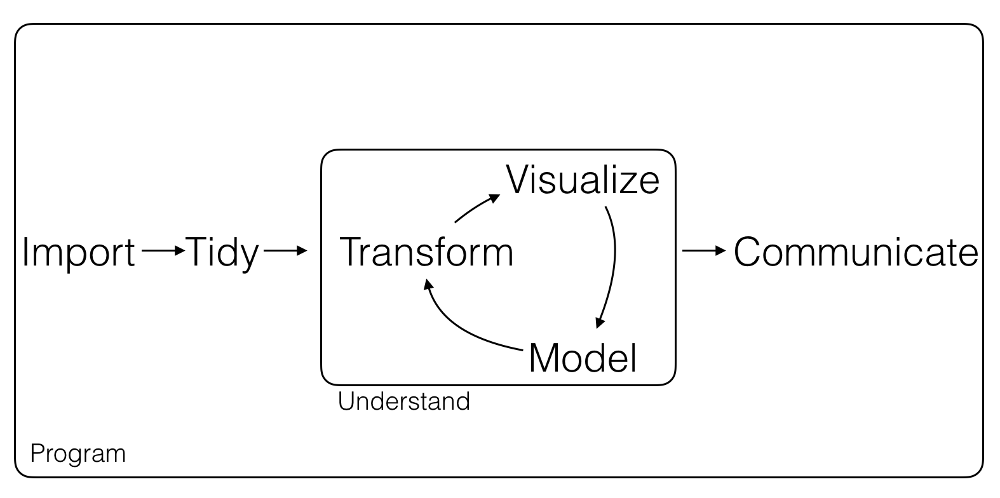

---
output:
  pdf_document: default
  html_document: default
---
# (PART) Introduction {-}

# Problem

## Big Data, Many Information, Less Knowledge?

Se l'ambiente informativo in cui noi esseri umani viviamo è radicalmente cambianto negli ultimi anni, con evidenti impatti su economia, tecnologia, cultura e società, l'impatto che ha avuto sulle aziende è ancora più forte[@Arun2006Firm; @jin2015significance; @degryse2016digitalisation; @john2014big; @o2016weapons]. Una persona infatti può raggiungere i suoi obiettivi anche senza il bisogno di gestire questa informazione (anche se con ormai alcune difficolà). Ciò non è vero per le aziende: per sopravviere ed essere competitive  hanno la necessità di avere dei chiari metodi e strumenti per risolvere il problema della information overload [@levitin2014organized; @feng2015competing]. 

Per capire le sfide che devono affrontare le aziende oggi, dobbiamo inanzitutto svolgere un esercizio di immedesimazione nei loro confronti. Immaginiamo che le la quantità di informazione che potenzialmente ci interessa e che proviene dall'ambiente nel quale viviamo (le informazioni tattili, spaziali e sonore, cio che dicono le persone con le quali interagiamo, il contenuto dei documenti importanti per il lavoro che svogliamo ecc..) inizi velocemente ad aumentare. Per sopravvivere in un ambiente di questo genere, avremmo bisogno di sensi più potenti o forse di nuovi; potremmo inoltre aver necessità sistemi esterni che ci aiutino nel compito della processazione delle informazioni. Misurando la quantità di informazione digitale prodotta negli ultimi 10 anni, notiamo come questa situazione è simile a quella che le aziende stanno vivendo: si ritrovano in un universo digitale caotico ed in continua espansione. Questo universo digitale crescerà di un fattore di 300 dal 2005 al 2020, da 130 exabytes a 40,000 exabytes (40 zettabytes) [@gantz2012digital], come mostrato in figura \@ref(fig:biginfo).

Le nuove tecnologie digitali inoltre non stanno avendo un impatto solo fuori le aziende, ma anche dentro di esse [@lasi2014industry; @brettel2014virtualization; @russmann2015industry]. Grazie ad industria 4.0 è infatti diventato possibile creare a poco prezzo un duale digitale dell'azienda, o in altri termini è economicamente fattibile oggi estrarre informazione da qualsiasi processo aziendale [@davies2015industry]. Questo che pare essere un enorme vantaggio per le aziende, crea il problema di una information overload anche interna, che necessità di essere gestita proprio come quella esterna. 


```{r  biginfo, echo=FALSE, fig.align='center', fig.asp=.75, fig.cap='Hisogram of the eximated Zettabites of information produced from 2005 to 2020.', message=FALSE, warning=FALSE, out.width='60%'}

tabletmp <- readxl::read_xlsx("_bookdown_files/tables/data_growth.xlsx") 

ggplot2::ggplot(tabletmp,ggplot2::aes(x= Year, y=`Information [ZB]`)) +
  ggplot2::geom_bar(stat="identity", color= "black", fill="grey") +
  ggplot2::theme_bw()

```

Un primo problema in tale contesto di pressione informativa crescente, è la difficoltà nel capire quali informazioni hanno valore per una azienda [@larose2014discovering;  @chemchem2015data; @kasemsap2015role] . Per valore qui si intende tutte le informazioni che possono aiutare l'azienda a costruire conoscenza in modo tale da perseguire la propia mission. Questo tipo di analisi richiede infatti sia una profonda comprensione delle tecnologie digitali, che di business acumen: non tutte le aziende sono in grado di avere al proprio interno (o comunque di procurarsi) queste skills [@hecklau2016holistic;  @davenport2012data; @provost2013data; @van2014data], considerando inoltre che il business acumen è fortemente dipendente dal settore nel quale si lavora. Come conseguenza è stato stimato che solo una piccola frazione dell'unvierso digitale è stato esplorato con l'obiettivo di estrarre vantaggio competitivo [@data2012bigger]. La percenutale di dati ancora untapped è stimata essere del 25% ed è destinata a cresce al 33% entro il 2020. Questo valore untapped può essere trovato in pattern nascosti nei social media, correlazioni fra studi scientifici, studi medici intersecati con studi sociologici, dall'analisi massima di documenti legislativi e così via.

Sempre in relazione alla difficoltà del reperimento di informazioni a valore, va considerato il fatto che sempre più spesso le informazioni ad alto impatto non sono più di tipo settoriale (tipiche di un solo knowledge field), ma nascono in contesti multidisciplinari. Questo le rende ancora più difficile da individuare. Tali informazioni anche se accessibili dagli esperti di un certo settore sono di difficile comprensione, poichè per definizione lontane dal settore stesso. A dimostrazione di tale fenomeno sta il recente aggiornamento della CPC (Cooperative Patent Classification) nella quale è stata introdotta la classe B33 e B33Y sulle tecnologie di addive manufacturing conosciuta anche come 3d-printing [@cpc2014], campo tecnologico ad alto contenuto multidisciplinare (scienze dei materiali, ingeria meccanica, informatica e robotica). Avere una nuova CPC significa un forte impatto sul patent officie, il quale deve foramre nuovi examiner per quella specifica CPC: questo è segno che i prcedenti examiner non avevano il range di competenze necessarie, e non è possibile a breve termine muoversi dall'interno di un dominio per conquistale. 

In seconda istanza, note le potenziali fonti di informazione che possono portare valore, è necessario capire quali strumenti è possibile utilizzare per estrarre questo valore sotto forma di conoscenza[@hand2007principles; @mining2006data] . Come mostrato nell'esempio precedente, una azienda si trova in una posizione di pericolo se la crescita di informazione sorpassa la propria capacità di processarla. In altri termini, l'aumento di informazione mostrato in figura  \@ref(fig:biginfo) non implica un aumento di conoscenza, ma al contrario è probabile che contribuisca ad impedirne la crescita [@allen2003information; @herbig1994effect]. Un celebre esempio di tale fenomeno è il computer boom dei decenni 1970 e 1980, il quale implicò un declinio temporaneo nella produttività generale sia economica che scentifica [@solow1987we]. Tale fenomeno viene identificato con il nome di productivity paradox. 

Dal punto di vista economico, evidenza di ciò è che i computer in quel periodo ebbero impatti su molti indicatori ma non su quelli di produttività economica (Robert Solow in 1987), e che gli stati uniti furono vittima di quattro recessioni tra il 1969 ed il 1982[@national2010us]. 

Il progresso scientifico è più difficile da misurare di quello economico [@hirsch2005index; @hauschildt1991towards; @van2000evaluation; @erno2011measuring; @bornmann2013societal; @bornmann2014evaluate; @bornmann2017does]. Non è infatti chiaro che misure possano essere utilizzate per misurare quanto uno stato sia efficace nel creare conoscenza, nonostante la letteratura sterminata su tale tema.  Una proxy largamente utilizzata per effettuare tale misura, è il numero di brevetti prodotti, letto in proporzione rispetto a l'investimento in ricerca e sviluppo: se diventa meno costoso per le aziende innovare, questo suggerisce che le aziende stanno usando le informazioni che hanno a disposizione in maniera più efficiente e che sono in grado di trasformarle in conoscenza utilie all'innovazione. Per misurare tale costo, si può vedere quanto una nazione spende ogni anno per produrre in media un brevetto. Tale metrica ha ovviamente una serie di problematiche (fra le quali gli investimenti per brevettare non provengono solo da fonti pubbliche, un brevetto può far parte di una famiglia di brevetti e la United Stated Patent Office può processare brevetti non sviluppati in America) ma è interessante notare come nel 1960 gli stati uniti hanno speso \$1000  (aggiustati per l'infalizione al 2015) per ogni patent application. Tale spesa inizialmente scende, poi sale anzichè scendere con l'arrivo dei computers con un picco di 735\$ nel 1986 [@silver2012signal]. La produttività ha nuovamente un crescita negli anni '90, quando ormai i computer erano diventati di largo utilizzo non solo per il business ma anche per applicazioni di tutti i giorni. La gobba presente intorno al decennio '80 nel grafico in figura \@ref(fig:bigexpendifure)  mostra come  il sistema America è stato meno efficente nel produrre nuova conoscenza a seguito dell'introduzione dei computer nelle aziende.


```{r  bigexpendifure, echo=FALSE, fig.align='center', fig.asp=.75, fig.cap='Trend in time (from 1964 to 2014) of the Research and Development Spending per Patent Application in dollars', message=FALSE, warning=FALSE, out.width='60%'}

tabletmp <- readxl::read_xlsx("_bookdown_files/tables/redexpenditure.xlsx") 

tabletmp <- dplyr::mutate(tabletmp, "R&D Spending per Patnet Application"= (`Total R&D Expenditure`/`Total Patent Applications`)*1000000)

ggplot2::ggplot(tabletmp,ggplot2::aes(x= Year, y=`R&D Spending per Patnet Application`)) +
  ggplot2::geom_line(stat="identity", color= "black", fill="grey") +
  ggplot2::theme_bw()

```

Oggi, nell'era dei big data, le aziende (ma anche le università) hanno dunque bisogno di nuovi "sensi" ed "aiutanti" che le assistano nella estrazione e consolidazione della conoscenza. La presente tesi ha come obiettivo comprendere quali fonti di informazioni ad oggi contengono maggiore valore ancora non dischiuso e quali metodologie e strumenti posso essere utilizzati a tale scopo. 

## A New Challenge for Management Engineers

Tipicamente ci occupaimo di attività ad altà ripetitività. Ti porti dietro metodologie ingegneristiche applicate a sistemi inernti, andnano a operare in sistemi socio-tecnici. Hai fatto il tuo mestieri (ricerca operativa ecc..).

Negli ultimi anni però le aziende le attività a maggior valore aggiunto sono non ripetitive. R&S, Design, marketing, HR ecc.. e quindi gestione della conoscena. Su situazione che sembrano uniche il gestionale rischia di perdere rispetto al creativo. Come disciplina voglio presidiare queste aree: non ci occupaimo di casi unici, ma costruire modelli in grado di incorporare conoscenza per essere usati in questi. 

La tesi ha l'obbiettivo di esploration and exploitation queste direzioni.

# Solutions

## A Process for Knowledge Creation

Modello generico di come un sistema (uomo, macchina, azienda...) genera conoscenza. Immagine + spiegazione

Un modello più actionable: data science. Immagine + spiegazione

```{r mainworkflow, echo=FALSE, fig.align='center', fig.asp=.75, fig.cap='A general workflow for the process of data analysis. Readapted from Wickham (2016)', message=FALSE, warning=FALSE, out.width='80%'}



```

## Text Mining

Istanza di data science e zona a maggior valore per estrazione conoscenza. 

Importanza di definire documenti dai quali fare mining. Come si decide dove sta la conoscenza per l'azienda? Di quali documenti l'azienda è stakeholder?

## Human & Machines

Datascience e text mining non fattibile da sole macchine...

Il problema non è sostituire domain knowledge. Idea vecchia ha fallito. E' insostibuibile perchè:

- Technology, interessa gli ingegneri
- Social Science, decision making

Perchè fallita: da una parte è andata avanti la knowledge rappresentation. E' impossibile rappresentare la conoscenza con regole, ma con altri strumenti si può rappresentare (bottom-up). 

Inoltre ho text mining, capaità di processare testi. Parte di intelligenza artificiale. Questi fenomeni non sostituioscono l'esperto ma ne cambiano il modo di operare. 

Si ha vantaggio su mitigazione bias se sistemi disegnati bene. 

Il pericolo delle black boxes. 

Oggi si integra. Vogliamo un esperto di dominio che faccia meglio il suo mestiere. 

Abbiamo oggi più potenza e correzione errori. 

Oltre ad efficienza e potenza nel correggere gli errori. Ora c'è anche la possibilità dio maggiore specificità. L'obiettivo è qiuindi poratre domain knowledge sia su technology sia ai decisori sociali. 

# Scope and Stakeholders

Algoritmi vecchi per domande nuove. Quale source per miglior precision noti gli algoritmi? Problema vincolato. Alcuni algoritmi. 


Alcuni documenti in analisi, alcuni stakeholders

Research and Development, Design, Marketing, Human Resources. Policy makers.

# Structure and rationale


