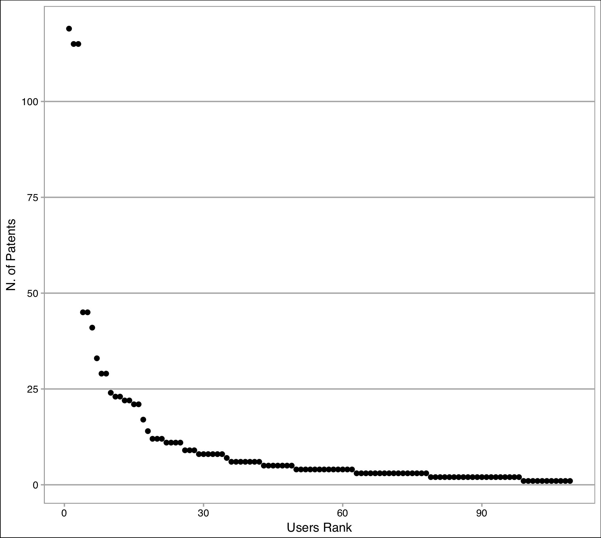

# Case Studies: Methods and Results {#methods}

L'aprrocio metodologico generico...


This chapter describes the methods applied for the analysis of technical documents. The methods are ensamble of Natural Language Processing (NLP) and Text Mining _techniques_ described in \@ref(sotatools), re-designed depending on the analyzed document and the analysis goal.
Not all the _techniques_ have been applied to all the documents: table tot summarise the relations between the documents under analysis (introduced in section \@ref(sotadocuments)) and the NLP techniques.

Table documents vs tools


## Patents

Patents contain a large quantity of information which is usually neglected. This information is hidden beneath technical and juridical jargon and therefore so many potential readers cannot take advantage of it. State of the art natural language processing tools and in particular named entity recognition tools, could be used to detect valuable concepts in patent documents. In this section we present three methodologies capable of automatically detecting and extracting threee of the multiple entities hidden in patents: the users of the invention, advantages and drawbacks of the invention and trademarks contained in patents. The results of the methodologies are described, togheter with example of applications of the extracted entities for intelligence tasks. 

### Users

In this section we show the approach used to extract the users of the invention described in a patent. The proposed process is shown in figure \@ref(fig:procesuser) and its phases are:

1. _Generation of an input list of users_: search all possible sources with the aim of creating an input list of users with the largest possible coverage (section \@ref(sourc));

2. _Patent set selection_: select the set of documents from which extract the users (section \@ref(patsel));

3. _Patent text pre-processing_: application of natural language processing tools on the documents with the aim of preparing them for the automatic user extraction;

4. _Automatic patent set annotation 1_: projection of the input list of users on the text to generate the Automatically Annotated Patent Set 1;

5. _Relevant sentences extraction_: selection of sentences containing at least one user to generate an informative training set;

6. _Automatic patent set annotation 2_: generation of a statistical model by a machine learning algorithm based on the training set sentences and automatically tagging the patent set to generate the Automatically Annotated Patent Set 2;

7. _Difference computation_: generation of the new list of users by computing the difference between the lists of users found in the automatically annotated patent set 1 and 2;

8. _Manual review_: manual selection of the entities that, in the new list of users, are effectively users. This new list will enrich the original list of users. This phase is described in section \@ref(manrev).


```{r procesuser, echo=FALSE, fig.align='center', fig.asp=.75, fig.cap='Process flow diagram of the proposed automatic user extraction system from patents. The diagram contains the representation of the documents and the operations performed on them. The process takes in input a patent set and a list of users and produces a list of new users as output.', message=FALSE, warning=FALSE, out.width='80%'}

knitr::include_graphics("_bookdown_files/figures/Process.pdf")

```

#### List of users generation {#sourc}

To generate the input list of users, we used two different approaches: a bottom-up approach and a top-down approach.
The bottom-up approach is based on the merge of lists from heterogeneous sources. In the present work we used the following lists of entities:

-  _Lists of jobs_ :[@listjobs],  11.142 entities

- _Lists of sports and hobbies_: [@listhob1, @listhob2], 9.660 entities;

_List of animals_:  [@listan], 600 entities;

- _Lists of patients_: [@listpat1, @listpat2],14.609 users;

- _List of generic words_: manually generated. It contains users with a higher level of abstraction (such as _person_ or _human being_), 56 items.

Bottom-up approach produced a list of 35.767 entries. 

Afterwards, a top-down approach was applied. Starting from the list generated with the bottom-up approach, we  looked for alternative methods to indicate a user, finding defined word patterns. The most relevant are:


- Patterns like "hobby_term + practitioner" for the hobbies;
- Patterns like "person who has + disease_term" or "suffering from + disease\_term" for the diseases;
- Patterns like "practitioner of + sport_term" for sports.

Top-down approach generated a total of 41.090 entries. 

The whole process generated a total of 76.857 users and gave us a reasonable number of terms to be used in the next step of the process.

Obviously our lists have a limited coverage and, therefore, they do not contain all variations of a certain user. For instance, the lists miss some users belonging to the classes mentioned above (e.g. new jobs emerged in the last years) and all the alternative ways for referring to a user we do not spotted in the top-down approach. For example our lists miss jobs like _data analyst_, _lap dancer_, _undertaker_, _mortician_ and _thief_ or patients with emerging diseases  like _work-alcoholic_ and _web-addicted_. In addition, our lists miss a class of users related to religious groups, containing users like _christians_ or _jewish_. Such terms have intentionally __not__ been introduced in the input list because we considered these terms as candidates to be extracted by the process in our case study .

#### Patent set selection {#patsel}

Our choice of patent sets aimed at challenging our system to find new users missing in the input list. 
To reproduce a patent set selection, we took into consideration the International Patent Classification (IPC) [@wipo1]. IPC is a hierarchical system of patent classes representing different areas of technology. Then, we wondered which classes could contain new users according to our seed list. Furthermore, IPC class A, which is the first level in IPC differentiation, is based on human necessities. For this reason, we assumed that in this class we would have found likely users from patents texts.

#### Patent text analysis

Our Entity Extraction system is composed by a set of sequential phases. The first three phases are related to the linguistic annotation: sentence splitting and tokenization, part of speech tagging and lemmatization. Then, the patent set is analyzed by the entity extractor, specialized for users extraction. A more detailed description of each phase is:

- Sentence splitting and Tokenization: These processes split the text into sentences and then segment each sentence in orthographic units called tokens. In our system, sentence splitting plays a key role since thanks to a given word, it is possible to find sentences where the word is used. Finding correct boundaries for a specific word allows to dramatically reduce the space to retrieve its surrounding contexts.

- POS tagging and Lemmatization: The Part-Of-Speech tagging (or POS tagging) is the process of assigning unambiguous grammatical categories to words in context. It plays a key role in NLP and in many language technology systems. For the present application we used the most recent version of the Felice-POS-tagger described in [@dell2009ensemble]. Once the computation of the POS-tagged text is completed, the text is lemmatized according to the result of this analysis.

- Semi-automatic Users Annotation: The Users Extraction tool is based on supervised methods. Such methods require an entity annotated corpus in order to extract new entities from unseen documents. A semi-automatic method has been used to generate an annotated corpus of users to avoid manual annotation of a patent set. The method is a projection of the list of users on the patent set defined in section \@ref{patsel}. The list of users described in section \@ref{sourc} is cleaned to avoid linguistic ambiguities when projecting these entities on the corpus. For example, the term _"guide"_ has two different meanings when used as a verb or as a noun. Furthermore, as a noun it could indicate a component of a system (guide for mechanical parts) or a person (someone employed to conduct others) and therefore a user.
Avoiding ambiguities is a crucial aspect to produce an informative training set, so ambiguous words were pruned.

The entity annotation schema for a single token is defined using a widely accepted BIO annotation scheme \cite{ramshaw}:


- __B-USE__: the token is the beginning of an entity representing an User;
- __I-USE__: the token is the continuation of a sequence of tokens representing an User;
- __O__: for all the other cases.


#### User Entity Extraction

The Users extraction problem is tackled by the implementation of a supervised classifier that is trained on an annotated patent set. Thus, the patent set is linguistically-annotated, using the steps described above and entity-annotated, exploiting the semiautomatic annotation process executed in the previous steps.

Given a set of features the classifier trains a statistical model using the feature statistics extracted from the corpus. For each new document the trained model assigns to each word the probability of belonging to one of the classes previously defined (B-USE, I-USE, O).

In our experiments the classifier has been trained using two different learning  algorithms:  Support  Vector  Machines  (SVM)  using  the  LIBSVM  library [@libsvm] configured to use a linear kernel and Multi Layer Perceptron (MLP) implemented using the Keras library [@libkeras]. It has been proven that LSTM methods are well suited for similar NER task. Anyway, we chose SVM and MLP method to study how two wheel established state of the art classifiers perform on the specific task of user extraction from patents and to evaluate their performance in terms of precision and computational effort. We also think that the popularity of these methods increment the reproducibility of the work.

The classifier uses different kind of features extracted from the text:

- _linguistic features_, i.e. lemma, Part-Of-Speech, prefix and suffix of the analyzed token;
 
- _contextual features_, the linguistic characteristics of the context words of the analyzed token; in addition the entity category of the previous token is considered;

- _compositional features_, combinations of contextual features and linguistic features. i.e. Part-Of-Speech of the previous word and the lemma of the current word. These extra features allow to infer statistics on the interaction of the combined features that can not be captured by a linear SVM model.

- _word2vec features_: vector representations of words computed by the _word2vec_ [@word2vec1] tool.
   
_Word2vec_ is a NLP tool able to produce word representations exploiting big corpora. The main property of the vectors produced by _word2vec_ is that words sharing similar contexts have similar vector representations. By using word vectors instead of the corresponding words we were able overcome the problem of the limited lexical knowledge in the training phase. Using these features and excluding all the others (delexicalized model) we expected that the resulting user extraction system had a lower precision and an higher recall in the classification phase. We presumed to find new users not contained in the input seed list. 
 
#### Manual Review of the new list of users {#manrev}

It is still possible that the classification process creates false positive results (words labeled as users that do not match the definition in section \@ref{theuse}). Thus, it is necessary to make a manual review of the extracted entities with the aim of evaluating the output.

#### Results

The following section describes the performances of the automatic users extraction process on two different patent sets. To test the system four experiments were conducted}. Finally the performances and the outcomes of the system are shown and discussed.

Following the guidelines for the patent set selection described in section \ref{patsel}, we examined two patent sets belonging to the IPC class A:


- __A47G33__. The IPC definition of the subclass is _"religious or ritual equipment in dwelling or for general"_.
- __A61G1-A61G13__. The IPC definition of the subclass A61G1 is _"Stretchers"_ while the definition of the subclass A61G13 is _"Operating tables; Auxiliary appliances therefor"_.

We extracted from the private Errequadro s.r.l. [@errequadro] database a random sample of 2.000 patents from each IPC class. For each patent set we applied the semiautomatic set annotation process by projecting the input list of users on the morphosyntactically analyzed patent set.
After this process, each semi-automatically annotated patent set was split in two parts: the first was used as training set for the user extractor, and the second one was used as test set.

To build an informative training set, from the semi-automatically patent set we selected a subset of sentences containing at least one user. The size of the training set in both cases is approximately composed by 600.000 tokens. For each patent set table \ref{tab:patent set-details} shows the number of sentences of the training set, the number of sentences of the test set, and the number of distinct users in the training set (re-projected by the semi-automatic annotation process).

ref ---> patent set-details

\begin{table*}[!h] %[td!]
  \scriptsize
        \centering
        \begin{tabular}{cccc}
                        \toprule
        \textit{patent set group } &  \textit{\#Sentences - training} & \textit{\#Sentences - test}  & \textit{\#Distinct users projected on training} \\
                        \midrule
         A47G33 & 13.364 & 214.029 & 126   \\
       A61G1-A61G13 & 15.108 & 2.520.350 & 121   \\
        \bottomrule[1pt]
        \end{tabular}
        \caption{\small Statistics related to the patent set groups analyzed in the case study}
       % }
        \label{tab:patent set-details}
\end{table*}


We chose two orders of magnitude for the sentences test-set to test the efficiency of multiple configurations of the system. 

To test the performances of the implemented user extractor, we devised four different configurations.
Each configuration uses a specific learning algorithm and a set of features to build the statistical model. The main purpose of this procedure is to find the configurations that better perform in the user extraction task. In addition, the different behaviour of the system in the classification phase is studied.
In tables \ref{tab:extractor-configurations} and \ref{tab:feat-confs} are reported the detailed configurations used in our experiments.


\begin{table*}[!h] %[td!]
 \footnotesize
        \centering
        \begin{tabular}{cc}
                        \toprule
        \textit{Feature group} &  \textit{Context Window} \\
                        \midrule
        Lemma unigrams & $[-2, -1, 0, 1]$  \\
        Lemma bigrams & $[(-1 ,0), (0, 1)]$ \\
        Word bigrams &  $[(-1 ,0), (-2, -1), (0, 1), (1, 2)]$ \\
        Word trigrams &  $[(1, 0, 1) (-2, 1, 0)]$ \\
         Pos unigrams & $[-2, -1, 0, 1]$  \\
         Pos bigrams &  $([(-2, -1) (-1, 0), (0,1)])$  \\
       Compositional feature \#1 & $(POS_{-1}, Lemma_{0})$ \\
       Compositional feature \#2 & $(Lemma_{-1}, Lemma_{0})$ \\
         Compositional feature \#3 & $(Lemma_{0}, Lemma_{1}) $ \\
                  Compositional feature \#4 & $(POS_{0}, Lemma_{1}) $ \\
         Compositional feature \#5 & $(NER_{-1}, Lemma_{0}) $ \\
         Word2vec & [-2, -1, 0, 1, 2] \\
        \bottomrule[1pt]
        \end{tabular}
        \caption{\small Context windows of the extracted features considering 0 as the 
        current analyzed token.
        }
        \label{tab:feat-confs}
\end{table*}

By using the first and the second configuration we expected to have a higher precision in the classification phase, since explicit lexical information is used in the training phase. For the same reason we expected to have low recall in classification phase. On the other hand, the third and fourth configurations are delexicalized: lexical information is provided by word vectors computed by word2vec_. In these two configurations we expected to have an higher recall and a lower precision, due to the characteristics of the computed vectors explained before. To limit errors when using the _word2vec_ features, some linguistically motivated filtering rules were introduced. Specifically, sequences of tokens classified as users were constrained from the following categories: verbs, adjectives not preceded by articles, articles and adverbs.

To evaluate the whole user extraction process in each experiment, we defined some evaluation measures. Each measure was introduced to evaluate the characteristics of the extraction system concerning the configuration applied.

These measures are:

- Training time: time needed to create the statistical model using the training set;
- Test time: time needed to re-annotate the semi-automatically annotated patent set;
- Number of extracted users: number of unique entities classified as user in the automatically annotated patent set;
- Number of known users: number of distinct extracted users in the automatically annotated patent set and belonging to the list of user in input;
- Number of new users: number of distinct entities classified as user in the automatically annotated patent set and not belonging to the input list of users;
- Number of new correct users: number of distinct entities considered as user and as correct after a manual review;
- Precision: ratio between the number of new distinct correct users and the total number of new distinct users;
- Gain: ratio between the number of new distinct correct users and the number of re-projected distinct users on the training set.


{
  \begin{table*}[!h] %[td!]
      \tiny
        \begin{tabular}{lccccccccc}
         \hline
               Experiment  &  Training time & Test Time & Extracted  &  Known &  New  &  New correct &  New wrong & Prec. (\%) & Gain (\%) \\

            \midrule
                        \multicolumn{10}{c}{\textit{A47G33}}\\

                  \midrule
    1 (SVM) & 83m  & 321m & 161 & 93 &  68 & 47 & 21  &  69.11 & 37.30  \\
    2 (MLP) & 1911m  & 9091m & 196 & 55 &  141 & 27 & 114  &  19.15 & 21.42  \\
    3 (MLP-W2V) &  165m & 246m &  162 & 35 &  127 & 45 & 82   & 35.43 & 35.71 \\
    4 (SVM-W2V) &  1265m & 4310m &  121 & 29 &  92 & 45 & 47   & 48.91 &  35.71  \\
     \hline
            \multicolumn{10}{c}{\textit{A61G1-A61G13}}\\
                \midrule

   5 (SVM)  & 148m & 3443m &  302 & 120 &  182 & 88 & 108  & 48.35 & 72.72  \\
   6 (MLP)  & 1818m & --- &  --- & --- &  --- & --- & ---  & --- & ---  \\
    7 (MLP-W2V)   & 333m & 3530m &  305 & 38 &  267 & 44 & 230   & 16.48  & 36.36 \\
    8 (SVM-W2V)  & 1268m & 47020m &  313 & 49 &  264 & 74 & 197   & 28.03 & 61.15 \\


    \bottomrule
        \end{tabular}
            \caption{\small Comparison of the values of the defined metrics across all the experiments.
              The patent set annotation in the experiment (6) was not performed due to the computational costs.
              All the experiments were run on a machine provided with 10 AMD Opteron(tm) 6376 processors.}
               \label{tab:runs-data}

  \end{table*}
}

Table \ref{tab:runs-data} reports the values of the defined metrics across all the experiments run on the two patent sets.

For what concerns training and test time of the automatic patent set annotation, it's clear that the configuration based on the SVM learning algorithm without the _word2vec_ features performs better in both the experiments (1, 5).
When the features based on _word2vec_ are introduced, the configuration based on the MLP learning algorithm is the fastest both in training and test time (3, 6): it is due to the fact that keras  implementation of this algorithm exploits all the available CPU cores of the system.
On the other side, the MLP algorithm does not scale properly with a higher number of features, as seen in training and annotation time in the experiment (2). In addition, we could not perform the patent set annotation in the experiment (6), since it would have required more than 60 machine days to complete the process.
When _word2vec_ features are introduced, the patent set annotation based on the SVM algorithm is 10 times slower than the MLP algorithm.

For what concerns the precision in the automatic patent set annotation, the SVM configuration without _word2vec_ features is clearly the more reliable: the precision values are from 1.5 to 2 times higher in the experiments (1, 5) in contrast to the other experiments. The higher precision is justified by the fact that the configurations based on _word2vec_ features lack explicit lexical information: words with very similar contexts are represented by similar _word2vec_ vectors, probably leading to errors in the classification phase. On the other hand, the use of  _word2vec_ vectors aims at extracting entities that would not be extracted by considering explicit lexical information only.

Finally, for what concerns information gain, the same amount of new information (21-37%) is extracted in the experiments on the A47G33 patent set. The gain values drastically change in the experiments on the A61G1-A61G13 patent set: in the experiments (5, 8) a gain between 61% and 72% is obtained: it is due to the size of this patent set in comparison to the A47G33 one. In the experiment (7), despite the introduction of _word2vec_ features, a gain of 36% is obtained. This fact, in conjunction with the non-feasibility of the experimental configuration 6, shows how MLP systems lack in efficacy and efficiency (in entity extraction in patent domain) when the test-set has an order of magnitude of millions of sentences. We think that this result is relevant, based on our experience with practical applications. 

Furthremore, a way to maximize the overall informative gain is to merge the results of all manually reviewed user extractions obtained by executing the patent set annotation process with all possible configurations.

The overall informative gain of the merging process is related to intersections that occur among the results obtained by the patent set annotation process in each configuration: the less the intersections, the more the overall informative gain obtained. In table \ref{tab:merge-data} is shown the overall gain obtained by merging results of the manually reviewed extractions in each patent set.


{
  \begin{table*}[!h] %[td!]
    \footnotesize
    \centering
    \begin{tabular}{ccc}
      \hline
      Configuration & A47G33 - Gain (\%) & A61G1+A61G11 - Gain (\%) \\
      \midrule
          SVM & 37.30 & 72.72 \\
          MLP & 21.42 & --- \\
          MLP-W2V & 35.71 & 36.36 \\
          SVM-W2V & 35.71 & 61.15 \\
          SVM $\cup$ MLP & 52.38 & --- \\
          SVM $\cup$ MLP-W2V & 69.84 & 126.44 \\
          SVM $\cup$ SVM-W2V & 73.01 & 103.30 \\
          MLP $\cup$ MLP-W2V & 55.55 & --- \\
          MLP $\cup$ SVM-W2V & 57.14 & --- \\
          MLP-W2V $\cup$ SVM-W2V & 59.52 & 76.30 \\
          SVM $\cup$ SVM-W2V $\cup$ MLP-W2V & 90.47 & 140.49 \\
          SVM $\cup$ MLP $\cup$ MLP-W2V & 82.53 & --- \\
          SVM $\cup$ MLP $\cup$ SVM-W2V & 85.71 & --- \\
          MLP $\cup$ SVM-W2V $\cup$ MLP-W2V & 77.77 & --- \\
          SVM $\cup$ MLP $\cup$ SVM-W2V $\cup$ MLP-W2V & 103.17 & --- \\
          \bottomrule
        \end{tabular}
    \caption{\small Gain obtained by merging correct entities extracted from each patent set annotation.}
    \label{tab:merge-data}

  \end{table*}
}

The table shows that the merging process of manually reviewed entities extracted from each patent set annotation run effectively contributes to increase the overall informative gain. For instance in the A47G33 patent set an overall gain of 103.17% is obtained, tripling the best result achieved by the extraction performed using the best single configuration. Good results are also achieved in the A47G33 patent set user extraction. In this case an overall gain of 140.49% is obtained, doubling the best result achieved by the extraction performed using the best single configuration. 


The results shown in section 5 prove that if the goal of the extraction is to reach the maximal recall, an ensemble method (combining the output of multiple classifier) over-performs every single classifier method. Anyway, the ensemble approach has clear efficiency issues, because the time of analysis will be the sum of every single approach time (in hypotheses of non-parallelization). This leads to a trade off between the speed of the system and the quality of the results, and whoever would use the presented system can decide to gain benefit in one or in another direction. 


Finally, tables \ref{tab:result-extraction-dl-a47g33} and \ref{tab:result-extraction-dlw2v-a47g33}  show an overview of extracted users randomly chosen from the A47G33 patent set (the only one in which were able to perform all experiments). Each table is divided in two blocks, representing the results of the extraction performed using a specific configuration. For each extracted user is shown the corresponding lemma (the root form), the frequency (how many times that user appears in the whole corpus) and the total number of patents containing the user. Users not contained in the starting user list, are highlighted in bold.  

The table shows that the system was able to extract characteristic users of the patent set. The results are in fact not unexpected for the IPC class under analysis: this is an evidence of the correct performances of the proposed system. In other words, the results presented in the table show that it is possible to train a NER systems able to extract sparse and valuable information. Such users are the ones that an expert would manually extract but the NER system does it with an enormous saving in terms of time and efforts. 

Other remarkable results are:

- many newly extracted entities have very low frequency in the patent set: it shows that the developed system is able to extract rare entities. 

- table \ref{tab:result-extraction-dlw2v-a47g33} shows that configurations using \textit{word2vec} features are able to find new users with a higher frequency in the patent set: it was an expected result, since the \textit{word2vec} configurations are not explicitly lexicalized and more able to generalize during extraction phase. 

- The system is able to extract single words and multi-words.

- Taking into consideration the definition we have given in section \ref{theuse}, the system extracts unusual and sometimes borderline users. Examples like _saint_, _angel_, _god_ and _ghost_ need  discussion that is far beyond the purposes of the present paper. These results are a remarkable evidence of the human-like generalization ability of the described method. 


  \begin{table*}[!h] %[td!]
    \footnotesize
    \centering
    \begin{tabular}{cccccc}
          \hline
      \multicolumn{3}{c}{SVM} &  \multicolumn{3}{c}{MLP} \\
    \hline
    Lemma & Frequency & \# Patents & Lemma & Frequency & \# Patents  \\
    \hline
female & 801 & 109 & child & 402 & 102  \\
child & 426 & 108 & cleregy member & 128 & 5 \\
guy & 156 & 17 & patient & 113 & 11 \\
patient & 115 & 11 & man & 50 & 26  \\
parent & 70 & 31 & young & 48 & 32 \\
man & 51 & 26 & \textbf{angel} & 29 & 23  \\
merchant & 50 & 6 & dog & 20 & 7  \\
soon & 46 & 29 & artisan & 12 & 12 \\
engineer & 45 & 45 & \textbf{male/female} & 12 & 4  \\
adult & 39 & 23 & hockey player & 7 & 1  \\
young & 35 & 24 &  \textbf{professional}  & 7 & 7   \\
society & 32 & 21 & tennis player  & 7 & 4  \\
\textbf{angel} & 29 & 23 & football player   & 6 & 3 \\
fund raiser & 27 & 4 &  \textbf{ghost} & 5 & 3   \\
priest & 22 & 4 & children  & 5 & 5 \\
cheerleader & 15 & 4 & manager  & 5 & 5  \\
\textbf{fund-raiser} & 11 & 4 & \textbf{spider} & 5 & 5 \\
\textbf{athlete} & 10 & 9 &  \textbf{vandal}  & 5 & 1  \\
\textbf{ghost} & 5 & 5 & \textbf{athlete}  & 4 & 3  \\
\textbf{adulterant} & 3 & 3 & mother  & 4 & 2  \\
\textbf{jew} & 3 & 3 & soccer player  & 4 & 3  \\
\textbf{maid} & 3 & 1 & squirrel  & 3 & 2 \\
\textbf{tourist} & 3 & 3 & \textbf{maid}  & 3 & 1 \\
\textbf{indian} & 2 & 2 & \textbf{god}  & 3 & 2  \\
\textbf{beginner} & 1 & 1 & \textbf{mariner}  & 3 & 3  \\
\textbf{christians} & 1 & 1 &  \textbf{male-female}  & 2 & 2  \\
\textbf{datum entry operator} & 1 & 1 & \textbf{manufacturer}  & 2 & 2  \\
\textbf{expert} & 1 & 1 & \textbf{jew}  & 1 & 1  \\
\textbf{jewish} & 1 & 1 & \textbf{merchandizers} & 1 & 1  \\
\textbf{marinaro} & 1 & 1 & \textbf{parishioner} & 1 & 1 \\
          \bottomrule
        \end{tabular}
            \caption{\small Extracted users from the A47G33 patent set using the SVM and DL configurations.
            New users extracted by the system are reported in bold.
            }
              \label{tab:result-extraction-dl-a47g33}
  \end{table*}

  \begin{table*}[!h] %[td!]
    \footnotesize
    \centering
    \begin{tabular}{cccccc}
          \hline
      \multicolumn{3}{c}{SVM-W2V} & \multicolumn{3}{c}{MLP-W2V}   \\
    \hline Lemma & Frequency & \# Patents & Lemma & Frequency & \# Patents \\
    \hline
  child & 152 & 68 & clergy member & 124 & 5 \\
 clergy member & 124 & 5  & \textbf{crowd} & 36 & 3 \\
  man & 50 & 26 & basketball player & 20 & 5\\
 engineer & 45 & 45 & \textbf{him} & 17 & 8  \\
young & 29 & 24 & woman & 16 & 8   \\
\textbf{choir} & 17 & 1 & \textbf{saint} & 14 & 2  \\ 
 \textbf{infirm} & 13 & 8 & \textbf{youth} & 14 & 2  \\
\textbf{bride} & 9 & 4 &\textbf{angel} & 8 & 4  \\
\textbf{volunteer} & 8 & 6 &\textbf{choir} & 8 & 1   \\
 musician & 6 & 6 & musician & 6 & 6   \\
 boy & 3 & 1 & \textbf{god} & 5 & 1  \\
 children & 3 & 3 & children & 3 & 3   \\
 girl & 3 & 2 & guy & 3 & 3  \\
 \textbf{creature} & 2 & 1 & infant & 3 & 3  \\
\textbf{deceased} & 2 & 1 & priest & 3 & 3  \\
\textbf{jewish} & 2 & 2  & \textbf{bride} & 2 & 2  \\
\textbf{person} & 2 & 2 & \textbf{consumer} & 2 & 2  \\
mother & 2 & 2 & \textbf{everyone} & 2 & 2  \\
 \textbf{audience} & 1 & 1 & \textbf{him/her} & 2 & 2  \\
\textbf{boyfriend} & 1 & 1 & \textbf{spectator} & 2 & 2   \\
\textbf{derby member} & 1 & 1 & farmer & 2 & 1   \\
\textbf{gift giver} & 1 & 1 & youngster & 2 & 2  \\
 \textbf{handicapped} & 1 & 1 & \textbf{boyfriend} & 1 & 1  \\
\textbf{jesus} & 1 & 1 & \textbf{grandparent} & 1 & 1  \\
 \textbf{saint} & 1 & 1  & \textbf{subject} & 1 & 1 \\
husband & 1 & 1  & clown & 1 & 1 \\
lady & 1 & 1  & husband & 1 & 1 \\
runner & 1 & 1 & runner & 1 & 1  \\
 society & 1 & 1 & society & 1 & 1  \\
teenager & 1 & 1 & tennis player & 1 & 1  \\
          \bottomrule
        \end{tabular}
            \caption{\small  Extracted users from the A47G33 patent set using the SVM-W2V  and MLP-W2V configurations.
            New users extracted by the system are reported in bold.}
              \label{tab:result-extraction-dlw2v-a47g33}

  \end{table*}


The total number of users is 109. 28,2\% (564 on 2.000) of patents in analysis contains at least one user. This result is an evidence of the fact that patents actually contain users information, and, considering the approach we followed, this percentage is an accurate lower approximation of the actual percentage of patents containing at least one user. 

In figure \ref{patents_per_user} for each user on the x axes is shown the number of patents in which the user is contained. The distribution is skewed, with some occurrences showing large numbers and many others with just one or few occurrences. It is clear that there is a Pareto like distribution, with the first 20% of users covering 70% of total users in terms of occurrence. It means that some users are more likely to be cited in patents and many more users that rarely appear. Following this observations, we can divide users in three groups: 


    
- _Group A_: users that appear in more than 100 patents (5% of the patent set). In our case these are _male_, _child_ and _female_. 
    
- _Group B_: users that appear in more than 20 patents (1% of the patent set). This group is composed by 13 different users. Some of these are _engineer_, _person_, _player_, _adult_, _angel_ and _guy. 
    
- _Group C_: users that appear in less then 20 patents. This group is composed by 93 different users. Some of these are _mother_, _athlete_, _priest_, _adulterant_, _golfer_ and _hockey player_. 
    
Further research means to study how these users differ from patent set to patent set. We expect to see similar distribution but with different content of users. Frequent and non-specific users comprise Group A: in other patent set we could see differences in terms of entities contained in this class but its content will stay non-specific. These results seem to be generic social roles indicating the gender or the age of a person. Group B is composed of mainly non-specific users and some specific users that change from patent set to patent set. This class helps to identify the core users of the patent set. Lastly, Group C contains non-frequent users that are both specific and non-specific, making it the most interesting of the three for the purposes of our work. In this group we find users that are market niches, so the patent that contains these users is of great interest for marketers and designers. These are both samples of the more generic users (for example a _mother_ is a _female_ and a _hockey player_ is a _player_) or  specific users of the patent-set (like _priest_, _fund-raiser_, _doll_, _spouse_ and _clergy member_. 


```{r userrank, echo=FALSE, fig.align='center', fig.asp=.75, fig.cap='Process flow diagram of the proposed automatic user extraction system from patents. The diagram contains the representation of the documents and the operations performed on them. The process takes in input a patent set and a list of users and produces a list of new users as output.', message=FALSE, warning=FALSE, out.width='80%'}



```

### Advantages and Drawbacks

### Trademakrs

## Papers

## Projects

## Wikipedia

## Twitter

## Job Profiles