# (PART) Methods and Results {-}

This part describes the methods and processes designed for the analysis of technical documents following the guidelines of design research described in section \@ref(introdesres). The methods are ensamble of Natural Language Processing (NLP) and Text Mining _techniques_ described in \@ref(sotatools), re-designed depending on the analyzed document and the analysis goal. 

Since design research is a problem solving paradigm,  each chapter starts with a brief description of the field of applicaton of the method and with the framing of the problem to be solved. Then the methodlogy to solve the prolbem is described with the goal of beeing clear to a technical audience and a managerial audience. Each chapter closes with the results description that proves the utility, quality, and efficacy of the design artifact.

# Patents

Patents contain a large quantity of information which is usually neglected. This information is hidden beneath technical and juridical jargon and therefore so many potential readers cannot take advantage of it. State of the art natural language processing tools and in particular named entity recognition tools, could be used to detect valuable concepts in patent documents. A deeper description of what patents are and how these documents are used to mine technical knowledge can be found in section \@ref(sotadocumentspatents)

In this section we present three methodologies capable of automatically detecting and extracting threee of the multiple entities hidden in patents: the users of the invention, advantages and drawbacks of the invention and trademarks contained in patents. The results of the methodologies are described, togheter with example of applications of the extracted entities for intelligence tasks. 

## Users {#usersresults}

Patents are documents that must provide a detailed public disclosure of an invention [@wipo2]. An _invention_ is a new and useful process, machine, manufacture, or composition of matter, or any new and useful improvement thereof ^[http://www.uspto.gov]. 

The notion of usefulness implies that the invention must have some value and not necessarily for a human entity. In fact, patents usually describe processes, machines or composition of matter which are useful for another process, machine or composition of matter. 

Therefore, we distinguish between stakeholders and users, considering the definitions given by the authors in [@bonam2017].

Definition 1: __Stakeholder__ : _Stakeholders are entities on which the invention has or will have a positive or negative effect in order to show usefulness._

This definition covers all possible entities that engage an active or passive relation with the invention.Given the logical condition of usefulness of patents, all patents must have stakeholder information. If a patent has not got any stakeholder information in it the patent application should be rejected.

Definition 2: __User__: _Users are animated or previously animated entities (human or animal, alive or dead), on which the invention has a positive or negative effect at an unspecified moment._

Given definition 2, it is clear that every user is a stakeholder while non-users stakeholders include artifacts, machines, manufacturing or operational processes. 

Corollary 1: __Multiple roles__: _Identities may have multiple roles as users._

Our idea of users describes roles, not identities. Animated entities have an identity, as it happens for a specific person. A person has many roles as a user. For example, a _working mother_ starts her day taking on the role of a _mom_, in which she is expected to feed her children and get them ready for school. At the office she shifts to the role of _project manager_, so she oversees projects in a timely and professional manner. _Working mother_, _mom_ or _project manager_ can be considered user roles attributed to the same person, or identity. From this definition it is clear that users are close to what social sciences define as “social roles”.

Afterward, we can outline knowledge fields using the concept of user, with a twofold aim: help the reader to understand how the concept of users is interpreted in different knowledge fields; explain the background of the methodology we adopted.

#### Social sciences: social roles as users {-}

In social sciences _social roles_ are comparable with our definition of user. As defined in the psychological field [@alleydog], _"social roles refer to the expectations, responsibilities and behaviors we adopt in certain situations."_. The example of the working mother shown before, is the case of social roles. 

The field of social sciences is the only one in which an attempt of automatic extraction of users has been done. In [@belieber] the authors extracted social roles from Twitter using heuristic methods. The authors looked for all the words preceded by constructions like "I'm a" and similar variations. This search resulted in 63.858 unique roles identified, 44.260 of which appeared only once. The result of the extraction process is noisy and only a low percentage of the extracted words are social roles. Despite of this noisy extraction, some entities are consistent with our definition of user, e.g. _doctor, teacher_, _mother_ or _christian_.

Another work [@prefine] tries to identify social roles on Twitter exploiting a set of assumptions. The authors take into account roles, each one with a set of related verbs: if someone uses verbs from a set, that person may cover that particular social role. To sanitize the collection of positively identified users, the authors crowd-sourced a manual verification procedure, using the  Mechanical Turk platform [@kittur2008crowdsourcing]. Also here some interesting extractions are performed, obtaining users like _artist, athlete, blogger, cheerleader, christian, DJ_, or _filmmaker_. 
These two works differ from the present study for what concerns the analyzed texts and the methods to extract the entities.  Nevertheless, the extracted set of entities is consistent with our definition of user.

#### Human Resources Management: workers as users {-}

In organizations, Human Resources Management is the function designed to maximize employees performance [@HRM]. Employees are key actors and they can be considered users according to our definition.

Human Resources Management has tried to classify employees, especially in sub-fields like insurance, social security or work psychology. Usually, we refer to those as lists of jobs. Classifications were made with the goal of grouping similar jobs for educational requirements, job outlooks, salary ranges or work environments to facilitate social analysis and the placement of new workers. Such lists are relevant because, even if they represent just one subset of all the possible users, they contain valid information. Many institutions developed lists of jobs [@listjobs].

#### Medicine: patients as users {-}

Another field of interest is medicine, since patients can be considered users. Also in this case there are many lists of patients, illnesses and diseases  [@cdcdiseases], which are valuable in terms of information contained.

#### Design and Marketing: between users and customers {-}

In the field of _Design_ the concept of user plays a central role and it overlaps with our definition of user. Many tools and theories like "User Centered Design" are based on the concept of user [@ucd]. As stated by the authors in [@npdul], the quality of the design process is proportional to the user needs' satisfaction. It implies that a designer has to understand the user needs; as a consequence he has to discover whom are potential users. 

### Method

In this section we show the approach used to extract the users of the invention described in a patent. The proposed process is shown in figure \@ref(fig:procesuser) and its phases are:

1. _Generation of an input list of users_: search all possible sources with the aim of creating an input list of users with the largest possible coverage;

2. _Patent set selection_: select the set of documents from which extract the users;

3. _Patent text pre-processing_: application of natural language processing tools on the documents with the aim of preparing them for the automatic user extraction;

4. _Automatic patent set annotation 1_: projection of the input list of users on the text to generate the Automatically Annotated Patent Set 1;

5. _Relevant sentences extraction_: selection of sentences containing at least one user to generate an informative training set;

6. _Automatic patent set annotation 2_: generation of a statistical model by a machine learning algorithm based on the training set sentences and automatically tagging the patent set to generate the Automatically Annotated Patent Set 2;

7. _Difference computation_: generation of the new list of users by computing the difference between the lists of users found in the automatically annotated patent set 1 and 2;

8. _Manual review_: manual selection of the entities that, in the new list of users, are effectively users. This new list will enrich the original list of users. 


```{r procesuser, echo=FALSE, fig.align='center', fig.asp=.75, fig.cap='Process flow diagram of the proposed automatic user extraction system from patents. The diagram contains the representation of the documents and the operations performed on them. The process takes in input a patent set and a list of users and produces a list of new users as output.', message=FALSE, warning=FALSE, out.width='60%'}

knitr::include_graphics("_bookdown_files/figures/Process.pdf")

```

#### List of users generation {-}

To generate the input list of users, we used two different approaches: a bottom-up approach and a top-down approach.
The bottom-up approach is based on the merge of lists from heterogeneous sources. In the present work we used the following lists of entities:

-  _Lists of jobs_ :[@listjobs],  11.142 entities

- _Lists of sports and hobbies_^[http://www.notsoboringlife.com/list-of-hobbies/,http://www.notsoboringlife.com/list-of-hobbies/]: 9.660 entities;

_List of animals_ ^[http://a-z-animals.com/animals/]: 600 entities;

- _Lists of patients_ ^[http://www.medicinenet.com/diseases\_and\_conditions/alpha\_a.htm, http://www.cdc.gov/DiseasesConditions/az/a.html]: 14.609 users;

- _List of generic words_: manually generated. It contains users with a higher level of abstraction (such as _person_ or _human being_), 56 items.

Bottom-up approach produced a list of 35.767 entries. 

Afterwards, a top-down approach was applied. Starting from the list generated with the bottom-up approach, we  looked for alternative methods to indicate a user, finding defined word patterns. The most relevant are:


- Patterns like "hobby_term + practitioner" for the hobbies;
- Patterns like "person who has + disease_term" or "suffering from + disease\_term" for the diseases;
- Patterns like "practitioner of + sport_term" for sports.

Top-down approach generated a total of 41.090 entries. 

The whole process generated a total of 76.857 users and gave us a reasonable number of terms to be used in the next step of the process.

Obviously our lists have a limited coverage and, therefore, they do not contain all variations of a certain user. For instance, the lists miss some users belonging to the classes mentioned above (e.g. new jobs emerged in the last years) and all the alternative ways for referring to a user we do not spotted in the top-down approach. For example our lists miss jobs like _data analyst_, _lap dancer_, _undertaker_, _mortician_ and _thief_ or patients with emerging diseases  like _work-alcoholic_ and _web-addicted_. In addition, our lists miss a class of users related to religious groups, containing users like _christians_ or _jewish_. Such terms have intentionally __not__ been introduced in the input list because we considered these terms as candidates to be extracted by the process in our case study .

#### Patent set selection {-}

Our choice of patent sets aimed at challenging our system to find new users missing in the input list. 
To reproduce a patent set selection, we took into consideration the International Patent Classification (IPC) [@wipo1]. IPC is a hierarchical system of patent classes representing different areas of technology. Then, we wondered which classes could contain new users according to our seed list. Furthermore, IPC class A, which is the first level in IPC differentiation, is based on human necessities. For this reason, we assumed that in this class we would have found likely users from patents texts.

#### Patent text analysis {-}

Our Entity Extraction system is composed by a set of sequential phases. The first three phases are related to the linguistic annotation: sentence splitting and tokenization, part of speech tagging and lemmatization. Then, the patent set is analyzed by the entity extractor, specialized for users extraction. A more detailed description of each phase is:

- Sentence splitting and Tokenization: These processes split the text into sentences and then segment each sentence in orthographic units called tokens. In our system, sentence splitting plays a key role since thanks to a given word, it is possible to find sentences where the word is used. Finding correct boundaries for a specific word allows to dramatically reduce the space to retrieve its surrounding contexts.

- POS tagging and Lemmatization: The Part-Of-Speech tagging (or POS tagging) is the process of assigning unambiguous grammatical categories to words in context. It plays a key role in NLP and in many language technology systems. For the present application we used the most recent version of the Felice-POS-tagger described in [@dell2009ensemble]. Once the computation of the POS-tagged text is completed, the text is lemmatized according to the result of this analysis.

- Semi-automatic Users Annotation: The Users Extraction tool is based on supervised methods. Such methods require an entity annotated corpus in order to extract new entities from unseen documents. A semi-automatic method has been used to generate an annotated corpus of users to avoid manual annotation of a patent set. The method is a projection of the list of users on the patent set defined in section \@ref{patsel}. The list of users described in section \@ref{sourc} is cleaned to avoid linguistic ambiguities when projecting these entities on the corpus. For example, the term _"guide"_ has two different meanings when used as a verb or as a noun. Furthermore, as a noun it could indicate a component of a system (guide for mechanical parts) or a person (someone employed to conduct others) and therefore a user.
Avoiding ambiguities is a crucial aspect to produce an informative training set, so ambiguous words were pruned.

The entity annotation schema for a single token is defined using a widely accepted BIO annotation scheme \cite{ramshaw}:


- __B-USE__: the token is the beginning of an entity representing an User;
- __I-USE__: the token is the continuation of a sequence of tokens representing an User;
- __O__: for all the other cases.


#### User Entity Extraction {-}

The Users extraction problem is tackled by the implementation of a supervised classifier that is trained on an annotated patent set. Thus, the patent set is linguistically-annotated, using the steps described above and entity-annotated, exploiting the semiautomatic annotation process executed in the previous steps.

Given a set of features the classifier trains a statistical model using the feature statistics extracted from the corpus. For each new document the trained model assigns to each word the probability of belonging to one of the classes previously defined (B-USE, I-USE, O).

In our experiments the classifier has been trained using two different learning  algorithms:  Support  Vector  Machines  (SVM)  using  the  LIBSVM  library [@svm] configured to use a linear kernel and Multi Layer Perceptron (MLP) implemented using the Keras library [@libkeras]. It has been proven that LSTM methods are well suited for similar NER task. Anyway, we chose SVM and MLP method to study how two wheel established state of the art classifiers perform on the specific task of user extraction from patents and to evaluate their performance in terms of precision and computational effort. We also think that the popularity of these methods increment the reproducibility of the work.

The classifier uses different kind of features extracted from the text:

- _linguistic features_, i.e. lemma, Part-Of-Speech, prefix and suffix of the analyzed token;
 
- _contextual features_, the linguistic characteristics of the context words of the analyzed token; in addition the entity category of the previous token is considered;

- _compositional features_, combinations of contextual features and linguistic features. i.e. Part-Of-Speech of the previous word and the lemma of the current word. These extra features allow to infer statistics on the interaction of the combined features that can not be captured by a linear SVM model.

- _word2vec features_: vector representations of words computed by the _word2vec_ [@word2vec1] tool.
   
_Word2vec_ is a NLP tool able to produce word representations exploiting big corpora. The main property of the vectors produced by _word2vec_ is that words sharing similar contexts have similar vector representations. By using word vectors instead of the corresponding words we were able overcome the problem of the limited lexical knowledge in the training phase. Using these features and excluding all the others (delexicalized model) we expected that the resulting user extraction system had a lower precision and an higher recall in the classification phase. We presumed to find new users not contained in the input seed list. 
 
#### Manual Review of the new list of users {-}

It is still possible that the classification process creates false positive results (words labeled as users that do not match the definition in section \@ref{theuse}). Thus, it is necessary to make a manual review of the extracted entities with the aim of evaluating the output.

### Results

The following section describes the performances of the automatic users extraction process on two different patent sets. To test the system four experiments were conducted}. Finally the performances and the outcomes of the system are shown and discussed.

Following the guidelines for the patent set selection described in section \ref{patsel}, we examined two patent sets belonging to the IPC class A:


- __A47G33__. The IPC definition of the subclass is _"religious or ritual equipment in dwelling or for general"_.
- __A61G1-A61G13__. The IPC definition of the subclass A61G1 is _"Stretchers"_ while the definition of the subclass A61G13 is _"Operating tables; Auxiliary appliances therefor"_.

We extracted from the private Errequadro s.r.l. ^[http://www.errequadrosrl.com/] database a random sample of 2.000 patents from each IPC class. For each patent set we applied the semiautomatic set annotation process by projecting the input list of users on the morphosyntactically analyzed patent set.
After this process, each semi-automatically annotated patent set was split in two parts: the first was used as training set for the user extractor, and the second one was used as test set.

To build an informative training set, from the semi-automatically patent set we selected a subset of sentences containing at least one user. The size of the training set in both cases is approximately composed by 600.000 tokens. For each patent set table \@ref(tab:patentsetdetails) shows the number of sentences of the training set, the number of sentences of the test set, and the number of distinct users in the training set (re-projected by the semi-automatic annotation process).

ref ---> patent set-details

Table: (\#tab:patentsetdetails) Statistics related to the patent set groups analyzed in the case study


| *patent set group* | *\#Sentences - training* | *\#Sentences - test* | *\#Distinct users projected on training* |
|:------------------:|:------------------------:|:--------------------:|:----------------------------------------:|
|       A47G33       |          13.364          |        214.029       |                    126                   |
|    A61G1-A61G13    |          15.108          |       2.520.350      |                    121                   |

We chose two orders of magnitude for the sentences test-set to test the efficiency of multiple configurations of the system. 

To test the performances of the implemented user extractor, we devised four different configurations.
Each configuration uses a specific learning algorithm and a set of features to build the statistical model. The main purpose of this procedure is to find the configurations that better perform in the user extraction task. In addition, the different behaviour of the system in the classification phase is studied.
In table \@ref(tab:feat-confs) are reported the detailed configurations used in our experiments.

Table: (\#tab:feat-confs) Context windows of the extracted features considering 0 as the 
        current analyzed token.

|      *Feature group*      |              *Context Window*             |
|:-------------------------:|:-----------------------------------------:|
|       Lemma unigrams      |            \\([-2, -1, 0, 1]\\)           |
|       Lemma bigrams       |          \\([(-1 ,0), (0, 1)]\\)          |
|        Word bigrams       | \\([(-1 ,0), (-2, -1), (0, 1), (1, 2)]\\) |
|       Word trigrams       |        \\([(1, 0, 1) (-2, 1, 0)]\\)       |
|        Pos unigrams       |            \\([-2, -1, 0, 1]\\)           |
|        Pos bigrams        |     \\(([(-2, -1) (-1, 0), (0,1)])\\)     |
| Compositional feature \#1 |        \\((POS_{-1}, Lemma_{0})\\)        |
| Compositional feature \#2 |       \\((Lemma_{-1}, Lemma_{0})\\)       |
| Compositional feature \#3 |        \\((Lemma_{0}, Lemma_{1})\\)       |
| Compositional feature \#4 |         \\((POS_{0}, Lemma_{1})\\)        |
| Compositional feature \#5 |        \\((NER_{-1}, Lemma_{0})\\)        |
|          Word2vec         |            \[-2, -1, 0, 1, 2\]            |

By using the first and the second configuration we expected to have a higher precision in the classification phase, since explicit lexical information is used in the training phase. For the same reason we expected to have low recall in classification phase. On the other hand, the third and fourth configurations are delexicalized: lexical information is provided by word vectors computed by word2vec_. In these two configurations we expected to have an higher recall and a lower precision, due to the characteristics of the computed vectors explained before. To limit errors when using the _word2vec_ features, some linguistically motivated filtering rules were introduced. Specifically, sequences of tokens classified as users were constrained from the following categories: verbs, adjectives not preceded by articles, articles and adverbs.

To evaluate the whole user extraction process in each experiment, we defined some evaluation measures. Each measure was introduced to evaluate the characteristics of the extraction system concerning the configuration applied.

These measures are:

- Training time: time needed to create the statistical model using the training set;
- Test time: time needed to re-annotate the semi-automatically annotated patent set;
- Number of extracted users: number of unique entities classified as user in the automatically annotated patent set;
- Number of known users: number of distinct extracted users in the automatically annotated patent set and belonging to the list of user in input;
- Number of new users: number of distinct entities classified as user in the automatically annotated patent set and not belonging to the input list of users;
- Number of new correct users: number of distinct entities considered as user and as correct after a manual review;
- Precision: ratio between the number of new distinct correct users and the total number of new distinct users;
- Gain: ratio between the number of new distinct correct users and the number of re-projected distinct users on the training set.


Table \@ref(tab:runs-data) reports the values of the defined metrics across all the experiments run on the two patent sets.


Table: (\#tab:runs-data) Comparison of the values of the defined metrics across all the experiments.
              The patent set annotation in the experiment (6) was not performed due to the computational costs.
              All the experiments were run on a machine provided with 10 AMD Opteron(tm) 6376 processors.

| Experiment  | Training time | Test Time | Extracted | Known | New | New correct | New wrong | Prec. (%) | Gain (%) |
|:------------|:-------------:|:---------:|:---------:|:-----:|:---:|:-----------:|:---------:|:---------:|:--------:|
|             |               |           |           |       |     |             |           |           |          |
| 1 (SVM)     |      83m      |    321m   |    161    |   93  |  68 |      47     |     21    |   69.11   |   37.30  |
| 2 (MLP)     |     1911m     |   9091m   |    196    |   55  | 141 |      27     |    114    |   19.15   |   21.42  |
| 3 (MLP-W2V) |      165m     |    246m   |    162    |   35  | 127 |      45     |     82    |   35.43   |   35.71  |
| 4 (SVM-W2V) |     1265m     |   4310m   |    121    |   29  |  92 |      45     |     47    |   48.91   |   35.71  |
|             |               |           |           |       |     |             |           |           |          |
| 5 (SVM)     |      148m     |   3443m   |    302    |  120  | 182 |      88     |    108    |   48.35   |   72.72  |
| 6 (MLP)     |     1818m     |     —     |     —     |   —   |  —  |      —      |     —     |     —     |     —    |
| 7 (MLP-W2V) |      333m     |   3530m   |    305    |   38  | 267 |      44     |    230    |   16.48   |   36.36  |
| 8 (SVM-W2V) |     1268m     |   47020m  |    313    |   49  | 264 |      74     |    197    |   28.03   |   61.15  |


For what concerns training and test time of the automatic patent set annotation, it's clear that the configuration based on the SVM learning algorithm without the _word2vec_ features performs better in both the experiments (1, 5).
When the features based on _word2vec_ are introduced, the configuration based on the MLP learning algorithm is the fastest both in training and test time (3, 6): it is due to the fact that keras  implementation of this algorithm exploits all the available CPU cores of the system.
On the other side, the MLP algorithm does not scale properly with a higher number of features, as seen in training and annotation time in the experiment (2). In addition, we could not perform the patent set annotation in the experiment (6), since it would have required more than 60 machine days to complete the process.
When _word2vec_ features are introduced, the patent set annotation based on the SVM algorithm is 10 times slower than the MLP algorithm.

For what concerns the precision in the automatic patent set annotation, the SVM configuration without _word2vec_ features is clearly the more reliable: the precision values are from 1.5 to 2 times higher in the experiments (1, 5) in contrast to the other experiments. The higher precision is justified by the fact that the configurations based on _word2vec_ features lack explicit lexical information: words with very similar contexts are represented by similar _word2vec_ vectors, probably leading to errors in the classification phase. On the other hand, the use of  _word2vec_ vectors aims at extracting entities that would not be extracted by considering explicit lexical information only.

Finally, for what concerns information gain, the same amount of new information (21-37%) is extracted in the experiments on the A47G33 patent set. The gain values drastically change in the experiments on the A61G1-A61G13 patent set: in the experiments (5, 8) a gain between 61% and 72% is obtained: it is due to the size of this patent set in comparison to the A47G33 one. In the experiment (7), despite the introduction of _word2vec_ features, a gain of 36% is obtained. This fact, in conjunction with the non-feasibility of the experimental configuration 6, shows how MLP systems lack in efficacy and efficiency (in entity extraction in patent domain) when the test-set has an order of magnitude of millions of sentences. We think that this result is relevant, based on our experience with practical applications. 

Furthremore, a way to maximize the overall informative gain is to merge the results of all manually reviewed user extractions obtained by executing the patent set annotation process with all possible configurations.

The overall informative gain of the merging process is related to intersections that occur among the results obtained by the patent set annotation process in each configuration: the less the intersections, the more the overall informative gain obtained. In table \@ref(tab:mergedata) is shown the overall gain obtained by merging results of the manually reviewed extractions in each patent set.


Table: (\#tab:mergedata) Gain obtained by merging correct entities extracted from each patent set annotation.

|                       Configuration                      | A47G33 - Gain (%) | A61G1+A61G11 - Gain (%) |
|:--------------------------------------------------------:|:-----------------:|:-----------------------:|
|                            SVM                           |       37.30       |          72.72          |
|                            MLP                           |       21.42       |            —            |
|                          MLP-W2V                         |       35.71       |          36.36          |
|                          SVM-W2V                         |       35.71       |          61.15          |
|                    SVM - MLP                    |       52.38       |            —            |
|                  SVM - MLP-W2V                  |       69.84       |          126.44         |
|                  SVM - SVM-W2V                  |       73.01       |          103.30         |
|                  MLP - MLP-W2V                  |       55.55       |            —            |
|                  MLP - SVM-W2V                  |       57.14       |            —            |
|                MLP-W2V - SVM-W2V                |       59.52       |          76.30          |
|         SVM - SVM-W2V - MLP-W2V        |       90.47       |          140.49         |
|           SVM - MLP - MLP-W2V          |       82.53       |            —            |
|           SVM - MLP - SVM-W2V          |       85.71       |            —            |
|         MLP - SVM-W2V - MLP-W2V        |       77.77       |            —            |
| SVM - MLP - SVM-W2V - MLP-W2V |       103.17      |            —            |

The table shows that the merging process of manually reviewed entities extracted from each patent set annotation run effectively contributes to increase the overall informative gain. For instance in the A47G33 patent set an overall gain of 103.17% is obtained, tripling the best result achieved by the extraction performed using the best single configuration. Good results are also achieved in the A47G33 patent set user extraction. In this case an overall gain of 140.49% is obtained, doubling the best result achieved by the extraction performed using the best single configuration. 


The results shown in section 5 prove that if the goal of the extraction is to reach the maximal recall, an ensemble method (combining the output of multiple classifier) over-performs every single classifier method. Anyway, the ensemble approach has clear efficiency issues, because the time of analysis will be the sum of every single approach time (in hypotheses of non-parallelization). This leads to a trade off between the speed of the system and the quality of the results, and whoever would use the presented system can decide to gain benefit in one or in another direction. 


Finally, tables \@ref(tab:result-extraction-dl-a47g33) and \@ref(tab:result-extraction-dlw2v-a47g33)  show an overview of extracted users randomly chosen from the A47G33 patent set (the only one in which were able to perform all experiments). Each table is divided in two blocks, representing the results of the extraction performed using a specific configuration. For each extracted user is shown the corresponding lemma (the root form), the frequency (how many times that user appears in the whole corpus) and the total number of patents containing the user. Users not contained in the starting user list, are highlighted in bold.  

The table shows that the system was able to extract characteristic users of the patent set. The results are in fact not unexpected for the IPC class under analysis: this is an evidence of the correct performances of the proposed system. In other words, the results presented in the table show that it is possible to train a NER systems able to extract sparse and valuable information. Such users are the ones that an expert would manually extract but the NER system does it with an enormous saving in terms of time and efforts. 

Other remarkable results are:

- many newly extracted entities have very low frequency in the patent set: it shows that the developed system is able to extract rare entities. 

- table \@ref(tab:result-extraction-dlw2v-a47g33) shows that configurations using _word2vec_ features are able to find new users with a higher frequency in the patent set: it was an expected result, since the _word2vec_ configurations are not explicitly lexicalized and more able to generalize during extraction phase. 

- The system is able to extract single words and multi-words.

- Taking into consideration the definition of user of an invention, the system extracts unusual and sometimes borderline users. Examples like _saint_, _angel_, _god_ and _ghost_ need  discussion that is far beyond the purposes of the present paper. These results are a remarkable evidence of the human-like generalization ability of the described method. 

Table: (\#tab:result-extraction-dl-a47g33) Extracted users from the A47G33 patent set using the SVM and DL configurations.
            New users extracted by the system are reported in bold.

|                          |           |            |                   |           |            |
|:------------------------:|:---------:|:----------:|:-----------------:|:---------:|:----------:|
|           Lemma          | Frequency | \# Patents |       Lemma       | Frequency | \# Patents |
|          female          |    801    |     109    |       child       |    402    |     102    |
|           child          |    426    |     108    |   cleregy member  |    128    |      5     |
|            guy           |    156    |     17     |      patient      |    113    |     11     |
|          patient         |    115    |     11     |        man        |     50    |     26     |
|          parent          |     70    |     31     |       young       |     48    |     32     |
|            man           |     51    |     26     |     **angel**     |     29    |     23     |
|         merchant         |     50    |      6     |        dog        |     20    |      7     |
|           soon           |     46    |     29     |      artisan      |     12    |     12     |
|         engineer         |     45    |     45     |  **male/female**  |     12    |      4     |
|           adult          |     39    |     23     |   hockey player   |     7     |      1     |
|           young          |     35    |     24     |  **professional** |     7     |      7     |
|          society         |     32    |     21     |   tennis player   |     7     |      4     |
|         **angel**        |     29    |     23     |  football player  |     6     |      3     |
|        fund raiser       |     27    |      4     |     **ghost**     |     5     |      3     |
|          priest          |     22    |      4     |      children     |     5     |      5     |
|        cheerleader       |     15    |      4     |      manager      |     5     |      5     |
|      **fund-raiser**     |     11    |      4     |     **spider**    |     5     |      5     |
|        **athlete**       |     10    |      9     |     **vandal**    |     5     |      1     |
|         **ghost**        |     5     |      5     |    **athlete**    |     4     |      3     |
|      **adulterant**      |     3     |      3     |       mother      |     4     |      2     |
|          **jew**         |     3     |      3     |   soccer player   |     4     |      3     |
|         **maid**         |     3     |      1     |      squirrel     |     3     |      2     |
|        **tourist**       |     3     |      3     |      **maid**     |     3     |      1     |
|        **indian**        |     2     |      2     |      **god**      |     3     |      2     |
|       **beginner**       |     1     |      1     |    **mariner**    |     3     |      3     |
|      **christians**      |     1     |      1     |  **male-female**  |     2     |      2     |
| **datum entry operator** |     1     |      1     |  **manufacturer** |     2     |      2     |
|        **expert**        |     1     |      1     |      **jew**      |     1     |      1     |
|        **jewish**        |     1     |      1     | **merchandizers** |     1     |      1     |
|       **marinaro**       |     1     |      1     |  **parishioner**  |     1     |      1     |


Table: (\#tab:result-extraction-dlw2v-a47g33) Extracted users from the A47G33 patent set using the SVM-W2V  and MLP-W2V configurations.
            New users extracted by the system are reported in bold.
  
|                  |           |            |                   |           |            |
|:----------------:|:---------:|:----------:|:-----------------:|:---------:|:----------:|
|       Lemma      | Frequency | \# Patents |       Lemma       | Frequency | \# Patents |
|       child      |    152    |     68     |   clergy member   |    124    |      5     |
|   clergy member  |    124    |      5     |     **crowd**     |     36    |      3     |
|        man       |     50    |     26     | basketball player |     20    |      5     |
|     engineer     |     45    |     45     |      **him**      |     17    |      8     |
|       young      |     29    |     24     |       woman       |     16    |      8     |
|     **choir**    |     17    |      1     |     **saint**     |     14    |      2     |
|    **infirm**    |     13    |      8     |     **youth**     |     14    |      2     |
|     **bride**    |     9     |      4     |     **angel**     |     8     |      4     |
|   **volunteer**  |     8     |      6     |     **choir**     |     8     |      1     |
|     musician     |     6     |      6     |      musician     |     6     |      6     |
|        boy       |     3     |      1     |      **god**      |     5     |      1     |
|     children     |     3     |      3     |      children     |     3     |      3     |
|       girl       |     3     |      2     |        guy        |     3     |      3     |
|   **creature**   |     2     |      1     |       infant      |     3     |      3     |
|   **deceased**   |     2     |      1     |       priest      |     3     |      3     |
|    **jewish**    |     2     |      2     |     **bride**     |     2     |      2     |
|    **person**    |     2     |      2     |    **consumer**   |     2     |      2     |
|      mother      |     2     |      2     |    **everyone**   |     2     |      2     |
|   **audience**   |     1     |      1     |    **him/her**    |     2     |      2     |
|   **boyfriend**  |     1     |      1     |   **spectator**   |     2     |      2     |
| **derby member** |     1     |      1     |       farmer      |     2     |      1     |
|  **gift giver**  |     1     |      1     |     youngster     |     2     |      2     |
|  **handicapped** |     1     |      1     |   **boyfriend**   |     1     |      1     |
|     **jesus**    |     1     |      1     |  **grandparent**  |     1     |      1     |
|     **saint**    |     1     |      1     |    **subject**    |     1     |      1     |
|      husband     |     1     |      1     |       clown       |     1     |      1     |
|       lady       |     1     |      1     |      husband      |     1     |      1     |
|      runner      |     1     |      1     |       runner      |     1     |      1     |
|      society     |     1     |      1     |      society      |     1     |      1     |
|     teenager     |     1     |      1     |   tennis player   |     1     |      1     |
  
  
The total number of users is 109. 28,2% (564 on 2.000) of patents in analysis contains at least one user. This result is an evidence of the fact that patents actually contain users information, and, considering the approach we followed, this percentage is an accurate lower approximation of the actual percentage of patents containing at least one user. 


In figure \@ref(fig:patentsperuser) for each user on the x axes is shown the number of patents in which the user is contained. The distribution is skewed, with some occurrences showing large numbers and many others with just one or few occurrences. It is clear that there is a Pareto like distribution, with the first 20% of users covering 70% of total users in terms of occurrence. It means that some users are more likely to be cited in patents and many more users that rarely appear. Following this observations, we can divide users in three groups: 


    
- _Group A_: users that appear in more than 100 patents (5% of the patent set). In our case these are _male_, _child_ and _female_. 
    
- _Group B_: users that appear in more than 20 patents (1% of the patent set). This group is composed by 13 different users. Some of these are _engineer_, _person_, _player_, _adult_, _angel_ and _guy. 
    
- _Group C_: users that appear in less then 20 patents. This group is composed by 93 different users. Some of these are _mother_, _athlete_, _priest_, _adulterant_, _golfer_ and _hockey player_. 
    
Further research means to study how these users differ from patent set to patent set. We expect to see similar distribution but with different content of users. Frequent and non-specific users comprise Group A: in other patent set we could see differences in terms of entities contained in this class but its content will stay non-specific. These results seem to be generic social roles indicating the gender or the age of a person. Group B is composed of mainly non-specific users and some specific users that change from patent set to patent set. This class helps to identify the core users of the patent set. Lastly, Group C contains non-frequent users that are both specific and non-specific, making it the most interesting of the three for the purposes of our work. In this group we find users that are market niches, so the patent that contains these users is of great interest for marketers and designers. These are both samples of the more generic users (for example a _mother_ is a _female_ and a _hockey player_ is a _player_) or  specific users of the patent-set (like _priest_, _fund-raiser_, _doll_, _spouse_ and _clergy member_. 


```{r patentsperuser, echo=FALSE, fig.align='center', fig.asp=.75, fig.cap='Distribution of the number of patents per user.', message=FALSE, warning=FALSE, out.width='60%'}

knitr::include_graphics("_bookdown_files/figures/user_rank.png")

```

## Advantages and Drawbacks {#advdrwresults}

An effective development of new products or the redesign of an existing one require the analysis of its positive and negative properties. Due to that, advantages and drawbacks of products are extremely valuable information for companies. Unfortunately, this information is not easy to obtain and manage: a strong evidence of that is the effort in the development of tools able to manage this information [@pahl2013engineering; @ulrich2003product]. Companies frequently make use of Quality Functional Deployment (QFD) and requisites lists, users' needs, users' requirements with the purpose of tracking advantages [@carnevalli2008review].  On the other hand, companies use Failure mode and effects analysis (FMEA) to gather and study drawbacks, failure modes and their effects and causes [@liu2013risk.] 
However, product developers can acquire QFD and FMEA data only from the users of the invention: this leads to the need of expensive processes of customer's voice listening whose results are often unclear. Moreover, this information is not disclosed to researchers since this is part of the company know-how. 

The description of the brought advantages and solved drawbacks are critical requirements for the patentability of a product, as stated by the politics and the guidelines given by World Intellectual Property Organization (WIPO) on writing patents [@world2004wipo]. As stated by WIPO, an invention is a _solution_ to a specific _problem_ . The problem that an invention solves is a negative effect that state-of-the-art technologies can not fully overcome; on the other side, a solution is a way to solve this problem. A solution can lead to some advantages with respect to the known art. Thus, starting from the definition of invention, it is clear how it can be characterized by the advantages that it brings and by the problems that it solves. Also, it is reasonable to assume that having a clear picture of both advantages and drawbacks of a technology is important for an effective design process ^[The most precise couple of words is __advantage__ and __disadvantage__, but the reading is facilitated by using two very different words, therefore we decided to adopt the couple __advantage__ and __drawback__.]

### Methodology

In this section we show the approach used to extract the advantages and the drawbacks of the invention described in a patent. More precisely, the system identifies textual elements which represent the advantages or the drawbacks described in a patent. Advantages and drawbacks information can strongly advantage designers in the phase of new product development or in the process of product improvement and marketers in the phase of customer understanding and product placing. Furthermore a patent based method has a strong advantage with respected to methods that extracts information using other type of documents (e.g. online reviews of products [@monireh]): patents  anticipate availability of products on the market by a factor varying from 6 to 18 months [@golzio2012]. 

The proposed extraction process is shown in figure \@ref(fig:advdrwprocessgeneral) and its macro-phases are:

1. _Advantage and Drawback Clues Collection_: in this section we described the method to collect a reasonable number of generic advantage and drawback clues;
2. _Domain Clues Extraction_: in this section is shown how the generic clues are used in exploiting machine learning algorithm to extract new domain specific advantages and drawback clues;
3. _Domain Clues Validation_ : since the new clues are automatically extracted, the output of the extraction phase surely contains a certain degree of noise. To clean this output a validation tool based on tweeter sentiment analysis is developed;
4. _Advantages and Drawbacks Extraction_: here the extracted clues (generic and domain specific) are expanded according to specific regular expression pattern in order to obtain the advantages and the drawbacks of the analyzed patent set.


```{r advdrwprocessgeneral, echo=FALSE, fig.align='center', fig.asp=.75, fig.cap='Main overview of the advantages and drawbacks extraction process from patents.', message=FALSE, warning=FALSE, out.width='80%'}

knitr::include_graphics("_bookdown_files/figures/General.pdf")

```


#### Clues of Advantages and drawbacks in patents {-}

First of all we have to define the concept of clue to an advantage or a drawback. To describe with a certain degree of precision an advantage or a drawback, patent writers need to use sequences of words of a certain length. Since NER systems do not perform well on long sequence of tokens, we split the problem of extracting advantages and drawbacks in two parts: first we extract entities that are clues in the sequence of words that describes the advantage or the drawback; then we extract the surrounding words to collect the whole sequence that describes the advantage or the drawback. 

To better understand these concepts some examples are:

- <advantage_clue> ease </advantage_clue> of access

- cook food <advantage_clue> quickly </advantage_clue> and <advantage_clue>economically</advantage_clue>

- <advantage_clue>benefits</advantage_clue> of keeping an outdoor cooker lid fixed

For the present work, we refer to advantages and drawbacks as a sequence of words of minimal length that express the advantage or the drawback. The three phrases of the example are three advantages. On the other hand clues are words that are likely to be contained in advantages or drawbacks phrases.

#### Advantages and Drawbacks Clue Collection {-}


```{r advdrwarticlecluecollection, echo=FALSE, fig.align='center', fig.asp=.75, fig.cap='Main overview of the patent set annotation process.', message=FALSE, warning=FALSE, out.width='80%'}

knitr::include_graphics("_bookdown_files/figures/pointer-collection-phase.pdf")

```

The approaches to generate a knowledge base of clues were two. The first approach was based on a  manual collection of clues of advantages and drawbacks directly from patent texts. This process was performed on 2,000 patents, randomly chosen from the freepatent database ^[http://www.freepatentsonline.com/]. With this approach we were able to collect 3,254 advantages and 5,142 drawback clues. Some examples of the extracted clues are shown in table \@ref(tab:advdrwarticleextdclue).

Table: (\#tab:advdrwarticleextdclue) Examples of the clues collected with the first approach.

| *Advantages Clues* | *Drawbacks Clues* |
|:------------------:|:-----------------:|
|       ability      |     aggravated    |
|      efficacy      |      breakage     |
|       ensure       |       damage      |
|       healthy      |       defect      |
|     innovative     |       error       |
|       optimum      |      improper     |
|       protect      |        leak       |
|    quick-release   |      problem      |
|      reinforce     |    unavailable    |
|      securely      |       wrong       |


The second approach consisted in looking for alternative methods to indicate advantages or drawbacks clues, looking defined word patterns. The most relevant are the negations of advantages to obtain drawbacks, and the negation of drawbacks to obtain advantages. Some examples of such constructions are shown in table \@ref(tab:advdrwarticleexbaclue).

Table: (\#tab:advdrwarticleexbaclue) Examples of the clues collected with the second approach.

| *Advantages Clues* |  *Drawbacks Clues* |
|:------------------:|:------------------:|
|     non damaged    |       out of       |
|   anti-corrosion   | in need of comfort |
|   loss reduction   |  non user-friendly |
|       prevent      |  diminish comfort  |
|     defect free    |     issue with     |
|    reduce waste    |    problem with    |
|    reduction of    |      lacks of      |
|      cost less     |     lacks with     |
|     less severe    |       loss of      |
|    avoid disease   |    unfacilitate    |

At the end of this process, a total of 6.568 advantages and the 14.809 drawbacks formed the knowledge base for the system, and gave us a reasonable number of clues to be used in the next step of the process.

The first approach was restricted by the lists being extracted from a random and limited sample of patents. On the other side, the rules used in the second approach are non exhaustive, and this can create non-sense clues, due to all of the possible combinations of words. Anyway, it is reasonable to assume that a large set of non-domain dependent clues are collected and will be used in the next steps of the process.

It is important to underline that the list of advantages and drawbacks clues is designed to avoid linguistic ambiguities when projecting these entities on the corpus. For example _guide_ has two different meanings^[www.dictionary.com] when used as a verb or as a noun: as a verb it means _"to assist something or someone to travel through, or reach a destination in, an unfamiliar area, as by accompanying or giving directions"_, so it could be the clue to an advantage; at the same time as a noun it assumes the mean of _"a book, pamphlet, etc., giving information, instructions, or advice; handbook"_ thus indicating a product and not an advantage. Avoiding such ambiguities is a crucial aspect to produce an informative training set, so ambiguous words were avoided to be projected on patents. 

#### Domain Clues Extraction {-}

The domain-specific clues collection process takes in input the automatically annotated patent set 1. The analyzed patent set is automatically annotated using the domain-independent clues, and is used to extract new domain-specific clues. We decided for the present methods to analyze the whole text of the patents and not to focus only on a specific section. 


```{r advdrwarticleprocessfigclueexpansionphase, echo=FALSE, fig.align='center', fig.asp=.75, fig.cap='Overview of the domain specific advantages and failures clues extraction process.', message=FALSE, warning=FALSE, out.width='80%'}

knitr::include_graphics("_bookdown_files/figures/pointer-expansion-phase.pdf")

```

Our system resorts to state-of-the-art NLP tools which are part of the linguistic analysis pipeline shown in figure \@ref(fig:advdrwarticleprocessfigclueexpansionphase). In addition we developed a specific advantages and drawbacks clues extraction tool, still based on Natural Language Processing techniques.

The automatic patent set annotation 2 process, as shown in figure \@ref(fig:advdrwarticleprocessfigclueexpansionphase), is composed by a set of sequential steps. The first three steps are related to the linguistic annotation: sentence splitting and tokenization, part of speech tagging and lemmatization. Once these three steps are completed the entity extractor collects the advantages and drawbacks clues from the analyzed patents. 

_Sentence splitting and Tokenization_ steps split the text into sentences and then segment each sentence in orthographic units called tokens.

The _Part-Of-Speech tagging_ (or POS tagging) step assigns unambiguous grammatical categories to the tokens. For the present application we use the most recent version of the Felice-POS-tagger described in [@dell2009ensemble]. Once the computation of the POS-tagged text is completed, the text is automatically _lemmatized_ in order to group inflected forms of a word in a single item. Some of the following steps of the entire extraction process exploit the lemmatized texts in order to achieve better extraction results. 

Successively the _semi-automatic annotation of advantages and drawbacks clues_ is performed. The advantages and drawbacks clues extraction tool is the key ingredient of the present paper, and it is based on supervised methods. Such methods require an entity annotated corpus in order to extract new entities from unseen documents. Since the manual annotation of a patent set is too expensive both in terms of time and manual effort, we apply a semi-automatic method to generate an advantage and drawback annotated corpus.

The entity annotation schema for a single token is defined using a widely accepted BIO annotation scheme [@ramshaw]:


- __B-ADV__: the token is the start of an entity representing an advantage clue;
- __I-ADV__: the token is the continuation of a sequence of tokens representing an advantage clue;
- __B-DRW__: the token is the start of an entity representing a drawback clue;
- __I-DRW__: the token is the continuation of a sequence of tokens representing a drawback clue;
- __O__: for the remaining case.


The _Advantages and Drawbacks Clues Extractor_ is a supervised classifier that, given an annotated patent set, is trained on these examples. The patent set is: (a) linguistically-annotated, using the steps described above; (b) entity-annotated, exploiting the semiautomatic annotation process executed in the previous steps.  Given a set of features the classifier trains a statistical model using the feature statistics extracted from the corpus. This trained model is then employed in the classification of unseen patents: it extracts new domain specific clues from patents and assigns them a probability score whether they are an advantage or a drawback. In our experiments the classifier has been trained using the Support Vector Machines (SVM) learning algorithm using the LIBSVM [@svm] library configured to use a linear kernel. The classifier uses two different kinds of features that are extracted from the text:

- __raw features__: prefix and suffix of the analyzed token; it works particularly well with advantages ending with -full -ious and with drawbacks starting with un- dis- etc..

- __word2vec features__: vector representations of words computed by the _word2vec_ [@word2vec1] tool.

Table \@ref(tab:featconfsadvdis) reports the detailed features chosen for the proposed advantage and drawbacks clues extractor.


Table: (\#tab:featconfsadvdis) Context windows of the extracted features considering 0 as the current analyzed token.

|  *Feature group* |   *Context Window*  |
|:----------------:|:-------------------:|
| Prefixes up to 4 |        \[0\]        |
| Suffixes up to 4 |        \[0\]        |
|     Word2vec     | \[-2, -1, 0, 1, 2\] |
|        TAG       |        \[-1\]       |


By introducing prefixes and suffixes of the analyzed token, the classifier is able to identify frequent orthographic patterns which allow to maximize the precision in classification phase. On the other hand, the _word2vec_ features are introduced in order to maximize the recall, since semantically similar clues should have similar _word2vec_ vectors. Finally, the tag of the previous token is added to the final feature vector in order to improve the accuracy classification of multi-word clues.

#### Word2vec feature computation {-}

While contextual, linguistic and compositional features are commonly used for entity extraction task in patents, from a computational linguistic point of view the presented system introduces the novelty of using _word2vec_ features for entity extraction in patents. 

_Word2vec_ is a NLP tool able to produce word representations exploiting big corpora. The main property of the vectors produced by _word2vec_ is that words that share similar contexts have similar vector representations. By using word vectors instead of the corresponding words we were able to overcome the problem of the limited lexical knowledge in the training phase. 

To build our _word2vec_ vectors we used the Skipgram model with a context window of 5 tokens. As reported in table \@ref(tab:word2vecpatents), we used a corpus consisting of 48,194 different patents, containing more than 400,000,000 tokens.

The corpus was designed to contain patents belonging to different classes (12 in total) in order to acquire an extended knowledge of the contexts in which the words in general are surrounded. In addition, patents belonging to two of these classes are analyzed  and,  in the same section, detailed configurations of the entity extractor has been provided.

Table: (\#tab:word2vecpatents) Statistics of the documents on which the
word2vec vectors have been learned. The patent sets of the analyzed case study are reported in bold.

| Patent class | \# Patents |               \# Tokens |
|:--------------:|:------------:|:-------------------------:|
|   **A47G33**   |   **2423**   |       **5.225.000**       |
|   **A61G13**   |   **2991**   |       **15.937.000**      |
|    **A61G1**   |   **5040**   |       **36.348.000**      |
|    **A61H**    |   **5199**   |       **41.831.000**      |
|    A61P25/24   |     5297     |        103.098.000        |
|      A63F1     |     5461     |         75.900.000        |
|      A63F3     |     4923     |         40.909.000        |
|      A63F7     |     4747     |         13.807.000        |
|      E02B3     |     3796     |         14.434.000        |
|      E04H9     |     2221     |         12.500.000        |
|     G01V11     |     1345     |         11.166.000        |
|     G08B13     |     4831     |         40.904.000        |
|     *Total*    |     48194    |        412.065.000        |

#### Clue validation using tweets sentiment analysis {-}


```{r advdrwarticleprocessfigcluevalidationphase, echo=FALSE, fig.align='center', fig.asp=.75, fig.cap='Overview of the domain specific advantages and failures clue validation process.', message=FALSE, warning=FALSE, out.width='80%'}

knitr::include_graphics("_bookdown_files/figures/pointer-validation-phase.pdf")

```

Figure \@ref(fig:advdrwarticleprocessfigcluevalidationphase) gives an overview of the activities performed to validate the collected clues using twtitter. Since the manual review of the new domain specific clues can be very time consuming, an innovative approach to automatic validation of these entities is proposed. The approach is based on the assumption that advantages of technological innovations can be considered positive factors by the users. Conversely, the drawbacks of the artifacts are considered negative factors impacting on the satisfaction of the users. Both advantages and drawbacks are common terms or chunks of terms commonly used in other contexts, too. Therefore, if we can identify a wide source of sentences tagged with a polarity score and containing advantages or drawbacks, the probability of assigning the proper polarity to advantages and drawbacks increases.

Social media platforms provide powerful venues for consumers to interact not only with brands but also with other consumers as they engage in the processes of curation, creation, and collaboration [@evans2010social].  Such virtual platforms are places where users discuss about products, about their features but also about problems and failures they experienced during the daily use. The way they discuss or describe products or services is often unambiguous and highly polarized.

Our approach to the automatic validation of advantages and drawbacks exploits the information contained in the Twitter platform ^[https://twitter.com].  More precisely, for each extracted advantage or drawback clue we collect a set of tweets in which the clue is mentioned. Once a significant number of tweets is collected (in our case 3,073,959 - around 2,738 per entity in average), they are analyzed by a sentiment classifier. The main idea behind this process is to assign to each clue a sentiment polarity score which should express the feeling of the user with respect to the considered clue on the social media. 

The tweet collection can be easily performed by using the Twitter streaming API ^[https://dev.twitter.com/streaming/public], which is freely available. By assigning a polarity score to each clue, we expect to detect tagging anomalies: entities tagged as advantages by the classifier are expected to have a positive polarity in the extracted tweets. Vice versa, entities tagged as drawbacks by the classifier are expected to have a negative polarity in the extracted tweets.

#### Sentiment Classifier: features, classification model and performance evaluation {-}

In our sentiment classifier we focused on a wide set of features ranging across different levels of linguistic description. The whole set of features we started with is described below, organized into four main categories: 

- raw and lexical text features
- morpho-syntactic features
- syntactic features
- lexicon features.  

This proposed four-fold partition closely follows the different levels of linguistic analysis which is automatically carried out on the text being evaluated, (i.e. tokenization, lemmatization, morpho-syntactic tagging and dependency parsing) and the use of external lexical resources. 

Raw and lexical text features are extracted considering the text available in the tweet. For this work we considered a number of tokens, character n-grams, word n-grams, lemma n-grams, char repetition sequences, mentions number, hashtags number and punctuation.

Morpho-syntactic and Syntactic Features consider the part of speech tags and the syntactic analysis of the text. Our sentiment analyzer extracts Part-Of-Speech n-grams (coarse and fine), coarse grained Part-Of-Speech distribution and syntactic dependency types n-grams.

To extract features based on lexicons we exploited three freely available resources. The Bing Liu Lexicon [@hu2004mining], which includes approximately 6,000 English words, the Multi--Perspective Question Answering Subjectivity Lexicon [@wilson2005recognizing], which consists of approximately 8,200 English words and the SentiWordNet 3.0 Lexicon [@baccianella2010sentiwordnet] which consists of more than 117,000 words. For each word in these lexicons the associated polarity is provided.  In addition, we manually developed a lexicon of positive and negative emoticons, which usually is a strong indicator of tweets polarity.
By exploiting the described resources, the following features were extracted: positive/negative emoticon distribution, sentiment polarity n-grams, sentiment polarity modifiers, the distribution of sentiment polarity, the most frequent sentiment polarity and changes of polarity in tweet sections. A more detailed description of these features is provided in [@cimino2014linguistically.

In order to assign a sentiment polarity score to each tweet, we employed an adapted version of the ItaliaNLP Sentiment Polarity Classifier for the English language [@cimino2014linguistically]. This classifier operates on morpho-syntactically tagged and dependency parsed texts and assigns to each document a score expressing its probability of belonging to a given polarity class. The highest score represents the most probable class. Given a set of features and a training corpus, the classifier creates a statistical model using the feature statistics extracted from the training corpus. This model is used in the classification of unseen documents. The set of features and the machine learning algorithm can be parametrized through a configuration file.  For this work, we used a tandem Long Short Term Memory Recurrent Neural Network (LSTM) - Support Vector Machines (SVM) architecture.

#### Validation of the extracted clues {-}

The sentiment classifier is employed to validate the advantage and drawback clues which were previously extracted from patents by the clue extractor. In order to do so, we exploited the output of the tweet classifier on the tweets we previously downloaded. Each tweet, as said before, contains one or more clues to be validated. The sentiment classifier assigns the likeliness to each tweet to positive, neutral or negative. Consequently by analyzing all the tweets we previously downloaded, we obtained for each clue the distribution of positive, neutral and negative tweets. 

Then to make a decision regarding each clue we used another SVM based classifier. This classifier is trained on a gold set of advantages and drawbacks clues: we manually labeled 344 words as advantages and 193 words as drawbacks, obtaining the gold set. The features used by this classifier are a number of positive, neutral and negative tweets extracted in which the entities are mentioned and the _word2vec_ vector representing the considered entity. 
In table \@ref(tab:sentiment-validation) the classification results of the proposed approach over a 5-fold cross validation are reported. The obtained results show that the proposed entity validation method is suitable for the automatic advantages/drawbacks clues validation process.

Table: (\#tab:sentiment-validation) Classification results of the proposed validation method over a 5-fold validation.

| *Method* | Global accuracy | *ADV Prec.* | *ADV Rec.* | *ADV F1* | *DRW Prec.* | *DRW Rec.* | *DRW F1* |
|:--------:|:---------------:|:-----------:|:----------:|:--------:|:-----------:|:----------:|:--------:|
|  SVM-W2V |      87.71      |    89.89    |    91.29   |   90.57  |    83.35    |    80.66   |   81.92  |


#### Advantages and Drawbacks sentences extraction {-}


```{r advantagedrawbacksextraction, echo=FALSE, fig.align='center', fig.asp=.75, fig.cap='Overview of the advantages and failures extraction process.', message=FALSE, warning=FALSE, out.width='80%'}

knitr::include_graphics("_bookdown_files/figures/relevant-sentences-extraction.pdf")

```


The advantages and drawbacks extraction process is shown in figure \@ref(fig:advantagedrawbacksextraction). Once all the domain specific advantages and drawbacks clues are extracted, these are merged with the ones belonging to the original knowledge base, obtaining a final list which will be processed by the advantages and drawbacks sentences extractor. The advantages and drawbacks sentences extractor exploits predefined linguistic and clues filters which operate on the automatic pos–tagged patents. Specifically, for each advantage and drawback term identified in patents, we used a pos–clue-pattern constraining the start-token and the rest of the token pos. Since we were interested in phrases containing words belonging to specific morphological categories, we identified sequences of allowed pos–clue-pattern in order to cover most of the English morphosyntactic multi–words structures, using the following pattern:

(ADVClue|textbar DISClue)+Noun.\*Noun.\*Noun.


The pattern is applied to the previously lemmatized text in order to have less sparse and more informative extractions.

This choice was made because the pattern:

1. expresses an advantage or a drawback exhaustively;
2. increases the precision and the recall of the final output list of advantages and drawbacks;
3. allows to build a three-level named based tree over the final output list.  

In particular, the tree is built by grouping terms which share at the first level the same clue, at the second level the same noun and at the third level the same noun. This grouping procedure allows to easily represent the final output list in a tree structure which can be easily navigated by the end user of the system. 

### Results

In this section we describe the experimental use of the proposed process by applying it on four different patent sets. 

To test the proposed methodology, we chose 4 patent sets composed of a sample of 3,000 patents each. The patent sets belong to 4 different IPC patent classes. The chosen classes and the definitions given by WIPO are reported in table \@ref(tab:advdrwarticleexampleipcclasses).


Table: (\#tab:advdrwarticleexampleipcclasses) The patent IPC classes from which samples of 3,000 patents were chosen for the experimental analysis.

| *IPC name* |                    *Definition*                    |
|:----------:|:--------------------------------------------------:|
|   A61G13   | Operating tables and auxiliary appliances therefor |
|    A61H    |             Physical therapy apparatus             |
|   A61C15   |       Devices for cleaning between the teeth       |
|   A47J37   |         Baking; Roasting; Grilling; Frying         |

Our choice of patent sets aimed at challenging our system to find new domain specific advantages and drawback clues in different domains. Furthermore, we only selected patent sets from the IPC class A, which is based on human necessities, to maximize the probability of finding advantages and drawbacks that impacts on the users and not only on other products/components.

Once the advantages and drawbacks are extracted, a manual review process was performed on the output of the system to compute the number of true positive clues. In this way we were able to compute the precision of the process for both the advantages and the drawbacks. The output of the clue extraction validated by the clue validator is analyzed in table \@ref(tab:advdrwarticlecluemeas). 

The table shows that the number of the extracted true positive advantage clues is higher than the number of the extracted true positive drawback clues. On the other side, the automatic evaluation process has a lower performance on advantage clues in terms of precision. 

A first hypotheses to explain these results is that our knowledge base contained more drawback clues than advantage clues. Another possible reason could be that the applicant is minded to describe the invention highlighting the positive effects of the invention.

Table: (\#tab:advdrwarticlecluemeas)  Number of clues filtered with the clue validator and number of true positive clues.

|                                 | \# *Advantage clues* | \# *Drawbacks clues* |
|:-------------------------------:|:--------------------:|:--------------------:|
|      *Tot extracted clues*      |         3607         |         1244         |
| *Automatically Validated clues* |         1976         |          576         |
|         *True Positive*         |          984         |          448         |
|           *Precision*           |         49.8%        |         77.8%        |


In order to assess the performance of the overall process, another important measure is  the amount of new information that is obtained, which we call _information gain_. As shown in table  \@ref(tab:infogain1), the percentage of new discovered clues decreases with the number of starting clues. Obviously, the more patent sets are analyzed, the less new generic and domain specific clues are extracted. The percentage of information gain (represented as delta in the table), stabilizes at a 5\% value in the advantage clues case, and 1\% in the drawback clues case. This trend could be an evidence that the clue extraction process has a natural saturation level.

Table: (\#tab:infogain1)  Information gained by applying the extraction process on different patent sets.
         Each row reports the percentage of information gained by incrementally
         adding the extracted entities to the knowledge base and the overall
         number of entities belonging to the extended knowledge base.

|  *Patent set*  | ∆ Adv. | \# Adv. | ∆ Draw. | \# Draw. |
|:--------------:|:-----------------:|:-------:|:------------------:|:--------:|
| Knowledge Base |        N/A        |  6,568  |         N/A        |  14,809  |
|     A47J33     |        +23%       |  8,133  |         +3%        |  15,332  |
|     A61C15     |        +12%       |  9,178  |         +2%        |  15,644  |
|     A61G13     |        +5%        |  9,653  |         +1%        |  15,849  |
|      A61H      |        +5%        |  10,175 |         +1%        |  16,053  |


Tables \@ref(tab:advantageclueextracted) and \@ref(tab:drawbacksclueextracted) show the frequencies of a randomly chosen set of the new extracted advantages and drawbacks domain specific clues for each of the four analyzed patent sets. The results show that the domain specific clues clearly characterize the different technical areas of the patent sets. It is thus interesting to notice how valuable information is contained in the context specific clues them self. Further research can decide to stop here the process, without extracting the whole sentence. 

Table: (\#tab:advantageclueextracted) Extracted domain specific advantages clues with the measures of occurrences for each patent set.

|                 |                          |                         |                           |
|:---------------:|:------------------------:|:-----------------------:|:-------------------------:|
| A47J37 (Baking) | A61H (Therapy apparatus) | A61C15 (Teeth cleaning) | A61G13 (Operating tables) |
|  transport 295  |     regenerative 144     |      elasticity 495     |        rigidity 784       |
|  integrity 246  |      waterproof 101      |       rigidity 461      |      ventilation 177      |
|   rigidity 233  |        hygienic 85       |     disinfection 247    |        hygiene 135        |
|    insure 180   |     ergonomically 77     |      precision 199      |      versatility 121      |
|  adjusting 164  |      disinfection 48     |    ergonomically 108    |        reliably 113       |
| unobstructed 73 |   prevent excessive 39   |     economically 105    |      disinfection 56      |
|  uniformity 64  |      hemodynamics 25     |      waterproof 81      |     humidification 48     |
|  sensitivity 44 |      prophylaxis 22      |     hygienically 33     |      ergonomically 39     |
|   hygienic 30   |    prevent slippage 21   |     quick-connect 26    |       sanitation 20       |
|  selectively 34 |        smoothly 15       |      sanitation 24      |      non-invasive 12      |


Table: (\#tab:drawbacksclueextracted)  Extracted domain specific drawbacks clues with the measures of occurrences for each patent set.

|                       |                          |                         |                           |
|:---------------------:|:------------------------:|:-----------------------:|:-------------------------:|
|    A47J37 (Baking)    | A61H (Therapy apparatus) | A61C15 (Teeth cleaning) | A61G13 (Operating tables) |
|     accidental 61     |       infection 595      |      infection 446      |        syndrome 134       |
|        burnt 59       |        trauma 378        |    inconvenience 126    |         costly 72         |
|   malfunctioning 12   |       abrasion 106       |     irregularity 40     |     claustrophobia 38     |
|    time-consuming 8   |     fragmentation 37     |       pathogen 14       |     malfunctioning 36     |
|    non-compliant 6    |       paralysis 17       |        infected 8       |      unnecessarily 27     |
|        dirty 6        |        hematoma 15       |    unintentionally 6    |      discoloration 19     |
|       ignites 4       |      uncomfortably 8     |        abnormal 6       |      hyperglycemia 11     |
|      turbulence 4     |      undetectable 8      |          burn 4         |       unavoidable 10      |
| cross-contamination 3 |      embarrassment 8     |         toxic 3         |       not linearly 8      |
|      violently 3      |      discoloration 8     |        erosive 3        |       catastrophic 6      |


Then, after the re-projection of the extracted clues on the text, the regular expression described in section  is used to extract the sentences highlighted by the clues. 

Table: (\#tab:advantagedrawbackssentences) Number of sentences containing advantages and drawbacks for each analyzed patent set.
        
| *Patent class* | \# *Advantage sentences* | \# *Drawbacks sentences* |
|:--------------:|:------------------------:|:------------------------:|
|    *A61G13*    |           7,836          |           1,048          |
|     *A61H*     |          10,879          |           1,463          |
|    *A61C15*    |           9,551          |           1,572          |
|    *A47J37*    |           9,973          |           1,662          |
|     *Total*    |          38,239          |           5,745          |


The number of advantages and drawbacks sentences extracted from each patent are shown in table \@ref(tab:advantagedrawbackssentences). The table shows that the occurrence of sentences describing an advantage is higher than the ones containing a drawback \@ref(tab:infogain1). This result may be due to the fact that the applicant is minded to describe the invention by highlighting the positive effects of the invention.


Figure \@ref(fig:processimagetest1) and \@ref(fig:processimagetest2) show two subsets of the taxonomies obtained by the extraction of the advantages and drawbacks for each of the four analyzed patent sets. The two figures respectively refers to a subset of the leaves linked to the advantage clue _Improve_ and a subset of the leaves linked to the drawback clue _Damage.
In both cases an additional trimming action is performed by removing those branches or leaves containing terms belonging to the stop-word list typical of patent lexicon (e.g. claim, embodiment, invention, comprise, figure, etc..).
The figure shows that our process can extract highly informative sentences also starting from generic and non-contextual clues like  _improve_ or _damage_. Moreover the words that follow the generic clues are specific of the technical field of the analyzed products.
Both the results are promising for future applications, especially for the design fields. In particular figure \@ref(fig:processimagetest1) allows designers to focus on the positive side of the effects provided by the product and to better meet the explicit and implicit user needs. Similarly, figure \@ref(fig:processimagetest2) helps designers to redesign of the product in a proactive way, to keep attention to the critical issues identified by the drawbacks and to conceive possible corrective actions to solve such drawbacks.


```{r processimagetest1, echo=FALSE, fig.align='center', fig.asp=.75, fig.cap='Sample of the tree based taxonomy extracted from the analyzed patent sets. The sample contains some of the leaves linked to the advantage clue Improve', message=FALSE, warning=FALSE, out.width='100%'}

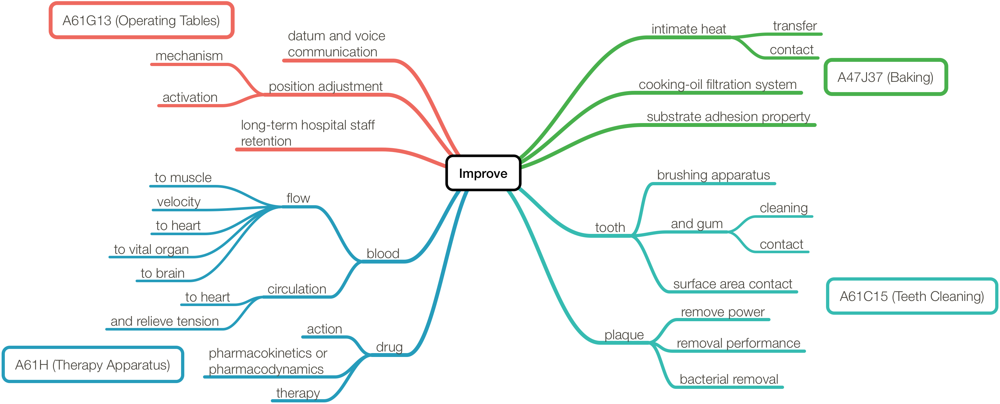

```

```{r processimagetest2, echo=FALSE, fig.align='center', fig.asp=.75, fig.cap='Sample of the tree based taxonomy extracted from the analyzed patent sets. The sample contains some of the leaves linked to the drawback clue Damage. ', message=FALSE, warning=FALSE, out.width='100%'}

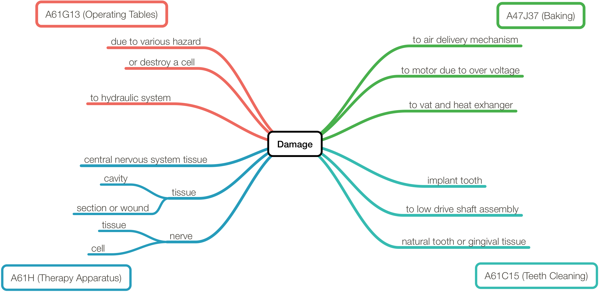

```

## Trademakrs

The market interest for both patents and trademarks has increased during the last decades, with a significant increase in filing for both types of Intellectual Property. The academia also took attention to patent data and trademark data, but with different and (almost) disconnected research approaches. Furthermore, the analysis of patents to study R&D is predominant while less attention has been paid to trademarks [@griliches1981market]. Indeed, very few are the works where patents and trademarks are investigated together and not generically cited together as parts of the intellectual property right framework.
Moreover cultural differences exist between United States and Europe (at least) and practical consequences can be observed in daily life: for example, even if Europe had an earlier and more enduring interest  in trademarking than the US the presence of the symbols ® and ™ in the product labels are more common in US than in Europe [@mercer2010reading].
The difference exists also from an industrial perspective, across different sectors [@baroncelli2004global]. Indeed, trademarks have their larger use worldwide in the R&D intensive scientific equipment, pharmaceuticals sector and advertising intensive manufacturing industries (clothing, footwear, detergents and food products). 

The present chapter studies the usage (if any) of _trademarks_ and _trade symbols_ within patent texts. The aim is to investigate possible indicators about IP strategies and innovation output utilizing information about the interlink between patents and trademarks. An additional goal is to understand if patent applicants makes a right use of trademarks and trade symbols when writing a patent document. 
The analysis clearly stands at the boundary between patent and trademark research areas, and since such intermediate territory has not been investigated in depth, there are several research questions we would like to answer. The starting point is a sheer numerical evidence: we have found out that, at the date of 01/09/2017, a total of 2.162.962 patents worldwide (for details about the database and its coverage see section 3) contain a trademark symbol. 
It is therefore a not negligible phenomenon, worth of investigation and that should provide interesting insights about the mechanisms and strategies that companies adopt at the frontier between technical innovation and marketing. 

#### The use of trademark symbols ™ and ® in patents from a legal perspective {-}

It is evident from our preliminary analysis that there exist an high number of patent documents containing a trademark indication. In the present section we investigate what is the legal perspective of this usage. 

In [@butler1969rules] the authors published a series of rules to standardize the use of trade terms in patents. They also specifies different rules in the case of use of trade terms in specifications and  the use of trade terms in patent claims. The rules are:

1- A trade term is properly used in a specification if those skilled in the art can make the product designated by the trade term at the time the application is filed, using the specification and/or published literature that is implicated by the specification.
2- A trade term is also properly used in a specification if the product is generally known to persons skilled in the art and is readily obtainable at the time the application is filed, provided the composition of the product is a trade secret and there is reason to believe that whenever the composition of the product is modified the trade term will also be changed.
3- A trade term is also properly used in a specification if it designates a component of the embodiment which is not essential to the invention.
4- A trade term can be used in a claim only if its meaning has been adequately defined in the specifications, whereby it imparts specific limitations to the claim.”

The second rule  is particularly interesting because it seems preventing early patenting or patenting before having produced and used a trade name. Rule number two is even more interesting since it contains a case of a product that is a trade secret used to build another product subject to patent application.

Similar guidelines are contained in the European patent convention [@hall2018impact].  Here is state that is not desirable to use trademarks or trade names if such words merely denote origin or where they may relate to a range of different products. Anyway trademarks could be used in patent application to satisfy  art.83, that  states that the application shall disclose the invention in a manner sufficiently clear and complete for it to be carried out by a person skilled in the art. In this case the product must be sufficiently identified, without reliance upon the word. A special case are such words that have become internationally accepted as standard descriptive terms and have acquired a precise meaning (e.g. "Bowden" cable, "Belleville" washer, "Panhard" rod, "caterpillar" belt). In this case they may be allowed without further identification of the product to which they relate. It is clear specifications afflicts the analysis that we want to carry out. 
Always in the same document are given also guidelines for the usage of trademarks in claims. These are, as expected, different from the specifications. For claims we have the problem that it may not be guaranteed that the product or feature referred to is not modified while maintaining its name during the term of the patent. They may be allowed exceptionally if their use is unavoidable and they are generally recognised as having a precise meaning.
It is the applicant's responsibility then to ensure that registered trademarks are acknowledged as such in the description. From that we can deduce that the presence of a trademark in patents and more specifically in claims decreases the reproducibility of the invention and thus the quality of the patent.
Also the the US patent legislation [@jaffe2000us] focuses on the use of trademarks in patents claims. Here the presence of a trademark or trade name in a claim is not considered improper but the examiner should  analyze the claim to determine how the mark or name is used. In fact, the trademark or trade name should identify a source of goods, and not the goods themselves. In this case the claim scope is uncertain since the trademark or trade name cannot be used properly to identify any particular material or product. In fact, the value of a trademark would be lost to the extent that it became descriptive of a product, rather than used as an identification of a source or origin of a product. Thus, the use of a trademark or trade name in a claim to identify or describe a material or product would not only render a claim indefinite, but would also constitute an improper use of the trademark or trade name.

Finally, in [@pressman2018nolo] the authors gives some guidelines on how to introduce trademarks when it is unavoidable. First,  the trademark should be capitalized and used as an adjective (not a noun), followed by the generic name of the product or service. Furthermore when referring to the trademark there should also be a reference to the trademark owner. 

### Methodology 

With respect to Users \@ref(usersresults) and to Advantages and Distadvantages \@ref(#advdrwresults) the process to extract tradenames from patents is trivial. The main activity performed are (for details aobut the activities see section \@ref(sotatools):

- Sentence splitting
- Tokenization
- Part-of-speech tagging
- Lemmatization

After that is is possibile to identify tradenames searching for the symbols ™ and ®.

### Results

The first investigation has the aim of understanding if the ™ and ® symbols has different content depending on different IPC [@wipo1] classes. The IPC classes are:  The main evidence in figure \@ref(fig:histtm) is that ® is used more than ™ in patent, with and average percent of presence of 7.4% and 5.6% respectively. The reason of this evidence could be that patents contains unregistered trademarks that are never converted to registered trademarks; another reason is the confusion between the ® and ™ symbol, usually considered as synonymous. Furthermore the writer will use the symbol only if he/she knows that the mark is protected, otherwise he/she will not indicate any symbols or will use ™ or ® without checking the right use. Another possible problem is that the word has become of common use and thus usually used without symbols. Furthemore, classes A (Human Necessities) and C (Chemistry; Metallurgy) clearly has more trade symbols than the other classes. 


```{r histtm, echo=FALSE, fig.align='center', fig.asp=.75, fig.cap='Histogram of the percentage of ® and ™ in patentes for each IPC class (limited to US patents). A (Human Necessities); B (Performing Operations; Transporting); C (Chemistry; Metallurgy); D (Textiles; Paper); E (Fixed Constructions); F (Mechanical Engineering; Lighting; Heating; Weapons; Blasting); G (Physics); H (Electricity).', message=FALSE, warning=FALSE, out.width='80%'}

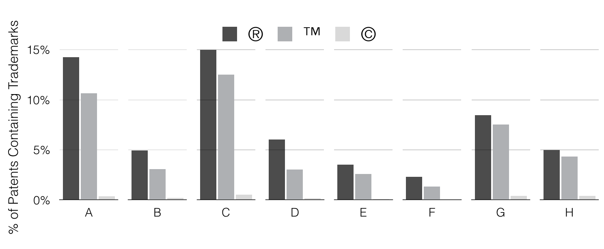

```

Secondly, from table \@ref(tab:ipcclassestm) it is evident that the average ratio is 6.4 for ® (the usage is 6.4 times higher in the year span 2007-2014 than the span 1995-2002) and 5.4 for ™ (the usage is 5.4 times higher in the year span 2007-2014 than the span 1995-2002) thus the usage of trade-symbols in patent is growing and the presence of ® is increasing faster than the presence of ™. From the present results is not possible to say if this effect is due to an higher quality of the process of patent application (and thus an higher awareness of applicant and examiner) or of a positive trend in trademark registration.
In particular for the IPC class E (fields constructions) the number of ® and ™ has increased 10.5 and 9.0 times respectively. This could be an evidence of the fact that the number of trademark in the field of fixed constructions is increasing.  

Table: (\#tab:ipcclassestm)  For each IPC class the ratio of the percentage of patents containing at least one ® or ™ character is computed for two patents sets 1995 to 2002 and from 2007 to 2014.
 
```{r ipcclassestmcode, echo=FALSE, fig.align='center', fig.asp=.75, fig.cap='', message=FALSE, warning=FALSE, out.width='80%'}

knitr::kable(
  readxl::read_xlsx("_bookdown_files/tables/table_trademarks_1.xlsx"), "markdown", booktabs = T
  )

```

#### The Selected Tradenames {-}

We a set of popular tradenames referring to [@morris2016trademarks]. Then we filtered the ambigouus ones (the one that can refer to surnames), because this can create an onverstimation of the number of patent citing it witouth the tradenames. The total namber of tradenames is 38 and these are: amazon®, blackberry®, bose®, budweiser®, chiquita®, chrome®, cocacola®, ebay®, facebook®, fender®, firefox®, gibson®, gillette®, heineken®, ibanez®, intel®, iphone®, kellog®, kodak®, lego®, marlboro®, matlab®, mcdonald’s®, nitinol®, nutella®, nylon®, photoshop®, polaroid®, postit®, powerpoint®, prozac®, sennheiser®, spotify®, teflon®, velcro®, whatsapp® and xanax®.

In figure \@ref(fig:tmlistcpmplete) are shown the number of patent containing the tradenames with and withouht ™ and ®; furthermore the information is divided for all the years, from 1995 to 2002 and from 2007 to 2014. 
In the previous analysis we noticed that ® is generally more used than ™. Now the goal is to understand if patent writers uses tradesymbols or not when citing tradenames, if there are any differences between different tradenames and if we can notice different behaviours in recent years. From figure \@ref(fig:tmlistcpmplete) is evident that despite the fact that it is mandatory to use ™ o ®, these symbols are not always used.


```{r tmlistcpmplete, echo=FALSE, fig.align='center', fig.asp=.75, fig.cap='Number of patents citing one of the 38 selected tradenames. The data are divided for any years, from 1995 to 2002 and from 2007 to 2014.', message=FALSE, warning=FALSE, out.width='100%'}


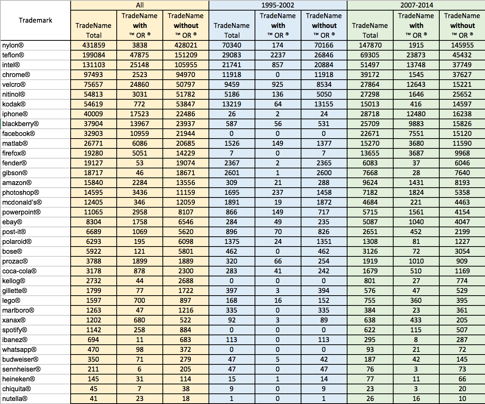

```

#### Tradenames Usage in Patents {-}

It is relevant to understand if there exists any difference between different tradenames in the correct usage of trade symbols (a trade name has been cited in the patent texts with the trade symbol). Figure \@ref(fig:tmcitedwell) illustrates in a bi-logaritmic plot the distribution of trade names correctly cited in patents with ® and ™ (Y-axis) versus the same trade names cited without using the proper symbol. Most of trade names are located under the diagonal. Those around the diagonal are those we can considered as well known trademarks and not so subject to genericization phenomena (green area). Conversely on the right we can find a read area where the ratio is even more shifted toward the absence of any indication of protected trademark. In the middle the orange area where many of the most famous trademarks fall down and that could be in phase of generalisation or conversely, since the trademark of a product is totally entangled with the owner (Iphone-Apple; Intel), inventors do not feel the reason to cite them as a trademark. 
A remark on Figure \@ref(fig:tmcitedwell) is necessary: the plot presents a correct measurement of trademarks with ® and ™ plotted in the y axis, while the search for trademark with missing trademark symbols in some case can introduce undesired errors and include other meaning of the word. Take for example the case of Blackberry®: the datum is referring to mobile phones and accessories or software applications. In all the cases where ® or ™ are correctly written, it is probably true that the inventor is referring to the Blackberry® mobile phones, but machines for jam or juice production extracted out of the blackberry introduce false positive examples. Similarly Fender is probably located too far on the right because it is also a part of a car, bike, motorbike, boat, etc.. and Gibson could introduce citations of works performed by someone called Gibson, therefore if cleaned results are necessary the searching strategies for the trademarks without symbols have to be refined. 

```{r tmcitedwell, echo=FALSE, fig.align='center', fig.asp=.75, fig.cap='Plot of the trade names correctly cited in patents with ® and ™ on the y-axis and the same trade names cited without using the proper symbol on the x-axes. Both axes are on a logaritmic scale.', message=FALSE, warning=FALSE, out.width='100%'}


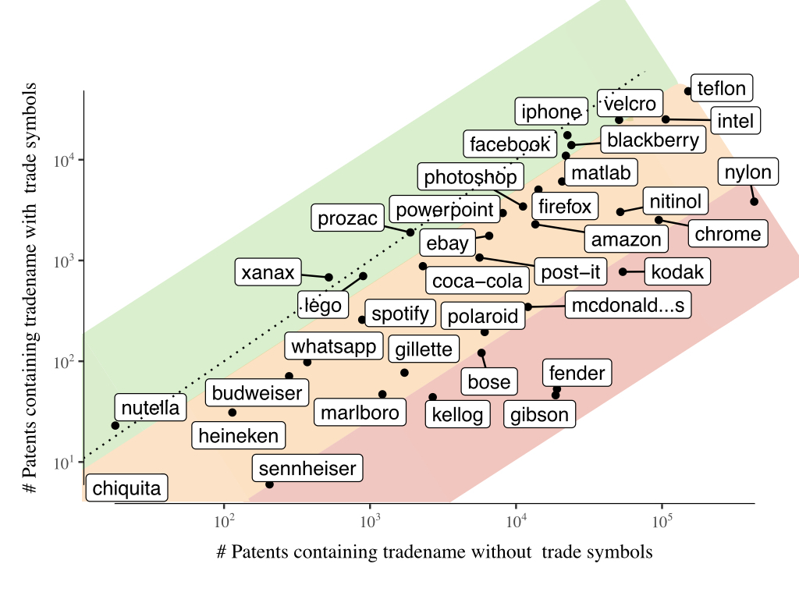

```

#### The Popularity of Tradenames in Patens {-}

In figure \@ref(fig:populartm) are plotted the trends of the numbers of patents that correctly cites a tradenames. We anlyzed 12 different tradenames, divided in couples: each couple belong to a similar sector. We make use of a generalized additive model fitting function to better analyze the results and to make more easily to understand and compare the two element of each pair. 

Each pair has been chosen to compare trademarks in homogeneous markets. Some of them shows: 

- (d, e) similar trends but different incidence; 
- (a, c) dissimilar behaviours (Amazon vs Ebay, Blackberry vs. Iphone: linear vs. exponential); 
- (f) similar results (e.g. Gibson vs Fender in the music market have almost the same behaviour and a reduced presence in patents)
- similar behaviour but shifted in time (e.g. Firefox vs Chrome). 


```{r populartm, echo=FALSE, fig.align='center', fig.asp=.75, fig.cap='Plot of the trade names correctly cited in patents from 2000 to 2014.', message=FALSE, warning=FALSE, out.width='80%'}


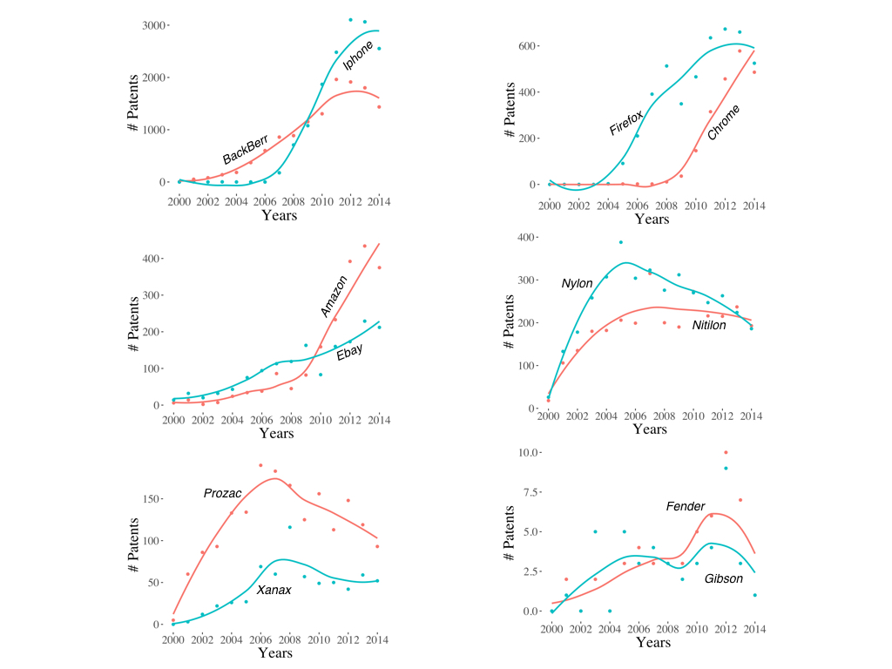

```


#### The Similarity of Tradenames in Patens {-}

Further informations can be derived by analysing the IPC classes where the patent have been chosen by the assignees-attorneys-examiners.The choice of a class is not only matter of market segment but rather of market use. Moreover it is necessary to remark that  from a formal point of view the IPC classes form a feature vector, denoted y ∈ N639. IPC classes form a complete dataset of 639 elements of such feature vector. Each tradename is represented in such a feature vector where the number of patents in each class constitutes the length of the vector along that direction (feature). Our training data is therefore D = (x,y,z), where x∈[1, .., 12], y∈[1, .., 639], and z represents the patent numerosity z∈[0..15*106]. This dataset contains information about how z varies as a function of x and y. The matrix is quite empty since each product/brand addresses needs of specific market/s, after cleaning of the totally empty columns the matrix reduces to the dimensions of 12x479 and demonstrates a correct choice of the trademarks since they covered almost 75% of the IPC space.

With such a dataset a series of computations can be performed: here we show the results of the correlation analysis among the chosen trademarks to analyse their relative positioning on the invention landscape (not only the market);
Correlation analysis is shown in Figure \@ref(fig:similartm). The matrix is triangular owing to the symmetry of the relationship.


```{r similartm, echo=FALSE, fig.align='center', fig.asp=.75, fig.cap='Heat-map of the IPC-based similiraties between trademarks.', message=FALSE, warning=FALSE, out.width='70%'}


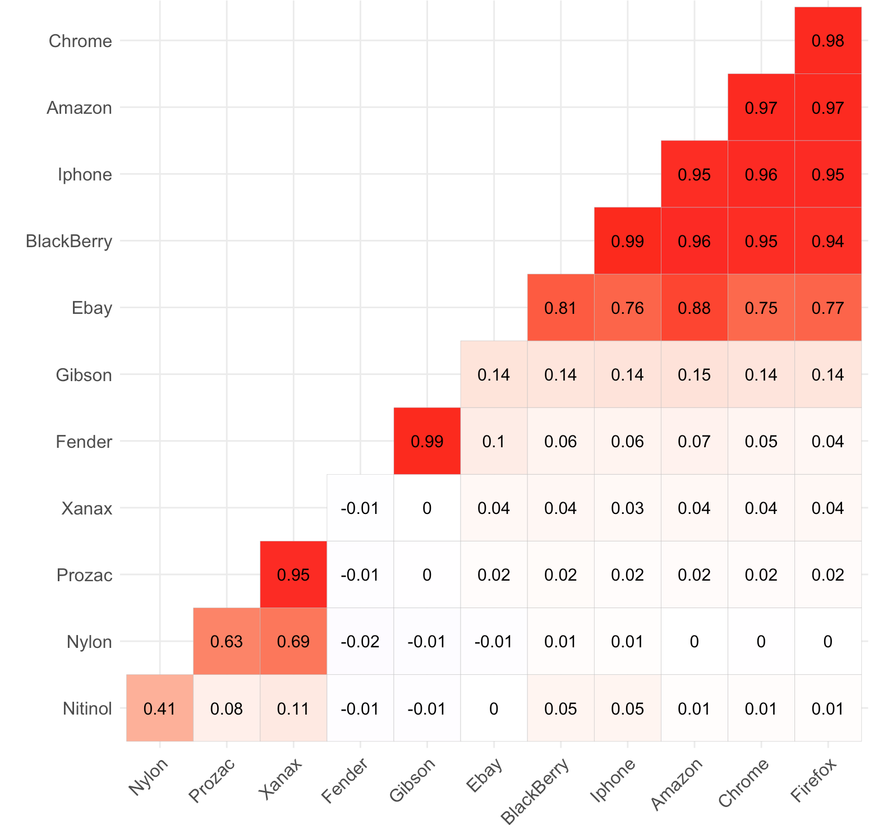

```

# Papers

There are fields (mature technologies) where patents anticipate papers, while in others (basic research) the opposite happens. For this reason, scientific literature is the place where companies and scholars gather information about the problems that researchers are facing in the development of new technologies. Anyway, standard approaches of knowledge extraction from papers requires skilled personnel, they are time consuming and lacks in reproducibility. 
Furthemore, the volume of scientific literature has grown rapidly raising an imminent question about how to extract knowledge from this source. On the other hand, this tehcnical knowledge if  managed, can be used to answer questions that 10 years ago would need the help of domain experts to be  answered. In the present section is shown how text mining techniques can help to unswer some of this questions.
In particular, it is an essential problem when different classification codes are used in order to organize scientific knowledge on a specific domain, becaues a specific categorization in a certain scientific field is missing. This leads to unnecessary complications in the researchers’ aims who want to quickly and easily find literature on a specific topic among the large amount of scientific publications, or want to effectivelly position a new research. Text mining techniques, and in particular topic modelling, can help scholars in solving this problems, if properly used togheter with domain expertise. 
A deeper description of what patents are and how these documents are used to mine technical knowledge can be found in section \@ref(sotadocumentspapers)


In this section we present two methodologies capable of automatically segmenting a knowledge field. These selected knowledge field are: sustainable manufacturing and block-chain. The results of the methodologies are described, togheter with example of applications. 

## Sustainable Manufacturing: an Analysis of the 6R Framework

One of the most important objectives of Sustainable Manufacturing (SM) is developing innovative and viable engineered materials, manufacturing processes and systems to provide multiple life-cycle of products. In SM the old concept “from cradle to grave” is now transforming into “from cradle to cradle” [@jawahir2016technological], tending toward multiple product life-cycles or even a “near-perpetual” product/material life. 
Scientific contributions in the sustainable manufacturing field mostly deals with energy and resource consumption. In this respect, two different main fields of causes can be identified: the process level and the material efficiency one. As a matter of facts, manufacturing processes have a significant role also in putting in place material efficiency strategies [@ingarao2017manufacturing].  As far as the processes are concerned, a first classification of research contributions was discussed in the CIRP General Assembly [@duflou2012towards]. There the authors state that research in manufacturing field, oriented to environmental impact reduction, can be clustered in 5 main sub-classes: 

1. unit process level (Individual device or machine tool in the manufacturing system)
2. manufacturing system level,
3. facility, 
4. multi-factory system up to considering the whole 
5. supply chain level. 

Another review paper was presented at the ASME international manufacturing science and engineering conference [@haapala2013review]. In that paper the authors scrutinize the research papers focusing more on the differentiation between manufacturing processes and manufacturing system.
Considering the process level, Ingarao [@ingarao2017manufacturing] clustered the scientific papers in 4 subsections: 
1. effect of process parameters
2. role of machine tool architecture and related technology
3. applied process
4. manufacturing approach selection.

As concerns material efficiency options, a framework is presented by [@allwood2014squaring]. The authors there provide strategies within three main classes corresponding to principles: reduce, reuse and recycling. Within each class guidelines for material efficiency practices are detailed.
As concerns material efficiency options, a framework is presented by Allwood [@allwood2014squaring]. There the authors provide strategies within three main classes (i.e. principle): reduce, reuse and recycling. Within each classes guideline for material efficiency practices are detailed.
A good framework of all the possible reuses of materials is provided by Coopper [@cooper2012reusing]. In this research the authors identify four main reuse strategies for metals: Remanufacture, Reshape (applying metal shaping processes, additive, subtractive, mass conserving) to obtain a new geometry, Relocate: (recovering component and applying little refurbishment, components reused in the same type of products), Cascade: recovering component and use it in another less demanding use (downgrading).
The role of manufacturing processes in putting in place material efficiency/reuse strategy was also outlined by Ingarao [@ingarao2017manufacturing]. In fact, manufacturing processes deserve to be considered as means for enabling material efficiency strategies. SM may be pursued by several strategies, such as re-designing and/or even changing manufacturing practices to conceive new-generation products, as well as by creating a closed-loop of environmentally-friendly material flow.  

#### The 6R Framework {-}

All the life-cycle stages of the product development (namely, design, production, use and post-use) should be considered carefully, with a particular attention to the design phase. This represents the real difference introduced by sustainable manufacturing concept with respect to traditional manufacturing, to lean manufacturing or even to green manufacturing, precursors of the SM. In a word, SM paradigm embraces those principles belonging to the 6R framework, namely: Reduce, Reuse, Recycle, Recover, Redesign and Remanufacture. The latter three principles where not included into the previous 3R framework.  To a certain extent, it appears that the better definition of sustainability for any manufacturing operation provided so far is the extent to these principles are applied. This statement justifies because in the search to find a common rationale behind the mess of SM applications, one possible way is to find common roots in the principles that inspired the same applications: namely principles, which allows to the decision maker either an effective way to search for new sustainable solutions or to a certain extent measure the “degree of sustainability”. The higher the number of principles that are satisfied, the higher the potential positive impact on sustainability can be for a given adopted solution.  In this sense, far from stating that the 6R framework is a widespread and commonly adopted metric of SM, the starting assumption in this paper is that 6R is the only approach, to the author’s knowledge, that provides a criteria of classification and selection of solution, and thus indirectly to provide a clear definition of what a SM application may look like.
The true question nowadays is _if the 6R framework may capture the essence of SM_, provided that it is really critical to clearly define the SM paradigm rationale to the scientific community. This paper aims to stimulate the reflection from the Italian perspective to this point, with a particular concern to the production technology side, by using an automatic classification of papers within the 6R framework and then by benchmarking approaches followed by the Italian Technologist research-network SOSTNERE on SM issues. 

Sustainability (from sustain plus ability) refers to the set of properties of a given system (either natural or artificial), which allows the same system to maintain itself for an almost indefinite period of time. This concept was officially introduced in a document of the World Commission on Environment and Development (WCED) entitled “Our Common Future”, where the Sustainable Development was defined as follows: _"Sustainable development is development that meets the needs of the present without compromising the ability of future generations to meet their own needs "_[@wced1987world]. Starting from this general definition, further conceptualizations have been produced for manufacturing activities and/or processes, as here briefly recalled. According to the Organization for Economic Co-operation and Development, Sustainable manufacturing is a formal name for an exciting new way of doing business and creating value. Different statements of sustainability in literature ^[http://www.trade.gov/green/sm-101-module.asp] share the same focus on the following three aspects: economy, environment and society. It is thus possible to summarize from the literature analyzed a possible definition for sustainable manufactured processes/products, according to the following set of prescriptions:

- (-) minimize business risk;
- (-) minimize negative environmental impacts;
- (-) conserve energy and natural resources;
- (-) are safe for employees, communities  and  consumers;  
- (-) are economically sound;
-	(+) a new way of creating value;
-	(+) are socially and creatively rewarding for all working people;
-	(+) providing access to basic services, green and decent jobs and a better quality of life for all ;
-	(+) adopt sustainable infrastructures.

where the (-) sign stands for those prescriptions oriented to preservation of resources without any significant change of the present condition, while the (+) sign indicates those prescriptions aiming at ameliorating/modification of the trends with respect to traditionally manufactured processes/products. To summarize simplifying, sustainable manufacturing is all about minimizing business risks of any manufacturing operation while maximizing the new opportunities that arise from improving processes and products.  
Fascinating in principle, these general statements are really difficult to deploy into real operations and production settings. The focus of the present analysis is to derive a clear definition of the concept of manufacturing sustainability based on clear and paper based evidences, rather than referring to general ethical or social principles, which appear to be a __top down__ definition. Conversely, information extracted from all the scientific papers available on SM can provide a sort of __bottom up__ statement. Evidences are relevant words and short concepts that can be related to sustainability, as it will be explained in the following paragraphs by also providing some sound examples from the italian point of view.

### Methodology

In this section, we describe the process involved to analyse the papers in the sustainable manufacturing field. To give a more detailed vision of the topic, we consider this field divided in 6 sub-classes (one for each principle), adopting the well know 6R framework. The goal of the process is both to identify which the topics in each of the 6R are, then to accurately measure the way this framework corresponds to the topics of sustainable manufacturing.
As seen in the flowchart of figure 1 the main activities of the process are four: Paper manual classification, Automatic Keywords Extraction, Keywords manual selection and Clustering. Each activity will be described in the next subsection.

#### Assignment of 6R principle meanings {-}

The first critical issue is the selection criteria of 6R principles for the assignment. This was done by trying to assign a semantic specification of each R principle, as below explicated, built by summarizing all the possible definitions and concepts extracted by the selected bibliography (partially cited in the present paper). The semantic specification provided below refers to the functional scope of each class, intended as an activity to be performed.

```{r wfsm, echo=FALSE, fig.align='center', fig.asp=.75, fig.cap='Flowchart of the 6R papers analysis process. The white boxes represent the activities and the yellow boxes the predicted documents. In the figure are also highlighted the input and the main outputs of the process.', message=FALSE, warning=FALSE, out.width='80%'}


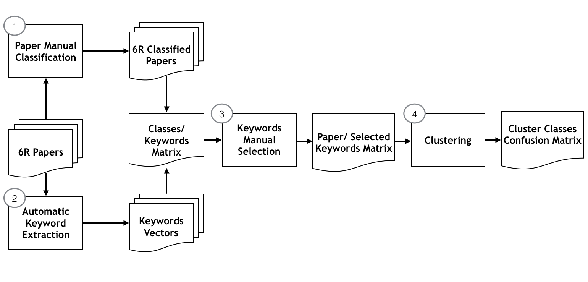

```

__Reuse__

Reuse is the action or practice of using something again, whether for its original purpose (conventional reuse) or to fulfill a different function (creative reuse or repurposing). Reuse involves taking, but not reprocessing, previously used items in order to save time, money, energy, and resources. In particular reuse is useful for machineries, especially when they are expensive, and for their components. Besides, technologies can be also reused and readapted to different situations. In addition, reuse is important because it minimizes disposal needs and costs.

__Reduce__

In pre-manufacturing it is possible to implement the reduction minimizing the use of resources. During the production phase, it refers to the use of energy and material, for example, it may involve the use of lower cost materials, the elimination of unnecessary product characteristics, the reduction of overhead costs or the readjustment of product processes. It implies a decrease of costs. As a consequence, the derived effect of this principle is to minimize and optimize performance in terms of cost, time and waste and it focuses primarily on the first three stages of the four life cycle of the product before recalled.

__Recycle__

Recycle involves the process of converting material that would otherwise be considered waste, into new products and it corresponds to the breaking down of used items to make raw materials for the manufacture of new goods. Recycling can prevent the waste of potentially useful materials and reduce the consumption of fresh raw materials, thereby decreasing: energy usage, air pollution (from incineration) and water pollution (from landfilling). Recyclable materials include many kinds of glass, paper and cardboard, metal, plastic, tires, textiles and electronics.

__Recover__

Product recovery operations refer to operational processes (e.g. disassembling, sorting and cleaning) on products at the end of their use, in order to make them usable in n subsequent life-cycles. Differently from recycling, the product life-cycle is shortened, skipping all that phases of retreatment of wastes up to their second use. The risks of implementing product recovery operations is the uncertainty of returned product quality and quantity and for this reason recovering activities have only recently been considered in manufacture.

__Redesign__

The redesign activity involves the act of redesigning the next generation of products, which would use components, materials and resources recovered from the previous life-cycle or previous generation of products. It refers to the evaluation of ideas turning them into concrete innovative products obtained from products in their post-use phase.

__Remanufacture__

Remanufacture involves the re-processing of used products, to restore them to their original like-new state through the reuse of as many parts as possible without loss of functionality. It includes and exceeds the activity of recovering, because a remanufactured product should match the same customer expectation as a new one.

Despite this initial classification, some problem occurred for experts in assigning the papers to the different classes, due to the absence of the formalization that is needed to define unique criteria of belonging. This fact brought to the unbalance of the number of words within each class (corresponding to each principle), that drove to the fuzziness of the training set and, as a consequence, the difficulty in performing a real classification of scientific papers.
This is the first critical issue of the followed approach so far, that may be overcome by alignment sessions of the decision makers.

#### Automatic Text analysis and Keywords extraction {-}

In order to analyze the information coming from scientific papers belonging to topics encompassed within the 6R framework, we exploit text mining techniques, which employ methods from different fields of data mining to extract meaningful information 8. The second activity in our analysis process is thus devoted to transforming the set of papers in a set of numeric vectors to be elaborated by the clustering algorithm. To this aim, some text mining techniques are applied in sequence 12 to automatically extract meaningful information and knowledge from unstructured texts.
The text mining process performed is summarized in the following. First, the information content of the
document is converted into a structured form (vector space representation). In fact, most of text mining techniques are based on the idea that a document can be faithfully represented by the set of words contained in it (bag-of-words representation 9). According to this representation, each document j of a collection of documents is represented as an M-dimensional vector, where M is the number of words defined in the document collection, and w(tji) specifies the weight of the word ti in document j. The simplest weighting method assigns a binary value to w(tji), thus indicating the absence or the presence of the word ti, while other methods assign a real value to w(tji).

In the following, the text mining steps performed are described (for details aobut the activities see section \@ref(sotatools):

- _Tokenization_ is the first step of our text mining process, and consists in transforming a string of characters into a string of processing units called tokens that could be syllables, words, or phrases. Typically, with tokenization other operations are performed with the aim of making the text cleaner. Such operations are the removal of punctuation and other non-text characters, and the normalization of symbols (e.g., accents, apostrophes, hyphens, tabs and spaces). In the proposed system, the tokenizer removes all punctuation marks and splits each text into tokens corresponding to words, bigrams and trigrams.
- _Stop-word filtering_ consists in eliminating the words which provide little or no information to the text analysis, or that, in our case, could make the clustering process fuzzier. Common stop-words belong to certain part of speech classes, such as articles, conjunctions, prepositions, pronouns, etc. Other stop-words are those that typically appear very often in sentences of the considered language (language-specific stop-words), or in the set of texts being analysed (domain-specific stop-words). In our case, this second group consists of typical words of the scientific articles such as "paper", "state-of-the-art", "present work”.
- _Stemming_ is the process of reducing each word (i.e., token) to its root form. The purpose of this step is to group words with the same theme having closely related semantics. In the proposed system, the stemmer exploits the Snowball Stemmer for the English language, based on the Porter’s algorithm.
- _Feature representation_ consists in building, for each text, the corresponding vector of numeric features. Indeed, in order to cluster the texts, we have to represent them in the same feature space. In particular, we consider the F- dimensional set of features corresponding to the set of relevant stems.

#### Manual keywords selection {-}

Keyword selection procedure was performed by hand from a team of 4 experts in the scientific field of sustainable manufacturing and with consolidated expertise on research and innovation. In order to prevent misunderstandings and difference in the judgement, a preliminary analysis of the single attitudes to classification was statistically performed and misalignment were eliminated by a guided training, based on the contemporary evaluation of a same sample from different experts so as to align the judgement. This process was done, as above mentioned, based on the 6R explicit framework and sharing the meaning of each principle.

It is clear that assignment of keywords to classes is not a trivial task and susceptible of interpretation. Disambiguation process would be required to explain the criteria of affinity to a given class, hopefully by referring to the functional scope of each class. Still an ambiguity may result, which can hardly be removed without a more profound specification with appropriate examples, which is out of the scope of the present paper.

According to this procedure the 6R refer to the following keywords:

- _Recover_: recovery, planning processes, renewable resources, new approach, waste recovery; process scrap recovery; energy recovery; heat recovery; collection; separation; design for environment; material recover optimization; recovery logistics;
- _Recycle_: recycle, adhesive technologies, materials conversions, government regulation; (Advanced) recycling technologies; Recyclability; End of first life; Down cycle; New/Old process scraps; Material scraps; Landfill taxes; Recycling benefit awarding; Secondary material production; Embodied energy saving; Environmental legislation
- _Redesign_: machining, cutting, lubrication, environment technologies, cryogenic; Material-efficient design; Design for Environment; New Materials; Eco-friendly design; Eco-friendly materials; Material reduction; Light- weighting; Design for Disassembly
- _Reduce_: reduce, optimize, waste minimization, consumption, energy payback, pollution, reduction, emission, saving; Energy reduction; Waste reduction; Resource reduction; Material usage reduction; Process sustainability optimization; Energy efficiency; Heat efficiency; Manufacturing efficiency; Doing with less;
- _Remanufacturing_: remanufacturing, material processing, eco-efficiency, renewable, innovations, nanocomposites; Product renewal; Product upgrade; Reconditioning; Part replacement; Modularity; Disassembly; Inspection; Separation; Re-Assembly; Design for Remanufacturing
- _Reuse_: reuse, replacing, material flow analysis, eco-efficiency; Component reuse; product re-conditioning; product upgrade; non-destructive recycling; reuse supply chain; product maintenance; product repair; product monitoring;

It is clear that the keyword extraction is not a trivial task, since the outcome of the process may range from a useless single word to a meaningful group of combined words that, on the other hand, could become too specific to be significant for the training set of the search engines.

#### Paper Clustering {-}

Document clustering is the application of the general process of cluster analysis to texts. The practical
applications of document clustering systems are several and vary from automatic document organization to automatic topic extraction. For further details see section \@ref(sotatoolsmodelnetanal). Independently from the kind of algorithm, before the clustering phase, each document has to be represented as a set of features. These features are typically the n-grams contained in documents, so a critical activity for clustering effectiveness is the n-grams extraction (or feature selection). This goal is achieved with a series of sub-activity. These are typically tokenization (the process of parsing text data into smaller units), stemming and lemmatization (reducing all tokens to its semantic base), removing stop-words (less important words), and finally computing term frequencies (or other measures of the relationship between documents and words).

To get an exploratory view of the degree of precision with which the 6R framework represents the papers in analysis, the manually classified documents were clustered using a clustering Spherical K-Means Clustering algorithm [@buchta2012spherical]. We will then compare the output of the algorithm with the manual classification in the following paragraph.

Spherical k-means exploit cosine dissimilarities to perform prototype-based partitioning of term weight representations of the documents. Prototypes are centroids defined in the same feature space of the documents. The aim of the algorithm is to minimize, given a set of objects (documents in our case) and prototypes described in the same features space (the selected keywords) the cosine distance between each element and the closest prototype. This implies that the output of the algorithm is a membership matrix, in which each document is assigned to a certain prototype.

### Results

In the present section, we describe the output of the application of the methodology described in section \@ref(smtextdrivenbottomup) on the 339 selected scientific papers on sustainable manufacturing extracted by the query "sustainable manufacturing" in the paper search field of the SCOPUS® database. Accordingly, apart the deliberate selection of the source database, no other filter was applied in the journal selection and this guarantees the significance of the journal sample selected. The main output, as highlighted in Figure 1, is the distribution of documents among the 6R principles (i.e. classes) as manually classified, the automatic keywords representations of the classes and the outputs of the clustering algorithm (which is an unsupervised assignment of the documents) compared to the manual classification.

The assignment of a paper to a class was made by recognizing the application, or tools or scope of the paper to one 6R’s principles. In this sense, for instance, a paper belonging to a recover might have as scope, or keywords or approach or an activity performed with the principal task to assure the recovery of a give good. It is thus clear, from the beginning, how complex may be to recognize just one principle more than a multiple possibility to satisfy more principles. This fact will be discussed in the followings.

#### Distributions of documents among the 6R {-}

The main point coming out from the histogram in Figure \@ref(fig:smhistogram) is that the distribution of scientific papers assigned to the 6R principles (classes) is not homogeneous. If the four classes Reduce, Recycle, Redesign and Remanufacture collect a comparable number of papers, the other two (Reuse, Recover) are poorly represented. One possible explanation of this is that cases of reuses or recoveries are less generalizable compared to other “R”, and thus potentially less interesting for conferences and journals. Recovery and reuse, in fact, often refers to specific functions embedded into the product, and finding a general rule for assessing or designing such processes might be more difficult. They rather might find room in technical magazines, not included in the present analysis as concern processes. It worth noting that reuse and recover here refers to product and not explicitly to materials. Different approach concerns the design for reuse, which to a certain extent would belong to remanufacturing, as in the most of papers discussed, to mention a few, in the Annals of CIRP 18,19,20. It is difficult to think that the classification criteria, which plays a critical role into the assignment to classes, contributed to this situation, depending on the meaning assigned to each principle. Whether a different combination of classed have been provided, a different histogram would be expected to appear.

```{r smhistogram, echo=FALSE, fig.align='center', fig.asp=.75, fig.cap='Histogram of the number of papers manually assigned to each of the 6R principles.', message=FALSE, warning=FALSE, out.width='80%'}


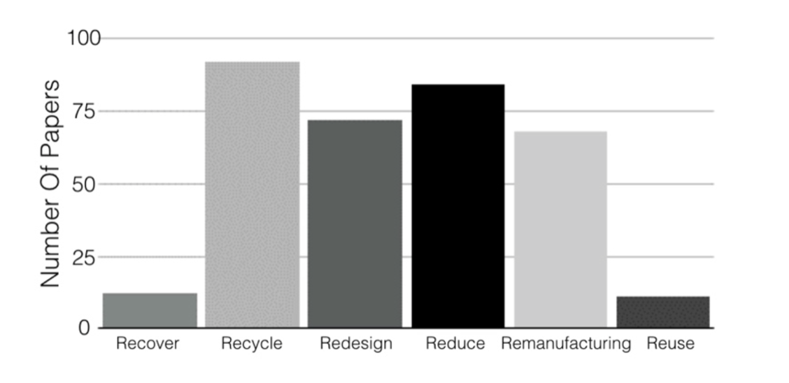

```

#### Keyword vector representation of 6R {-}

After the phases of automatic keyword extraction and manual keyword selection, we derived the paper/selected
keywords matrix. A sample of the elements of this matrix (keyword and their occurrency) is:

- _Recover_: Life cycle 5, environmental impact 4, raw material 3, cycle assessement 3, tossii fuel 3, energy payback 2, cleaner products 2, energy cost 2, energy usage 2, pv System 2, product process 2, managements System 2, new technologies 2, energy save 2, climate change 2, risk assessements 2
- _Recycle_:lite cycle 40, environmental impact 31, waste management 30, resource conservation recycle 25, solid waste 21, lite cycle assessement 18, recycle material 14, recycle process 12, reuse recycle 11, electronic equipement 11, global warm 9, waste disposai 9, heavy metal 8, environment friendly 8, waste treatment 8, waste stream 8
- _Redesign_: manufacturing process 20, lite cycle assess 19, sustainable manufacturing 17, machine tool 14, naturai gas 14, cutting tool 13, raw material 13, tool life 13, cutting fluid 13, tool wear 13, mechanical engineering 12, System boundaries 11, machining process 11, manufacturing System 11, cutting speed 11, cutting zone 10
- _Reduce_: life cycle 40, environment impact 38, energy consumption 31, life cycle assessment 28, energy usage 22, energy requirements 18, solar energy 15, cleaner product 13, global warm 13, climate changes 12, solid waste 12, gas emission 11, solar celi 11, cutting conditions 11, co2 emissions 10, environmental management 10
- _Remanufacturing_: sustainable manufacturing 28, manufacturing process 22, remanufacture product 18, supply chain 16, new product development 16, climate change 12, business model 12, product remanufacturing 12, manufacturing System 11, environmental performances 10, remanufacturing industry 10, management System 9, waste generation 9, design for environment 9, remanufacture and recycle 8, automotive industry 7
- _Reuse_: life cycle 7, environment impact 7, energy usage 4, mechanical engineering 4, industriai ecology 4, cleaner product 3, life cycle assessement 3, environment management 3, design for manufacturing 3, environment protection agency 3, waste management 3, united nation 3, environment management System 2, process design 2, sustainable manufacturing 2, green chemistry 2

The keywords were divided according to the 6R principles (i.e. class), listing the number of the paper belonging to each class.The sample list of keywords and their occurrency, reflects the distribution of figure \@ref(fig:smhistogram) and cannot thus be significant for classification but only for clustering purposes at the present.

#### Clusters/classes confusion matrix {-}

To analyze from a semantic dimension how well 6R framework represent sustainable manufacturing definition through the scientific papers considered, the manually classified documents were clustered using a clustering Spherical K-Means Clustering algorithm. The results (the assignments of each paper to a cluster) was then compared with the manual classification. The number of resulted clusters was 6, having this number of clusters no specific relation with the number of 6R classes. The output of the clustering process is thus a 6x6 Matrix (Class(row)/Cluster (column)) shown in Figure \@ref(fig:clusterssm). Numbers in the cells of the matrix represents centroids that can be characterized by the related keywords.

```{r clusterssm, echo=FALSE, fig.align='center', fig.asp=.75, fig.cap='Matrix: comparing the manual classification and the clustering output.', message=FALSE, warning=FALSE, out.width='60%'}


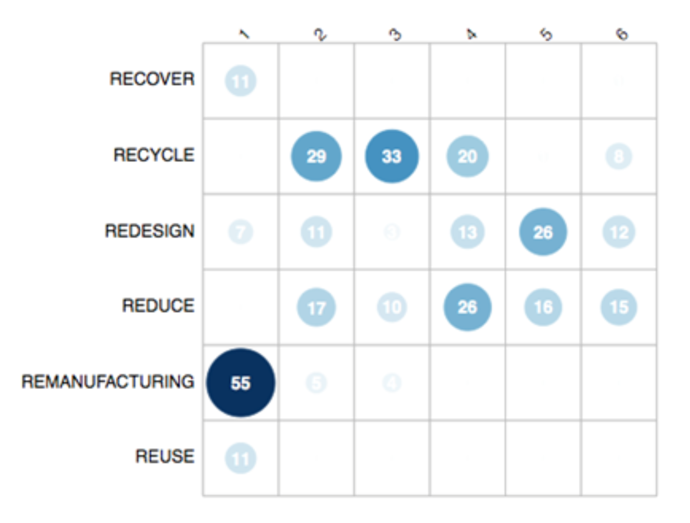

```

## Sustainable Manufacturing: An Extended Mapping

The methodology described in section \@ref(smtextdrivenbottomup) has been then re-adapted to give an extended anlysis of the 6R framework from a bottom-up perspective. In the present section, we map the state of the art of Sustainable Manufacturing using topic modelling, a widely used text mining techniques. The aim is to give a broad overview of how this knowledge field is approached world-wide and then, in section 3, to have a deeper look at the Italian way to sustainable manufacturing.

### Methodology

The process of topic extraction is composed by the sequent activities:

1.	_Papers Collection_
2.	_Keyword Extraction_
3.	_Topic Modelling:_ Number of topic selection
4.	_Topic Modelling:_ LDA Model fitting
5.	_Manual topic labelling_

Each activity is described in the sequent sections. 

#### Papers collection {-}

The analysis starts form a corpus of papers on sustainable manufacturing. The papers were downloaded from the Scopus database searching for the query: 

\begin{equation*} 
  TITLE-ABS-KEY("sustainable.*manufacturing")
\end{equation*} 


At the date of 29/05/2018 the query results in 1,628 documents.

#### Keyword extraction {-}


We represent each article as a set of keywords, merging Author Keywords and Index Keywords. The keywords are then “sanitized” following the sequent rules:

-	Eliminate duplicated keywords
-	Eliminate brackets and its content 
-	Substitute non-alphanumeric character with a blank space 
-	Merge synonyms, alternative spelling and keywords pointing to similar concepts
-	Eliminate scientific literature specific keywords like “article” and “review” 
-	Filter the generic keywords. The metrics for the threshold is the percentage of papers that contains the keywords. The value has been set to 7.5%.

Finally, we compute the Keywords Term Matrix. The matrix is composed of 1,628 documents and 26,272 keywords.
Having a mathematical representation of the documents allows us to apply standard mathematical techniques to them.

#### Number of Topic Selection {-}

The goal of the present section is to compute a topic model based on the keyword representation of the papers. A topic model allows examining a set of documents and discovering, based on the statistics of the words in each, what the topics might be and what each document's balance of topics is. To deploy it for the purposes of the present paper, keywords will cluster to form a topic: each topic will represent a different view (say, principle) of sustainable manufacturing.  This approach brings a new perspective to the definition of sustainable manufacturing with respect to the 6R’s framework.

To compute the topic model, we use the Latent Dirichlet Allocation (LDA) algorithm.  To select the number of topics for LDA, the most efficient and effective way is to calculate multiple metrics of the quality of the results in function of the number of topics. All existing methods require to train multiple LDA models to select one with the best performance. Several approaches tried to take the problem of automatically finding the right number of topics contained in a set of documents. Every approach follows the idea of computing distances (or similarities) between pair of topics varying the number of topics.  We used four different methods to evaluate the output of a topic model for different value of k. These methods are:

-	Caojuan2009 [@cao2009density]: Minimize the average cosine distance between every pair of topics. The best topic number K has a minimal final distance between topics in Latent Dirichlet Allocation
-	Arun2010 [@arun2010finding]: Minimize the symmetric KL-Divergence of the salient distribution that are derived from the matrices of factors. These matrices are the re-projections of the documents on the topics and of the topics on the vocabulary (the selected tokens). The divergence values are higher for non-optimal K values.
-	Griffiths2004 [@griffiths2004finding]: Maximize the likely of the data given the model built considering K topics. This is a problem of model selection using Bayesian statistics.

```{r topicnumsm, echo=FALSE, fig.align='center', fig.asp=.75, fig.cap='Relationship between the measures of the quality of the topic modelling output and the number of topics.', message=FALSE, warning=FALSE, out.width='60%'}


knitr::include_graphics("_bookdown_files/figures/Griffithsetc.pdf")

```

We computed these for measures fitting a LDA model for every K between 2 and 20. We choose the higher value because we wanted to obtain a reasonable number of topics representing the concepts (or we may say, principles) behind sustainable manufacturing. The results of the analysis are shown in figure \@ref(fig:topicnumsm). From this figure is evident how the measure we want to minimize intersect each other at a value between 11 and 12 topics. We thus decided to visualize the results of the LDA models for a number of topics k between 7 and 15: the expert panel interviewed then allowed to decide that the best results was at 12 topics. 

### Results

We then extract the one-topic-per-term-per-row probabilities, beta. Beta measures what is the probability for each topic to produce a term. Figure \@ref(fig:topicpicture) shows the top 5 terms for each topic. Here each topic has a different vertical position and a different color. Each topic is represented by a set of keywords and each keyword has a different position on the y axes. For each intersection topic/keyword, the dimension of a circle represent beta (what is the probability that topic to produce that term). It is possible for some keywords to belong to multiple topics: for example, optimization belongs to topic 1 and 9. It is easy to spot these keywords because typically (belonging to two different topics) are far from the group of keywords of the topics they belong. 


```{r topicpicture, echo=FALSE, fig.align='center', fig.asp=.75, fig.cap='Content of the 12 topics. Each topic has a different vertical position and a different color. Each topic is represented by a set of keywords and each keyword has a different position on the y axes. For each intersection topic/keyword, the dimension of a circle represent beta (what is the probability that topic to produce that term).', message=FALSE, warning=FALSE, out.width='100%'}


knitr::include_graphics("_bookdown_files/figures/geom_point_topic.pdf")

```


#### Manual Labelling of the topics {-}

To have a clearer representation of the topics, these were manually labelled by 6 independent experts in the field of manufacturing and sustainability. Then a seventh experts took in input the results of the manual naming and synthetized the label.  The final results are the names of the 12 topics. These names are: 

1.	Smartness for Sustainability 
2.	Sustainable Machining
3.	Manufacturing Environmental Efficiency
4.	Modelling Manufacturing Sustainability
5.	Welding Sustainability
6.	AM Sustainability
7.	Life-cycle Product Management
8.	Advanced Material Sustainability
9.	Production Management for Sustainability
10.	Sustainable Energies
11.	Innovation for Sustainability
12.	Sustainable Logistic

This final picture provides a clear representation of how topics recognized are mostly homogeneous, provided there are few outlier keywords per each topic, as in figure \@ref(fig:topicpicture). This “new perspective” of sustainable manufacturing represents a way of defining its contents by the grace of the tools or domain of interest involved. For instance, topic n.1 (smart sustainability) refers to the use of the new group of tools and approaches belonging to the Industry 4.0 stream, thus defining specific contents and criteria useful to pursue the sustainability in manufacturing.

## Blockchain

In section \@ref(advdrwresults)  has been proposed a new usage of sentiment analysis to extract advantages (considered synonym of the words benefit, gain or profit) and disadvantages (drawback, failure) of technologies from patents with the aim of helping researchers and designers to effectively develop new products, analyzing positive and negative properties of an innovation. The main contributions of the present analysis is to list the problems of a technological field using this sentiment tool. We want to understand which are the problems that research is trying to solve for a technology and if is there any focus from researchers on the solution of certain technical problem. Furthermore using text mining techniques it is possibile to correlate these problems between them and understand if is there any correlation between problems of technologies and if this map help researchers and companies to understand the research agenda.

This section thus proposes an innovative methodology for the (semi-automatic) extraction of technical knowledge from academic articles, using text mining techniques. Among many information related to technical knowledge, thw methodology focus on the collection and the analysis of the problems of a technology. The meaning of problems of a technology is related to the concept of disadvantages of a technology but with a broader sense. In fact, using papers as a source makes it possible to collect not only technical disadvantages (typically described in patents) but also, organizational, business or even social problems, since these are faced by different intellectual fields in the scientific literature.
We also propose a case study on the application of the method to the field of _block-chain_. We chose this technology because:

- It is highly innovative 
- It is having an impact in many different field 
- The problems of this technology are both technical and managerial

#### How Blockchain Technology Works {-}


The blockchain can be exemplified as a process in which a set of subjects shares computer resources (memory, CPU, band) to make available all private users in which each participant has a copy of the data.

The use of cryptographic validation techniques generates the mutual trust of the participants in the data stored by the blockchain, which makes it comparable to the registries managed in a centralized manner by recognized and regulated authorities (banks, insurance companies, etc.) [@pilkington201611].

A blockchain is an open and distributed register that can store transactions between parties in a safe, verifiable and permanent way. Once written, the data in a block can not be retroactively altered without the modification of all the subsequent blocks, and this, due to the nature of the protocol and the validation scheme, would require the consensus of the majority of the network. [@iansiti2017truth]

The blockchain is a continuously growing list of records, called blocks, which are linked to each other and made safe by the use of cryptography. Each block in the chain contains a hash pointer (that is a link to the previous block), a timestamp and the transaction data.

The distributed nature and the cooperative model makes the validation process robust and secure, but it has considerable time and costs, due in large part to the _price of the electricity_ needed to validate the blocks [@underwood2016blockchain]. Authentication takes place through mass collaboration and is fueled by collective interests. The result of all this is a robust workflow where participants' data security expertise is not required. The use of this technology also makes it possible to overcome the problem of the infinite reproducibility of a digital asset and of the double expense without using a central server or an authority. [@karame2012double]

There exist an overtrust about blochain technology for businesess, and there exist a growing interest about the drawbacks of this technology [@eyal2018majority; @lin2017survey; @yli2016current]. Has been pointed out that a 51 percent attack 26 would be enough to access or control a private blockchain because, in most cases, the organization that controls it already controls one hundred percent of the block creation. In fact, if someone could attack or damage the blocking tool on a private company server, would be possibile to get complete management of the network and the ability to access and modify the data [@hampton2016understanding]. This is because the centralization due to the privatization of the blockchain leads to a single point of failure, or a central break point, which in a public blockchain could not happen as distributed, so there would be no central point to attack. This could have profound implications in financial crises or debt crises like the 2007-08 financial crisis.
 
### Methodology

Considering our objectives, the approach we adopted for paper analysis is radically new with respect to the one traditionally established in the literature (bibliometric analysis and keyword approaches). These approaches do not allow a deeper understanding of the technical content described in the text. For this reason, we relied on text mining techniques supported by our technical knowledge base. For the sentiment computation in fact, we used a technical sentiment lexicon developed by the authors that extracts advantages and disadvantages of inventions from patents (\@ref(advdrwresults)) and a novel dictionary lookup approach that incorporates weighting for valence shifters. Following a bottom up-approach, we redesigned and updated these lexicons for an optimal application to paper documents.

```{r bcworkflow, echo=FALSE, fig.align='center', fig.asp=.75, fig.cap='Proposed workflow for the problem extraction from papers. ', message=FALSE, warning=FALSE, out.width='80%'}

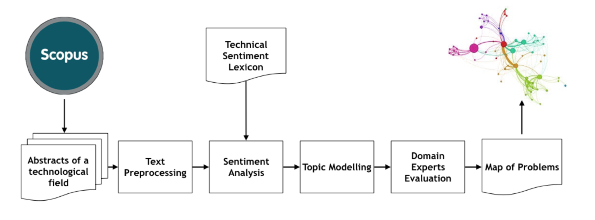

```


The workflow of the proposed methodology is shown in figure \@ref(fig:bcworkflow). The process starts with the collection of abstracts belonging to the same technological field. The abstracts are downloaded using the Scopus API, extracting all the documents that contains keywords of the selected technology in the title, abstract or keywords fields. The texts are then pre-processed using state of the art natural language processing tools (sentence splitter, tokenizer, lemmatization). Then, for each sentence we computed a negative sentiment polarity and took into consideration only the sentences having a negative polarity score below a threshold level. We applied topic modelling algorithm on the negative sentences with the aim of clustering. The output of topic modelling is evaluated by technology domain experts with the aim of labeling the identified clusters. 

The application scenarios of our methodology have a wide range of users: 

1.	Companies that want to rapidly map a certain technological field 
2.	Policy maker that want to invest to solve problems of a technology to boost its innovation
3.	Journals, to understand the hot-topic of a specific field 
4.	Research networks, to exploit possible collaborations and synergies between scholars.


#### Document collection and selection {-}

The documents were extracted from Scopus searching for the query:

\begin{equation*} 
  TITLE-ABS-KEY("blockchain" OR "block chain" OR "block-chain")
\end{equation*} 

At the date of 29/05/2018 the query results in 1,628 documents. 

The term blockchain and its morphological variations is used in other fields different from computer science and economics, in particular in chemistry. For this reason we filtered from the data set all the papers belonging to one of the sequent All Science Journal Classification (ASJC) classes: chemistry, physics and astronomy, chemical engineering, biochemistry, genetics and molecular biology, pharmacology, toxicology and pharmaceutics, immunology and microbiology. The result of this lead us to a set of 1,364 papers.

To have a dataset with an higher precision, we also filtered using rules based on the content of the abstracts, since many conferences do not have an ASJC class in scopus. This characteristic of the scopus database could lead to bias in the results, especially for innovative technologies like block-chain for which the scientific discussion is stronger in conferences then in more structured journals. For this reason we analyzed the abstracts of the 264 articles belonging to one of the ASJC classes listed above (chemistry related) extracting the most frequent words and filtering for a blacklist of generic words contained in scientific articles. This results in a dictionary of words that has ben used to search and filter al the papers containing in the abstract one or more of the words in the dictionary. The final number of selected papers is 1,276.

#### Sentence Splitting {-}

A sentence splitter (for furhter details see setction \@ref(sotatoolstransformsentencesplit)) is then applied to the abstract to divide the texts in sentences. From this step we had an output of 8,406 sentences.

```{r histbllength, echo=FALSE, fig.align='center', fig.asp=.75, fig.cap='Histogram of the lengths of the sentences.', message=FALSE, warning=FALSE, out.width='80%'}

knitr::include_graphics("_bookdown_files/figures/length_histogram_bl.pdf")

```

The next step involved the measure of the sentences length. Some of the sentences in fact could be too long due to several fact for example the style of the author or an error in the sentences splitting phase). Since it is not a goal of the present work to analyze the style of the authors or to design a better sentence splitter, we decided to filter the sentences that are too long. The decision on the threshold level of number of word has been taken analyzing the distribution shown in figure \@ref(fig:histbllength). The 97% of the population of sentences contain a number of words that is lower than 53. Thus all the sentences contain more than 53 words has been filtered. From this step we had an output of 8143 sentences.


#### Polarity Computation {-}

At this point has been possibile to apply a sentiment polarity measurement on the sentences [@sentimentr2018].
As output we had a polarity score between -1 (strongly negative) and 1 (strongly positive) for each sentence. Since we are interested in extracting the problems of the state-of-the-art blockchain systems, we visualize the distribution of the polarity scores of the sentences labeled as negative (having a polarity score lower then 0). The histogram of this distribution is shown in figure TOT. In this histogram are represented 1,108 different sentences. As we can see we have a distribution center in -0.2, with a tail that goes down to -0.8. This is an evidence that the system give a reasonable measures since it would be unreasonable to have more probable extreme values. Furthermore, the number of sentences having a polarity equal to 0 is 4,435 that is about the 50% of the sentences and the number of sentences having a positive polarity is 2,700 : it is reasonable that the higher number of sentences falls in these classes since the scientific jargon has to be neutral. The positive bias has been seen also for patent documents (see section \@ref(advdrwresults))).


```{r sentintimebl, echo=FALSE, fig.align='center', fig.asp=.75, fig.cap='Box plots of the distributions  by years of the polarities of the sentences having a negative polarity score.', message=FALSE, warning=FALSE, out.width='50%'}

knitr::include_graphics("_bookdown_files/figures/polarity_histogram_time_bl.pdf")

```

One interesting evidence we found is that the number of outliers (having a polarity values lower than the 95% of the population) is growing over the year as shown in figure \@ref(fig:sentintimebl). Even if the mean remains near to -0.2, int he last five years the number of strongly negative sentences has increased. This shows how there has been a trend in the focus on the problems of blockchain.


#### Tokenization and Token Filtering {-}

In the next phase we apply a state of the art natural language processing pipeline (see section \@ref(sotatools) for more details) to the 1,108 negative sentences. 

The tokenization process results in 220,094 tokens. To extract the meaningful words (words that adds information about the problem that the sentence is describing) we applied a series of filtering steps. As meaningful unit to analyze (token) we decided to use the lemma of the word. The 9,451 final token is a reasonable number considering the 1,108 sentences in input: we have a mean of 9 words per sentence. Considering the mean of 25 words per sentence shown in figure \@ref(fig:histbllength), we now have a summary of the sentences contains only the meaningful words. This output is a clean input for the topic modelling phase.

#### Topic modelling {-}

Topic modeling is a method for unsupervised classification of documents which finds groups of documents fitting a statistical model to the data. In other words, these models captures word correlations in a collection of documents with a set of topics. Latent Dirichlet allocation (LDA) is a particularly popular method for fitting a topic model. It treats each document as a mixture of topics, and each topic as a mixture of words. This allows documents to “overlap” each other in terms of content, rather than being separated into discrete groups, in a way that mirrors typical use of natural language (for further details see section \@ref(sotatoolsmodeltopicmodel)). 
If the topic modelling process is good, we have as output a structure where every topic is an understandable, meaningful and compact semantic cluster that in our case clearly represent a state-of-the-art problem of block chain technology. 

#### Document Term Matrix {-}

The first step is to take in input the 9,451 tokens and count how many times each one occurs in the 1,108 sentences. In this way we obtain a document-term matrix (DTM) where the documents are the sentences and the terms are our tokens (the lemmas). 
In our case the DTM has 1077 rows representing the sentences (31 sentences did not contain any relevant tokens) and  1147 tokens.

#### Definition of the Optimal Number of Topics: a Human-Machine Hybrid Approach {-}

To fit a LDA model we have to give as a parameter the number of topic k that we think that best represent the corpus in analysis. In literature there exists many measurement to compute an optimal value of k. However it is worth to keep in mind that these measures  are not always correlated with expert judgement about topics interpretability and coherence. For this reason in the present paper we use an hybrid approach in which we find an optimal neighborhood of value using state of the art k tuning methods and then we compute a graphical output for the 5 best k values to be evaluated by 4 different experts. 

Several approaches tried to take the problem of automatically finding the right number of topics contained in a set of documents. Every approach follow the idea of computing distances (or similarities) between pair of topics varying the number of topics.  We used four different methods to evaluate the output of a topic model for different value of k. These methods are:

-	_Caojuan2009_ [@cao2009density]: Minimize the average cosine distance between every pair of topics. The best topic number K has a minimal final distance between topics in Latent Dirichlet Allocation
-	_Arun2010_ [@arun2010finding]: Minimize the symmetric KL-Divergence of the salient distribution that are derived from the matrices of factors. These matrices are the re-projections of the documents on the topics and of the topics on the vocabulary (the selected tokens). The divergence values are higher for non-optimal K values.
-	_Griffiths2004_ [@griffiths2004finding]: Maximize the likely of the data given the model built considering K topics. This is a problem of model selection using Bayesian statistics.
- _Deveaud2014_ [@deveaud2014accurate]: Maximize the information divergence between all pairs of topics. The optimal value k is the value for which LDA modeled the most scattered topics.

```{r topicnumsmbl, echo=FALSE, fig.align='center', fig.asp=.75, fig.cap='Measures of quality of the topic modelling results for growing number of topics. The figure is divided in metrics to minimize (top figure) and to maximized (bottom figure).', message=FALSE, warning=FALSE, out.width='60%'}


knitr::include_graphics("_bookdown_files/figures/FindTopicsNumber_plot_bl.pdf")

```

We computed these for measures fitting a LDA model for every K between 2 and 30. We choose the higher value because we wanted to obtain a reasonable number of topics representing the problems of blockchain. After a brain storming with experts it emerges that there can not exists more than 15 classes of problems. We decide to take the double of this number to take in to consideration the biases of human experts. The results of the analysis are shown in figure \@ref(fig:topicnumsmbl). From this figure is evident how the measure we want to minimize interest each other at a value of 7 topics; the values we want to minimize are a little more unstable (especially Arun2010) and intersect both at level of 9 and 11. We thus decided to visualize and make choose the results of the LDA models for a number of topics k between 7 an 10. 

To help experts in their decision process, an interactive map of the problem hass been generated for 7, 8, 9, 10 and 11 topics. The map was created using Shiny [@shiny2017].  The interactive map of problems (a screen shot of the app is shown in figure \@ref(fig:topicmodelschinybc)) helped experts to understand the relationships between the problems. Here a multidimensional scaling algorithm compute the inter-topic distance that permits to visualize the distribution of topics in two dimensions. Clicking on a topic the experts can see its content, and for each word can see both at the estimated term frequency within the selected topic and at the overall term frequency. 

```{r topicmodelschinybc, echo=FALSE, fig.align='center', fig.asp=.75, fig.cap='Screenshot of the shiny app used by experts to choose the optimal number of topcis. ', message=FALSE, warning=FALSE, out.width='80%'}


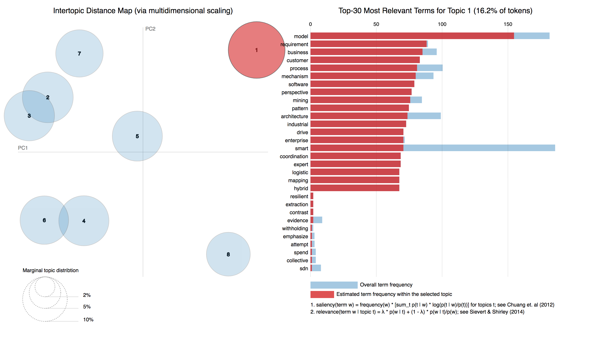

```

The experts agreed for a total number of 8 topics as optimal. 

### Results

The output topic modelling phase is show in figure \@ref(fig:topicmodelsoutputbc). The results of the topic modelling are visualized to make it possibile for the expert to explore and label the topic representing the problems of block chain technology. Each point is a word, and word belonging to the same topic are grouped. The size of the label is proportional to the probability ß that the word belong to that topic.

```{r topicmodelsoutputbc, echo=FALSE, fig.align='center', fig.asp=.75, fig.cap='Content of the 8 topics of problems of blockchain. Each topic has a different vertical position and a different color. Each topic is represented by a set of keywords and each keyword has a different position on the y axes. For each intersection topic/keyword, the dimension of a circle represent beta (what is the probability that topic to produce that term', message=FALSE, warning=FALSE, out.width='80%'}


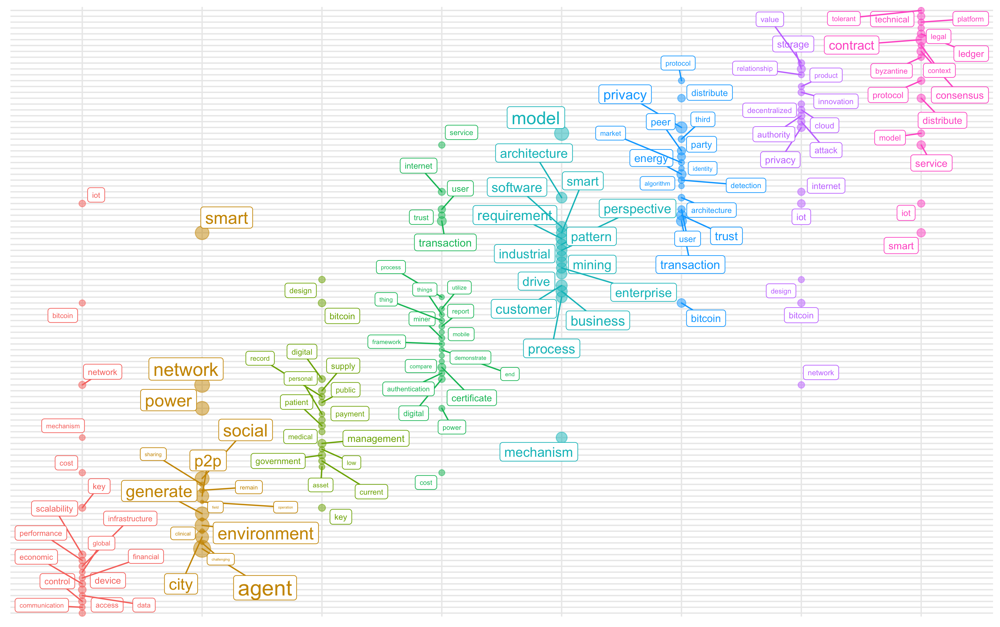

```

## Precision Agriculture

The agriculture is facing rapidly changing economic, social and environmental scenarios in 21st Century. Forecasts on worldwide population estimate that it might increase at about 9 billion by 2050 and led the Food and Agriculture Organization of the United Nations (FAO) to underline the growth of food needs of about 60% if compared to the annual average calculated between 2005 and 2007.  The Committee on Agriculture and Rural Development of the European Parliament confirms these figures. In this regard, FAO focuses on how global agricultural and food systems can support the subsistence needs of the worldwide population according to different cultures and dietary habits of both developed and emerging countries.

Compared to past agricultural policies, nowadays trends related to technological evolution, socio-political changes, water shortages, as well as the increase in energy needs and the emergence of new pests and diseases that affect agricultural production acquire greater importance in the discussion between policy makers and companies concerning the future of agricultural activities. 

In particular, technological innovation is necessary for the development of companies which aim to strengthen their production processes and organizational structures by exploiting automation and ICT within the cultivation and commercialization processes. 
Thus, digital technologies at the base of Precision Agriculture are the assets to leverage to deal with two major challenges for modern agriculture. On one hand, the need for an increase in production quantity by optimizing production factors. On the other hand, complying with production standards by combining appropriate quality levels and limited environmental impact. 
Precision Agriculture is a modern approach for agricultural management that exploits cutting-edge technologies to monitor and optimize agricultural production processes.

The concept of Precision Agriculture was born in the United States in the early nineties, where the House of Representatives [@liaghat2010review] defines it as "an integrated information- and production-based farming system that is designed to increase long term, site-specific and whole farm production efficiency, productivity and profitability while minimizing unintended impacts on wildlife and the environment".
Although it is a relatively well-known concept, Precision Agriculture still presents a low rate of adoption as reported by both academic surveys and professional reports [@pierpaoli2013drivers].

Different definitions given by researchers, practitioners and policy makers have gradually allowed to deepen the understanding of the constituent elements of the concept as shown in the following table.
Table 1 presents a literature review carried out on the Scopus database focusing on the analysis of the definitions of the concept of Precision Agriculture, and shows how technology emerges as the enabling aspect of Precision Agriculture. Anyway, authors focused also on other elements that refers to Precision Agriculture.

Pierce and Nowak [@pierce1999aspects] highlight the centrality of Technology and Benefits as the two key elements of Precision Agriculture. Zhang et al. [@zhang2002precision] strengthen these two distinctive elements, which compare in all subsequent analyses [@stafford2000implementing; @kirchmann2000challenging], until the introduction of the concept of Sustainability [@bongiovanni2004precision]. Indeed, Bongiovanni emphasizes the environmental topic by underlining the role of Precision Agriculture to manage harvest production inputs in an environmentally friendly manner. Finally, Gertsis et al. [@gertsis2018lisa], define Precision Agriculture as "A modern farming management concept using digital techniques to monitor and optimize agricultural production processes". They introduce the concepts of digital techniques and optimization of production processes by highlighting some possible concrete applications of Precision Agriculture. 
As emerged from the previous analysis, a fundamental role for the implementation of Precision Agriculture is played by digital technologies. In particular, object identification, georeferencing, measurement of physical and chemical parameters, satellite navigation, connectivity, data storage and analysis, process automation and vehicle driving are the most adopted [@schrijver2016precision]. Precision agriculture is then based on a cyclical process of observation and acquisition of data, followed by an interpretation and evaluation of the information acquired, and by the implementation of a series of decisions that respond to them.
Thanks to these technologies, farmers can increase production, optimize resources consumption (workforce included), costs and quantitative and qualitative production possibilities, according to the specific characteristics of the soil and cultivation. [@sawant2016organized] shows that the implementation of digital technology in agriculture can increase total profitability from \$ 55 to \$ 110 per acre (1 acre = 4046.87 m²).

However, whether the Precision Agriculture is still far from being widely adopted [@pierpaoli2013drivers; @tey2012factors]. Indeed, the implementation difficulties related to the high initial investments and the lack of suitable skills among the farmers identified still represent significant obstacles. In fact, a study conducted by Pierpaoli et al. [@pierpaoli2013drivers] identifies the so-called "non-adopters" farmers, (e.g. those who do not have sufficient skills or financial resources to manage the PA's instruments). For these reasons measuring the concrete benefits of Precision Agriculture is not an easy task. However, Precision Agriculture is an increasingly pervasive concept within the agricultural sector and the constant evolution of technologies linked to it generates many opportunities which have not been fully explored yet. 

Technologies advancements are directly linked also to another pervasive innovative concept in worldwide economy: Industry 4.0. This new paradigm grounds on the exploitation of digital technologies in the development of business processes and its enabling technologies are also used in Precision Agriculture . For example, Cyber-Physical Systems can be seen as one of the cornerstones for the development of innovative solutions to monitor and manage processes in agricultural businesses.

Starting from this relationship, the present chapter aims at analysing the technologies at the bases of the two domains to identify possible overlaps between Precision Agriculture and Industry 4.0.

### Methodology 

The work focuses on the creation of a dictionary which identifies the most innovative technologies that are applied in Precision Agriculture by investigating the overlaps with Industry 4.0 technologies to create clusters and to analyze the connections between them. 

The dictionary aims to analyze the technologies related to the Precision Agriculture domain and to identify those belonging also to the Industry 4.0 paradigm. Concretely, the dictionary is a list of Precision Agriculture technologies that were identified by analysing papers retrieved from the international database.
First of all, the twenty-five most cited scientific papers were identified by using the query “precision agriculture”, among those published between 2002 and 2017. Secondly, a text mining analysis on the 25 papers was conducted to identify the technologies mentioned and belonging to the Precision Agriculture domain. However, this list of technologies was not to considered exhaustive because of the reduced number of analyzed sources, which however provided the basic information to build the analysis context. To face this limitation, and given the proximity of the founding concepts of Industry 4.0 and Precision Agriculture, the Technimetro® was used to expand the list of technologies at the base of the dictionary. Technimetro® (Chiarello et al., 2018) is a dictionary that contains over 1500 technologies belonging to the Industry 4.0 paradigm and was created by selecting the Industry 4.0 technologies found in manuals, technical documents and scientific publications on Scopus. The relationships between these technologies were studied through a text mining activity to describe possible clusters and to understand how technologies are linked one-another. Therefore, the present work attempted to understand if the Technimetro® contains other Precision Agriculture technologies that were not identified with the analysis of the papers.

To answer this question, all abstracts of the publications on Precision Agriculture (published on SCOPUS from 2002 to 2017 for a total number of 4320 papers) were analyzed using the software “R”. In this way, technologies belonging to the Technimetro® that were mentioned in the Precision Agriculture publications were identified. Therefore, technologies extracted through the Technimetro® have been checked to manually eliminate not applicable terms. Technologies ware removed with the help of control groups.

Finally, the new list of technologies obtained, was compared to the list of technologies identified at the beginning with the analysis of twenty-five papers for removing duplicates, so the dictionary was ready to use.

On one hand, this analysis confirmed the relationship between Industry 4.0 and Precision Agriculture domains, on the other hand, it allowed to create a list of over 1000 technologies referring to the Precision Agriculture domain, by expanding the list generated thanks to the analysis of the 25 most cited papers on Precision Agriculture. This analysis shows how the intersection between the technologies belonging to Industry 4.0 and Precision Agriculture is very broad and makes the two concepts very close from a technological point of view. To investigate the presence of possible technological clusters, a text mining on abstracts of papers belonging to the "Precision Agriculture" domain was performed.

The block diagram in Figure \@ref(fig:precisionwf) describes the process to create the dictionary.

```{r precisionwf, echo=FALSE, fig.align='center', fig.asp=.75, fig.cap='Process to create Precision Agriculture dictionary.', message=FALSE, warning=FALSE, out.width='80%'}

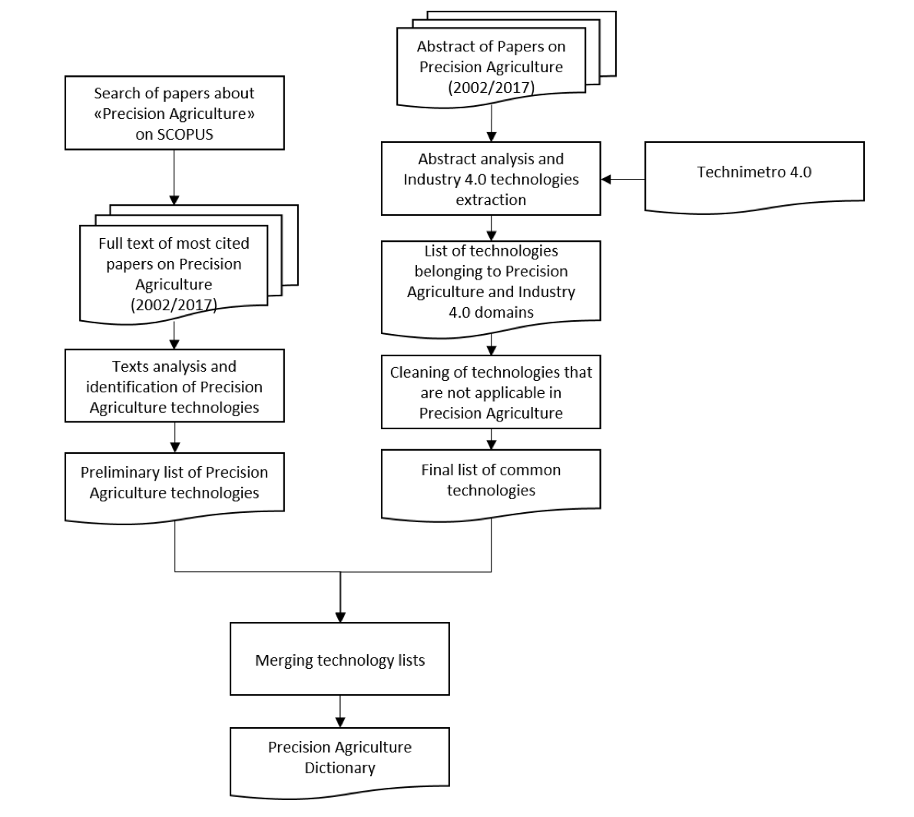

```

### Results

The dictionary of Precision Agricultural Technologies includes 324 terms. Thanks to a graph, the most cited technologies and the connections between them allowed to identify at least 6 technology clusters.
The graph in Figure \@ref(fig:precisiongraph) shows the structure of the dictionary containing the technologies related to Precision Agriculture and the relationships between the technologies that compose it. This representation allows to deepen the connections between the different clusters and technologies. The connections are represented by the lines that join the different nodes (which represent Precision Agriculture technologies) of the graph.

The size of the nodes varies proportionally to the number of papers they are cited in, instead their position depends on the number of connections between the different technologies: the most connected ones acquire a more central position into the graph and vice versa. A sample of the content of each cluster is:

- Monitoring: GPS, GIS, Data processing, GSM, Satellite, Ultrasound, Lidar, Broadband, Cellular, …

- IoT: Wireless sensor network, Internet of things, RFID, Bluetooth, Zigbee, Wi-fi, Microcontroller, Arduino, …

- Automation: Autonomous vehicle, Mobile Robot, Unmanned aerial vehicle, Agricultural robot, Computer vision, Data management, …

- Decision: Artificial intelligence, Data mining, Expert systems, Forecasting, Machine learning, Semantic web, Smart grid, …

- Hardware: Embedded system, Cyber-physical system, Manure spreader, Raspberry pi, CMOS, FPGA, …

- Laser: Laser, Laser transmitter, Laser receiver, Laser surveying, Optical fiber, Photonic sensor, …


```{r precisiongraph, echo=FALSE, fig.align='center', fig.asp=.75, fig.cap='Graph of the Precion Agriculture technologies.', message=FALSE, warning=FALSE, out.width='80%'}

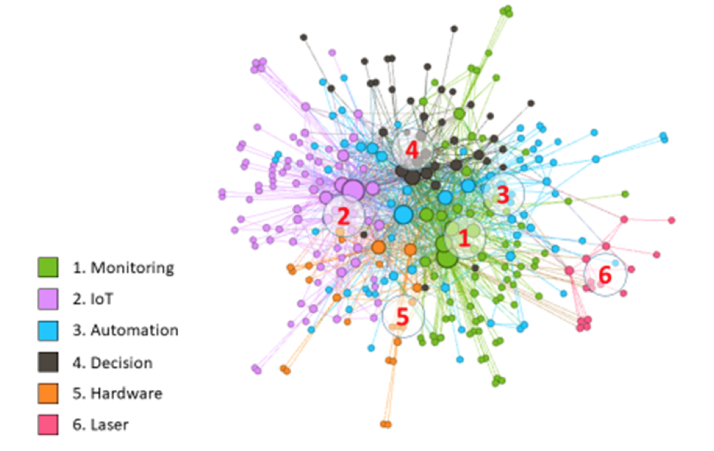

```


# Wikipedia

Wikipedia is a non-conventional source of technical knowledge, with respect to patent and papers. With respect to the literature on field delineation and clustering applied to science and technology we innovate by introducing this new source. In particular in the present chapter, Wikipedia is proposed as tool to map a technological field. The process start with a small number of documents following a procedure which is _expert-independent_, in order to minimize the distortions from subjective judgment. We then exploit the properties of Wikipedia in order to delineate the field and identifying the linkages between technologies. Further description of the structure of Wikipedia can be found in section \@ref(sotadocumentswiki)

In this section we present two methodologies capable of automatically use Wikipedia inforamtion and its structure with the aim of mapping and analysing this content. The results of the methodologies are described, togheter with example of applications of the extracted entities for intelligence tasks. 

## Industry 4.0: Extracting and Mapping Technologies {#technimetrochap}

Industry 4.0 is getting the center of the scene with respect to the future of production systems in advanced countries and to its economic and social implications. It is considered as the new fundamental paradigm shift in industrial production. The new paradigm is based on the advanced digitalization of factories, the Internet, and future-oriented technologies bringing intelligence in devices, machines, and systems [@lasi2014industry]. Despite its growing popularity and the great expectations in terms of innovation impact, the concept of Industry 4.0 remains strongly linked to technologies and frameworks that have been heavily researched and analyzed in the last decades. In particular, Industry 4.0 can be seen as a smart recombination of existing technologies and some new technologies and their application to the manufacturing environment [@trappey2016review]. This recombinant nature has led some authors to claim that it is nothing more than a re-labeling of old technologies, such as Computer Integrated Manufacturing [@apreda2016functional].

Yet other authors claim that this new wave of technology is fundamentally different from previous technologies and not just an amalgamation. In order to address the question whether Industry 4.0 is a new paradigm, or rather a re-labeling of existing technologies, a preliminary activity is needed, namely the delineation of the field and the clustering of technologies covered in the perimeter. It turns out that this activity is extremely challenging in the case of Industry 4.0, for a number of reasons we discuss in great detail. Faced with the complexity of Industry 4.0 existing delineation and clustering methodologies can be considered inadequate.

In this paper we develop a novel approach, test it, and show its superior performance with respect to other approaches.
The key features of the approach are as follows:

i) the description of Industry 4.0 is offered in the form of an “enriched dictionary”, or an ordered and comprehensive collection of lemmas, each of which are associated to full scale definitions and descriptions and to explicit linkages to other lemmas;

ii) the description of constituent technologies offered in the enriched dictionary is not obtained from individual experts, but is generated by accessing appropriate pages of the online encyclopedia Wikipedia;

iii) the total number of technologies covered is more than 1200, linked with more than 39,000 semantic relations;
iv) the perimeter of Industry 4.0 is not defined externally to the technology (by experts, government policies or other external sources) but is generated endogenously by examining the linkages between technologies described in the Wikipedia pages;

v) the update of the descriptions of technologies in the dictionary takes place in real time due to the distributed, parallel and selfcontrolled activities of authors in the worldwide community of contributors to Wikipedia;

vi) new technologies are automatically included in the dictionary if they exhibit a given threshold of connectivity with those already included in the perimeter.

#### Industry 4.0 as a multi-technology multi-stakeholder field {-}

Industry 4.0 is the main keyword used by researchers, policy makers and entrepreneurs when describing how worldwide industrial systems will evolve in the near future by leveraging Internet connected technologies to generate new added value for organizations and society [@roblek2016complex]. The growing interest is confirmed by the increasing number of academic papers focusing on topics that are related to the so-called “Fourth Industrial Revolution”. As shown in Figure \@ref(fig:40trendscopus) the query “Industry 4.0” generates 967 papers. Even if the query is very sharp and does not include all the research efforts on the single “enabling technology” it demonstrates an exponential growth of the topic. In Figure \@ref(fig:40trendscopus)  a projection represented by the dotted line is included. The projection has been drawn by considering a constant increase of the derivative calculated as the average of the last 4 years. Our forecast is that in 2017 there will be 575 new papers in Scopus; this estimate is supported by the fact that about 200 papers have been already published before June 2017 (represented by the point). Since previous analyses in Scopus demonstrate a delay between publication and loading of 5–6 months our forecast seems to confirm a growing interest on the topic.


```{r 40trendscopus, echo=FALSE, fig.align='center', fig.asp=.75, fig.cap='Trend of publications on Industry 4.0 (Title, Abstract, Keywords). Source: Scopus. Date: 06/06/2017', message=FALSE, warning=FALSE, out.width='60%'}

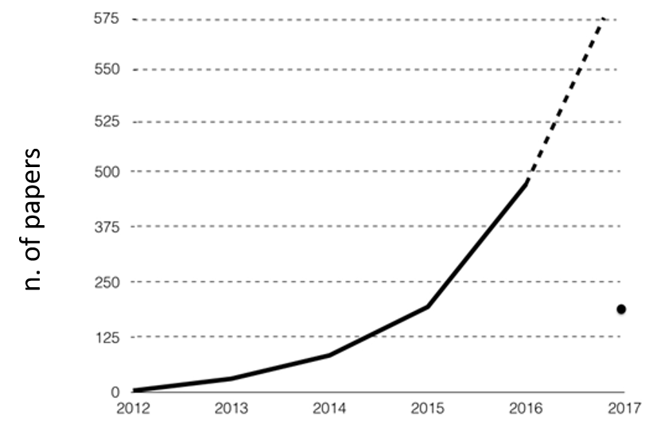

```

Table \@ref(tab:tabletech40scopus) shows how the scientific production on Industry 4.0 is divided among the main research fields (multiple attributions are possible in Scopus). In particular, it is possible to identify field specific-technologies that refers just to one or few sectors/business areas, and general purpose technologies that can be exploited in several sectors/business areas.


```{r tabletech40scopus, echo=FALSE, fig.align='center', fig.asp=.75, message=FALSE, warning=FALSE, out.width='80%'}

library(magrittr)

knitr::kable(
  readxl::read_xlsx("_bookdown_files/tables/table_1_tech40.xlsx"), "latex", booktabs = T,
  caption = "Breakdown of industry 4.0 papers per research field. Source: SCOPUS date: 06/06/2017" ) %>%     
  kableExtra::kable_styling(full_width = F) 
  

```


Formulated initially in Germany in 2011, the Industry 4.0 paradigm has been quickly translated, adapted and reinterpreted in developed and developing countries. Table \ref(tabledocs40scopus) offers a compilation of official documents of governments, agencies and international organizations that in a few years after the initial formulation have embraced the concept.


```{r tabledocs40scopus, echo=FALSE, fig.align='center', fig.asp=.75, message=FALSE, warning=FALSE, out.width='80%'}

library(magrittr)

knitr::kable(
  readxl::read_xlsx("_bookdown_files/tables/table_2_tech40.xlsx"), "latex", booktabs = T,
  caption = "Technical document and Scientific articles used to create the Technology Seed List." ) %>%   
  kableExtra::column_spec(1, width = "5em") %>% 
  kableExtra::column_spec(2, italic=T, width = "10em") %>% 
  kableExtra::column_spec(4, width = "5em") %>% 
  kableExtra::column_spec(6, italic=T, width = "5em")
  

```


Despite this rapid and impressive convergence of interest (in itself a clear demonstration of the interdependence of policies across the world), there is no common ground in the definition and delineation of the field even if a first definition of the goal of industry 4.0 have been presented since 1998 [@national1998visionary].

More precisely, while there is a reasonable convergence on the architectural definition of Industry 4.0, as defined in a relatively loose way, there is still considerable disagreement and misalignment with respect to constituent technologies [@riel2017integrated; @smit2016industry; @o2015industrial].

Furthermore, many constituent technologies are included in the definition of Industry 4.0, and hence described in these documents, from a variety of perspective that reflect mainly the huge variety of application domains. In other words, technologies are often described not only with respect to their fundamental engineering principles and related dimensions of performance, but with respect to specific applications to various manufacturing or service operations. In these applications the specific working of technologies and the associated dimensions of performance are indeed quite diverse.

Grangel and González [@grangel2016towards] develop a deductive rule-based system able to identify conflicts among AutomationML documents, named ALLIGATOR. It is interesting for the present work to notice how ALLIGATOR has the function to interoperate and align information models between a vast variety of areas (manufacturing, security, logistics) at a micro/plant level. In other words, this paper highlights the fact that one of the main problems of Industry 4.0 is the integration of models and concepts typically developed in their respective domains.

To offer an example of this state of affairs, let us consider the case of RFID (Radio Frequency Identification and Detection) technology. One of the main uses of RFID technology, that is, the detection of the location of a tag moving along a known path with known speed can indeed be applied for largely different purposes (safety, tracking, localisation) and in various company areas (production, logistics, maintenance). In practice, each of these applications will develop the basic technology in different directions. Depending on the applications we will find largely different descriptions of the technology involved. Figure \@ref(fig:techvaluechain40) offers a Value Chain-like representation of Industry 4.0, showing the wide range of applications of constituent technologies.

```{r techvaluechain40, echo=FALSE, fig.align='center', fig.asp=.75, fig.cap='A Porter-like Value chain framework for Industry 4.0 (courtesy of Towel Publishing).', message=FALSE, warning=FALSE, out.width='70%'}

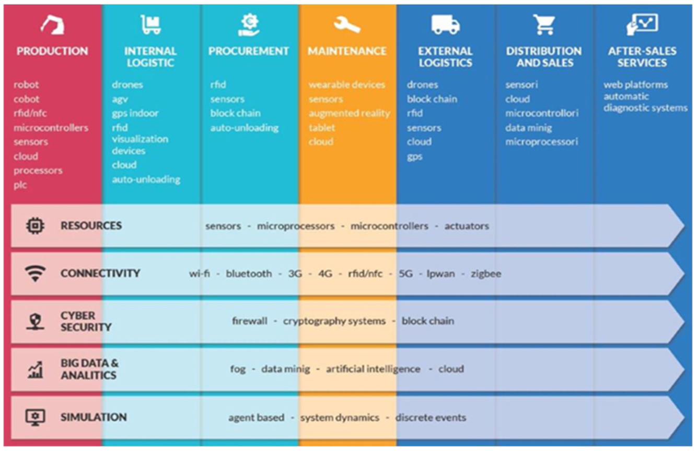

```


An interesting consequence of this state of affairs is that there is disagreement also at the higher level of government documents describing Industry 4.0 as the main object for innovation and industrial policies: when describing the main components of Industry 4.0 the French government uses 47 technologies, against 39 technologies for the Italian government.

Summing up, the recombinant nature of Industry 4.0 creates several interrelated problems for profiling and mapping:
-  the number of constituent technologies is very large
- the description and performance of constituent technologies depend critically on the specific application, hence on the business function/company area affected
- the stakeholders are located in several organizational positions
- the technical progress is very fast, with many (even if not all) constituent technologies facing rapid changes in their nature and performance.

Faced with this situation, a traditional approach to profiling and mapping would require a massive effort of keyword definition. A number of experts would be recruited in order to offer a representation of the field from their disciplinary or industry perspective. Extensive domain knowledge would be mobilized in such a way to build up detailed yet comprehensive maps of technologies. Based on these maps, governments, statistical offices and international organizations would work for a few years in line in the effort to identify the trends of technologies, the most important actors, the shares of individual countries or regions in the global landscape. For sure, this is the approach underlying most of the documents illustrated in Table \ref(tab:tabledocs40scopus) and this the approach that will be pursued in the years to come.

We strongly suggest this approach does not deliver the expected result. Keyword-based approaches to emerging technologies are too dependent on subjective judgments of experts. Even when the experts involved are top class and disinterested (often the best researchers or industrialists), their vision is inevitably partial. Even more importantly, keyword-based representations cannot be updated with the same speed of technology. The set of keywords identified by experts becomes inevitably obsolete in a few months.
This paper leverages on publications and open source repositories to design, develop and test a methodology that provides delineation and clustering of technologies of the Industry 4.0 paradigm. The methodology is based on a dictionary concerning the enabling technologies for industry 4.0 with full definitions and connections between them.
Given the fast growth and the uncertainty that characterizes industry 4.0 technologies, the present methodology is designed to be a bottom-up and continuous evolving tool. The structure and measurements made on the tool refer to July 2017.

#### Mapping and Clustering a complex emerging technology {-}

The first task for mapping a new technology is field delineation, or the definition of the perimeter of the field. Industry 4.0 is not a new technology, but a novel combination of partly existing, partly new technologies driven by the convergence of their trajectories. As a matter of fact, it is clearly an example of emerging technology [@rotolo2015emerging], as it shares the features of rapid growth, technological uncertainty, and market uncertainty.

The delineation of new fields of science and technology is an issue addressed since the late ‘70s, after the pioneering period of bibliometrics. Field delineation is a necessary step when existing classifications do not offer timely, reliable or comprehensive coverage of a topics, for example of a new technology or a new technological field. Moving beyond existing classifications require undertaking a search which, in general, may follow a lexical approach, a citationist approach, or a mix between the two [@small2006tracking; @kreuchauff2017patent]. In all cases there is a need to initialize the process, i.e. to identify a set of elements that constitute the starting point for searching.

The main approach has been based on keywords, to be identified in various regions of documents (title, abstract, keywords, full text of an article; title, abstract, claims, full text of a patent) and to be used as queries. A query is a structured sequence of words, connected by logical elements, such as “or”, “and” and the like, to be launched on a database in order to build up profiling, indexing, or clustering a given field. In general the initial set of keywords are provided by experts in the field, usually organized in an expert panel.

There are several limitations of the keyword/expert approach. First, expert based keyword definition, or patent classification is a very expensive activity [@tseng2007text]. Second, the keyword selection is based on subjective judgment, and when experts are asked to decide on relatedness measures (e.g. synonims, hypernims or hyponims), they do not apply systematic rules [@tseng2007text,@noh2015keyword]. Experts may be subject to a number of biases, such as for example the desirability bias (attributing higher probability of occurrence to preferred events) and many others (see section \@ref(sotadocumentsunderstandbyas)). Panels of experts are not immune by biases, such as group thinking. There is little research on the impact of expert subjective judgments on the delineation of emerging fields, but there is reason to believe it may be significant.

Third, the delineation of perimeter of emerging technologies is not robust to slight differences in the queries. As it has been shown by Zitt and Bassecoulard, little differences in the wording of queries, or on the time window, may end up in completely different sets of documents [@zitt2006delineating]. Therefore there is no proof that the method is reliable.

Finally, and more problematic for the case of Industry 4.0, the methodology is static, as it is based on a fixed sets of words. This set can (and in practice often is) updated, but this introduces a delay in the process and does not deliver reliable results. Keeping updated a collection of keywords in a dynamic technological landscape is extremely difficult.

These limitations have become evident in the last two decades, after the efforts of many authors to produce reliable perimeters of the emerging field of Nanotechnology. The initial efforts have been based on a classical expert-based approach. Panel of experts provided lists of keywords that were transformed into database queries. Among them, a consulting company called Lux, the Fraunhofer ISI in Germany, and CWTS in the Netherlands were the most active. Most studies delivered largely different delineations [@youtie2008nanotechnology; @ghazinoory2013application; @ozcan2017patent].

In turn, these limitations opened the way to massive efforts to reduce the dependence on experts and exploit systematically the new opportunities opened by text mining, following what has been called “full text based scientometrics” [@boyack2013improving]. Starting from the late ‘90 s several attempts have been made to apply text mining techniques to the patent corpus and the field is currently burgeoning [@joung2017monitoring; @ozcan2017patent].

Summing up, the existing approaches to the delineation of emerging technologies, taken together, suffer from the following limitations:
1. dependence on expert judgment
2. lack of robustness to alternative definitions of the perimeter
3. delay in update of technologies (static approach) iv) lack of transparency in the modeling of technology.

We now turn to the second main task in text mining of technology documents, that is, _clustering_. Once the perimeter of the field is delineated, a task usually included in the mapping is clustering, or the creation of groups of entities in such a way to reduce the complexity of the representation. Within text mining the clustering of documents is based on various kinds of linkages that are considered a signal of similarity in topics (see section \@ref(sotatoolsmodelnetanal)). In general, linkages among documents can be generated by citations (citationbased clustering) or by the extraction of features in texts (text-based clustering) [@leydesdorff2006measuring; @wang2017clustering; @jaffe1993geographic].

The most used approaches to clustering assume that members of a cluster:

– cite each other (citation analysis: [@jaffe1993geographic; @moed2006citation; @verspagen2007mapping; @lee2017knowledge]);

– share certain words (co-word analysis: [@callon1983translations; @rip1984co; @leydesdroff1989words; @engelsman1994patent; @van1993neural; @yoon2004text]);

– share a reference in their bibliography (bibliographic coupling: [@glanzel1996new; @kuusi2007anticipating]);

– share the same sub-fields in a classification (co-subfield analysis:[@chang2009using]);

– are cited by the same documents (co-citation analysis: [@small1973co; @small1985clustering]);

– are cited by the same authors (author co-citation analysis: [@white1981author]).


In the proposed methodology we exploit the hyperlink feature of Wikipedia in order to introduce a new approach to clustering. Hyperlinks are introduced by authors in order to establish a semantic linkage between the page and other pages. We exploit this feature as follows: members of the same cluster are those pages that share the hyperlinks to other pages, according to thresholds defined by an appropriate algorithm.
Note that hyperlinks are only superficially similar to citations. The origin page “cites” another page by hyperlinking it, but in effect this linkage is not a citation (that is, a reference to a previous work) but a signal of semantic similarity, intended to guide the reader in the network of meanings.
We suggest that the hyperlinks are similar to citations under some respect, but very different under some other respects. Like citations, hyperlinks are introduced in the text by authors and reflect intentionality. Unlike citations, they reflect semantic relations, not relations of credit assignment or tribute to scientific authority. Perhaps more importantly, citations are introduced only by the author(s) of a paper and remain unchanged after publication. Hyperlinks, on the contrary, are introduced also by subsequent readers of the Wikipedia page. If the introduction of hyperlinks is not considered appropriate by the community of contributors, as it may happen due to vandalism, they are immediately removed (see the discussion below). This means that they reflect all possible semantic connections among the pages, as collectively stated by a large community of authors, in a reliable and robust way. We believe this methodology offers a remarkable improvement with respect to existing approaches.

#### How is similarity measured by using Wikipedia {-}

In general, semantic relatedness is a measure of the similarity between two terms. It can be computed by statistical methods without requiring a manually encoded taxonomy, for example by analyzing term co-occurrence in a large corpus [@resnik1999semantic; @jiang1997semantic]. Wikipedia has been largely exploited in the literature in order to compute semantic relatedness. Gabrilovich and Markovitch [@gabrilovich2007computing] developed an alternative to Latent Semantic Analysis and called this new technique Explicit Semantic Analysis (ESA). This methodology first uses a classifier that is centroid-based to map input text to a vector of weighted Wikipedia articles. Then the vectors are exploited to obtain the semantic relatedness between two terms by computing the cosine similarity. This technique could be applicable to individual words, phrases or even entire documents. Furthermore, the mapping developed in this work has been successfully utilized for documents categorization.
A new version of this kind of systems was presented by Milne [@milne2007computing]. While in Gabrilovich and Markovitch [@gabrilovich2007computing] the authors use the full text of Wikipedia articles to establish relatedness between terms, in this work only the internal hyperlinks are exploited. To compute the relatedness between two terms, they are first mapped to corresponding Wikipedia articles and then vectors are created containing the links to other Wikipedia articles that occur in these articles.
The main problem facing semantic relatedness using Wikipedia is the disambiguation of terms. Several strategies have been developed to solve this problem. A first approach, described in Strube and Ponzetto [@strube2006wikirelate], exploits the order in which entries occur in the disambiguation pages of Wikipedia to find the most likely correct meaning. On the other hand, Gabrilovich and Markovitch [@gabrilovich2007computing] avoids disambiguation entirely by simultaneously associating a term with several Wikipedia articles. Milne [@milne2007computing] approach hinges upon correct mapping of terms to Wikipedia articles. However, when terms are manually disambiguated, it has been shown that the systems of semantic relatedness computation are more accurate than the systems of automatic disambiguation [@medelyan2009mining].

Summing up, a consistent literature in the field of computational linguistics and text mining supports the notion that the use of Wikipedia articles as a knowledge base is justified and promising.

### Methodology

In this section we give evidence of the methodological steps undertaken to build up the enriched dictionary referred to Industry 4.0. The dictionary contains technologies related to the Industry 4.0 paradigm, each of which is associated to the full set of relations with other technologies. The dictionary is semi-automatically generated using technical documents and the Wikipedia free online encyclopedia. The linkages between technologies have all a semantic content, since they are generated within the text of the articles of Wikipedia when a related topic or entry is considered necessary for the logical flow of the definition or description.

Figure \@ref(fig:wf40) shows the methodological steps needed to generate the enriched dictionary. In the flow diagram three elements are graphically displayed: activities (rectangular shape), check points (diamond shape) and documents created from the procedure (sheet of paper shape).

```{r wf40, echo=FALSE, fig.align='center', fig.asp=.75, fig.cap='Flow diagram of the adopeted methodology.', message=FALSE, warning=FALSE, out.width='80%'}

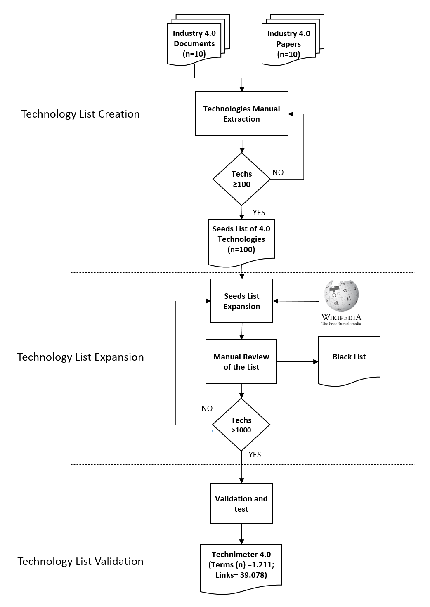

```

#### Generation of the seed list {-}


As input for our methodology we used technical documents, official government documents and the most cited academic papers in the field of industry 4.0. The selection of seed documents has been made by:

– taking the official government documents of the US government and of three large European countries (France, Germany, UK), all of which are strongly committed to the support of Industry 4.0 and are widely considered a benchmark in international documents (for example, OECD and European Union), plus a selection of technical documents cited in government papers, for a total of 10 documents;

– taking the 10 most cited papers on Industry 4.0 according to Scopus. The reference to Industry 4.0 was explicit in the title, abstract and keywords of the papers. The extraction was made on Scopus Database in June 2017. 

We deliberately limit ourselves to a small number of documents. The reason is explained in conjunction with the chosen stopping rules. The documents have been manually parsed by a team of Master students in Engineering Management at the University of Pisa. The assignment was “Understand each document and extract the enabling technologies for industry 4.0”. The manual search in the documents continued until the team reached the goal of 100 different technologies extracted. For our purposes 100 different technologies represents a reasonable seed list of technologies, which will be used as input for the automatic expansion phase. The chosen documents are shown in Table \ref(tab:tabledocs40scopus).

####  Seed list expansion {-}

For each term in the seed list the corresponding page in Wikipedia was found. All technologies identified in the seed were covered by Wikipedia. This is a preliminary confirmation of its relevance as a source of knowledge. These pages formed the initial glossary.
The expansion procedure automatically retrieved the pages and identified all hyperlinks included in the description of the technology. The pages that are the target of hyperlinks are classified manually
according to the following categorization:

a. links to pages already in the seed: these pages are labeled “anchors”, since they provide robust indicators of technologies that are, at the same time, mentioned explicitly in the seed documents and referred to in Wikipedia pages that deal with other technologies;
b. links to pages not in the seed: these are labeled “missing technologies” and are stored in memory for later treatment as potential candidates to inclusion in the dictionary;
c.  links to pages with non-technological content: they are labeled “stopwords” and are eliminated from the procedure.
The overall procedure is iterated up to the point in which a number of at least 1000 different technologies is reached. At this point the procedure will stop. Updates and changes of the dictionary can originate from new entries (new technologies) or from updates to existing pages.

Given that the automatic extraction of Wikipedia pages can be run on a permanent basis, each version of the dictionary has a date. The current version, illustrated in the rest of the paper, is at the time point of July 15, 2017.

#### The stopping rule for the manual and the automatic expansion {-}

The three stopping rules follow a sequential logic of order of mag- nitude: we start with approximately 101 documents, from which we extract 102 names of technologies, that, used as inputs to Wikipedia, deliver approximately 103 final technologies. More in detail we make use of:

1. 20 input documents: all technical documents taken as reference for Industry 4.0 share the same framework (i.e. DIN:SPEC 91345:2106). Many of the documents contains the same informations/terms/ technologies. Furthermore these documents are technology focused and therefore from a low number of documents we obtain a large number of technologies.

1. seed list of 100 technologies: as demonstrated in the past Wikipedia is a good source also for technical terms, therefore we assumed it was able to quickly expand the technologies related to Industry 4.0. For this reason the seed list is composed of no more than 102 entries.

2. output list of at least 1000 technologies: of the automatic expansion works correctly the technologies should increase by an order of magnitude in few iterations. Since the list has to be revised manually we decided for 103 entries as a target thus reducing the impact of manual review. As a matter of fact, the Wikipedia network of semantic linkages delivers a total number of technologies related to Industry 4.0 which exceeds this target, again confirming the validity of Wikipedia as a source of knowledge.

#### Structure of the enriched dictionary {-}

The enriched dictionary can be defined as a set of enabling technologies for industry 4.0, associated to their definitions and to the linkages between them. The digital version of the tool is a hyperlinked text ^[www.industria40senzaslogan.it].

For the purpose of publication in an academic paper the tool can be represented as a table in which we have:

- Column 1- Technologies: Enabling technologies for industry 4.0, or a broad categorisation of technologies following a clustering procedure (see below)
- Column 2- Url: Links of the Wikipedia pages of the enabling tech- nologies for industry 4.0
- Column 3- Definitions: Glossary, snippets from wikipedia page of the definition of the enabling technologies for industry 4.0
- Column 4 Links: hyperlinks to other wikipedia pages from the wi- kipedia pages of enabling technologies for industry 4.0
- Column 5- Anchors: hyperlinks to other wikipedia pages that are enabling technologies for industry 4.0 from the wikipedia pages of enabling technologies for industry 4.

In the table shown in figure \@ref(fig:technimetrosample) shows a sample of the dictionary for four enabling technologies. An evidence is that there are conflicting definitions of “Augmented reality” (AR) and “Virtual reality” (VR); the first says that AR contrasts VR, while the second states that “AR systems may also be considered a form of VR”. This is an evidence of the ambiguity that exists in the definition of 4.0 technologies. Moreover, the table underlines how words such as “3D printing” and “Additive manufacturing” that are used in different ways within papers and technical documents (see Table 3), basically refer to the same concept.
Table \@ref(fig:technimetrosample) also shows the difference between links and anchors. Links include all hyperlinks found in Wikipedia pages. By nature, a certain fraction of these links contain information that is not relevant to our task. It is likely that, in the course of discussion of a given topics, authors quote an author (e.g. Bob Sproull in Virtual Reality), an institution (e.g. British Museum or California Institute of Technology) or an event or application (e.g. Coachella Valley Music and Arts Festival). These links do not add to our knowledge of the Industry 4.0 field. It can be seen that, following the definition of anchor given above, these terms are eliminated in column (E), which includes only the anchors, or those entries that are added to the body of knowledge.


```{r technimetrosample, echo=FALSE, fig.align='center', fig.asp=.75, fig.cap='Sample of enabling technologies showing the table structure of dictionary.', message=FALSE, warning=FALSE, out.width='100%'}

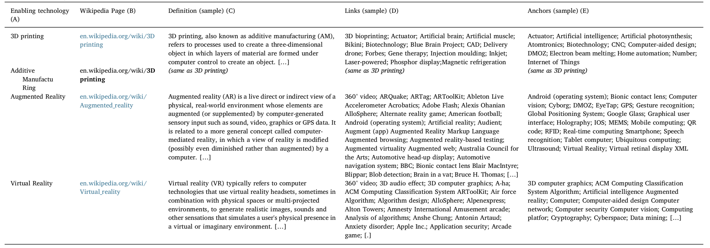

```

### Results

The dictionary is composed of 1.211 terms and 39.078 relationships between them. This generates a graph in which the node represents a technology and the edge represents a link in the Wikipedia page.
The network structure naturally gives origin to graph-theoretic metrics. We exploit this property in order to generate a number of indicators that the readers may find it useful to examine.

#### Graph analysis and Sub-graph selection {-}

Figure \@ref(fig:techgraphplot1) gives an overview of the obtained. We compute for each node the in-degree (horizontal axis), the out-degree (vertical axis) and the number of links to other Wikipedia pages that each node has (color of the node). Our results show that in terms of the analyzed variables we can identify 4 different clusters of nodes (or technologies) each one having a different behaviour.
The first group we take in consideration are the point having an indegree greater than 70 and an out-degree greater than 70. In this group on the top right of the page we have some outliers. These are terms like Microprocessor and Microcontroller, X86, 8-bit, 16-bit and 32-bit. Then we observe a sub-group centered on the coordinates (150, 100). Here we have terms like Program counter, Adressing mode, Instruction Cycle, Coprocessor, Symultaneus multitrading, SISD and MISD. Still within the first cluster we have another sub-group of terms centered in (80,110) with terms like Intel i860, Intel Atom, Intel 80286, Intel 80188 but also Bloomfiled and Wolfdale. The second cluster is one in which the points have an in-degree greater than 70 and an out-degree smaller than 70. Here we have terms like Machine learning, Artificial Neural Network, Cognitive Computing, Software, Random Access Memory, Internet, Firmware and C++. The third group collects points having an in-degree lower than 70 and an out-degree greater than 70. Here we have terms like Processors, Micro-Operation, Micro-Assembler, Application specific integrated circuit. The last and most populated cluster has an in-degree smaller than 70 and an out degree smaller than 70.

```{r techgraphplot1, echo=FALSE, fig.align='center', fig.asp=.75, fig.cap='Plot of the in-degree and the out-degree of the nodes of the graph. The colour of the node represents the number of Wikipedia internal links.', message=FALSE, warning=FALSE, out.width='100%'}

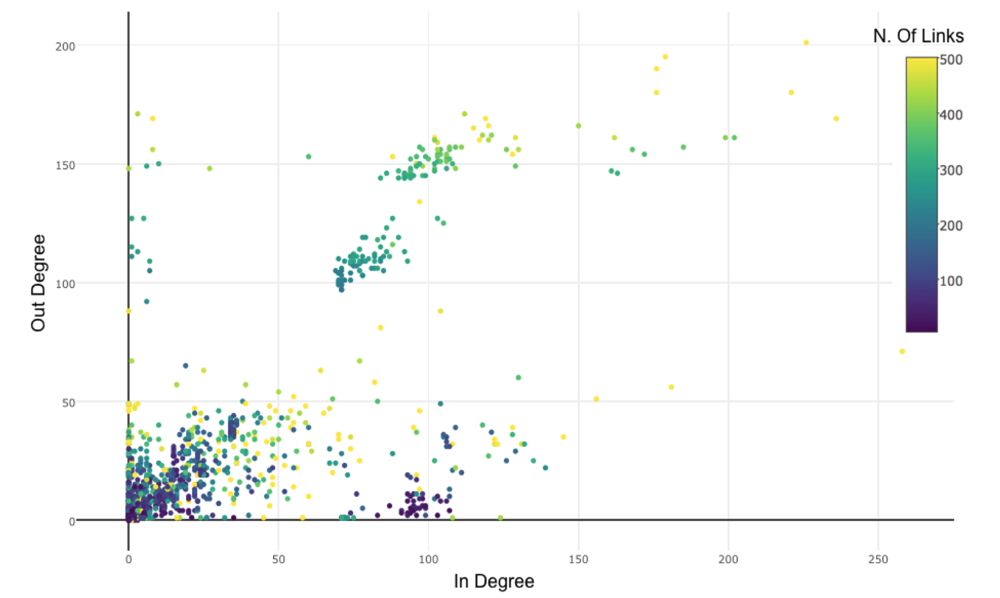

```

This cluster is more precisely visualized in Figure \@ref(fig:techgraphplot2), for which we have as before the in-degree (horizontal axis), the out-degree (vertical axis) and the number of links to other Wikipedia pages that each node has (colour of the node). A jitter process has been implemented to the points on the graph in order to better visualize the overlapped points. In this plot only the technologies having both an in-degree and an outdegree lower than 70 are shown. This generates a subgraph composed by 931 nodes and 10673 edges.

```{r techgraphplot2, echo=FALSE, fig.align='center', fig.asp=.75, fig.cap='Plot of the in-degree and the out-degree of the nodes of the sub-graph. Selection of the nodes having an in-degree and an out-degree lower than 70. The colour of the node represent the number of Wikipedia internal links.', message=FALSE, warning=FALSE, out.width='100%'}

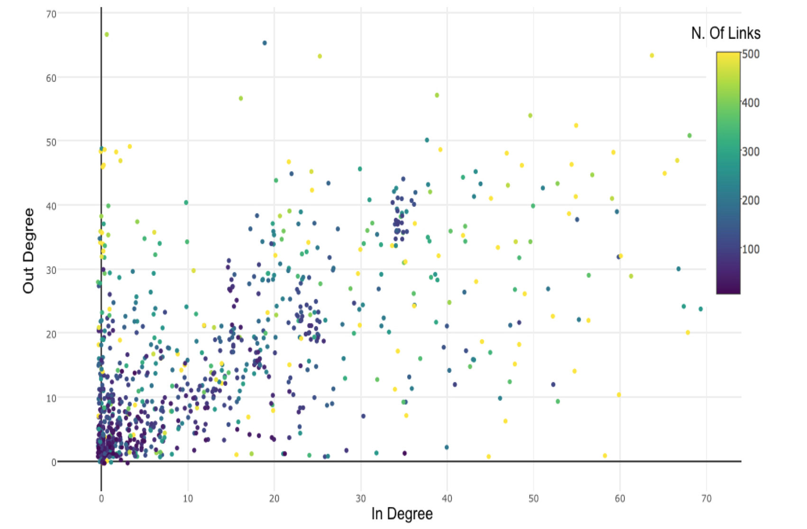

```

#### Graph representation and cluster analysis {-}

The structure of the graph offers it self naturally to clustering of technologies in order to obtain a readable mapping.
The clustering algorithm receives as input the collection of technology terms T of the analyzed subgraph and returns a set of terms clusters C = {C1, C2,.., Cn} that cover the whole subgraph in analysis. Each cluster Ci is a subset of terms of T, and a term may belong to only one cluster.
In Figure \@ref(fig:technimetro) we show a representation of the sub-graph made using Gephi software with its implementation of the Force Atlas algorithm [@ICWSM09154] . In this representation, two nodes in the graph are represented closely if they share an edge. In this way also nodes that belongs to the same communities of nodes (nodes that can be grouped into sets such that each set is densely connected internally) but do not share any edge are represented closely. In other words, the visualization tends to be coherent with the clustering algorithm. The size of the node is proportional to its in-degree while the colour express the cluster to which each node belong. Finally some of the labels of nodes and clusters are shown.

```{r technimetro, echo=FALSE, fig.align='center', fig.asp=.75, fig.cap=' Representation of the graph of 4.0 technologies and of the clusters in wich them are arranged.', message=FALSE, warning=FALSE, out.width='100%'}

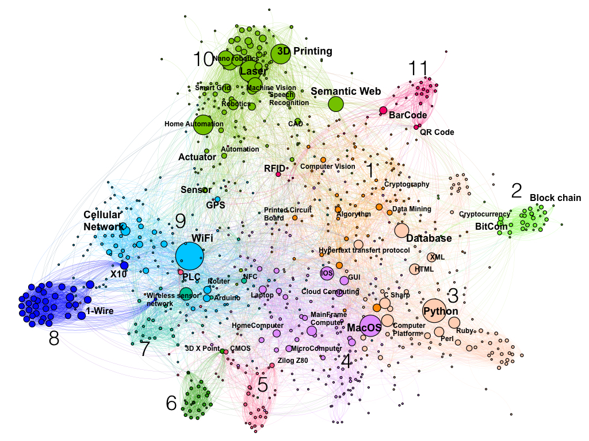

```

Each node is a technology and each edge represent a Wikipedia link between the pages. The size of the nodes is proportional to the in-degree, and the colours represent the clusters.

The algorithm we used to compute the modularity of each node and thus to assign a group to each of them is described in Blondel et al. [@blondel2008fast]. The process resulted in 11 clusters. The content of each cluster is (for each cluster we can see the first 15 nodes in terms of in-degree):

1. _Big Data_: Virtual machine, Data mining, User interface, Algorithm, Computer vision, Cryptography, Printed circuit board, Middleware, Real-time computing, Virtual reality, Augmented reality, Human–computer interaction, Multiprocessing, Decision support system, Supervised learning

2. _Transactions, digital certification, digital currency_: Bitcoin, Cryptocurrency, Bitcoin network, Cryptocurrency tumbler, Digital currency exchanger, Alternative currency, Dogecoin, Ethereum, Litecoin, Monero (cryptocurrency), Namecoin, Peercoin, Virtual currency, Auroracoin, Blockchain, Lisk, Primecoin, Ripple (payment protocol), Titcoin, Zerocoin

3. _Programming languages_: Python (programming language), Database, Computing platform, Ruby (programming language), C Sharp (programming language), HTML, Perl, Hypertext Transfer Protocol, XML, Java (software platform), Haskell (programming language), .NET Framework, Lua (programming language), Sun Microsystems, BASIC

4. _Computing_: MacOS, IOS, Mainframe computer, Graphical user interface, Cloud computing, Home computer, Laptop, Solaris (operating system), Microcomputer, Personal digital assistant, QNX, Read-only memory, Tablet computer, ASCII, DOS

5. _Embedded Systems_: Programmable logic controller, Zilog Z80, CMOS, Zilog Z8, Toshiba TLCS, Zilog eZ80, NEC µPD780C, MOS Technology 6502, R800 (CPU), U880, Zilog Z180, Zilog Z800, Zilog Z8000, КР1858ВМ1, Hitachi HD64180

6. _Intel_: 3D XPoint, Intel ADX, Intel Clear Video, Intel SHA extensions, Intel System Development Kit, Intel 1103, Intel AZ210, Intel Cluster Ready, Intel Compute Stick, Intel Display Power Saving Technology, Intel Mobile Communications, Intel Modular Server System, Intel PRO/Wireless, Intel Quick Sync Video

7. _Internet of Things_: Wireless sensor network, Near field communication, Arduino, NetSim, Z-Wave, OPNET, Telemetry, RIOT (operating system), Routing protocol, TinyOS, Internet of things, NesC, MiWi, Nano-RK, LinuxMCE

8. _Protocols & Architectures_: 1-Wire, Profibus, Smart meter, X10 (industry standard), Modbus, Local Interconnect Network, TTEthernet, Fleet Management System, Keyword Protocol 2000, Meter-Bus, MTConnect, OPC Unified Architecture, PROFINET, RAPIEnet, SAE J1587

9. _Communication Network and Infrastructures_: Wi-Fi, Cellular network, Router (computing), Internet Protocol, Radiotelephone, ARPANET, Radio frequency, Digital subscriber line, General Packet Radio Service, Global Positioning System, CYCLADES, Beacon, Wireless, High Speed Packet Access, Evolution-Data Optimized

10. _Production_: Laser, 3D printing, Home automation, Agricultural robot, Nanorobotics, Semantic Web, Machine vision, Nanotechnology, Robotics, Information and communications technology, Speech recognition, Smart grid, Memristor, OLED, Computer-generated holography

11. _Identification_: Barcode, RFID, QR code, MaxiCode, Mobile tagging, Code 128, GS1 DataBar, High Capacity Color Barcode, Aztec Code, Barcode printer, Bokode, Codabar, CPC Binary Barcode, Interleaved 2 of 5, ITF-14

Let us examine more in depth a cluster, such as Identification (cluster 11). The size and colour of the words are proportional to the in-degree of the nodes as shown in Figure \@ref(fig:identificationspec).

```{r identificationspec, echo=FALSE, fig.align='center', fig.asp=.75, fig.cap=' Wordcloud of the words belonging to the class 11 labelled as Identification. In this figure the size is proportional to the logarithm of the in- degree of each node that represents a word.', message=FALSE, warning=FALSE, out.width='70%'}

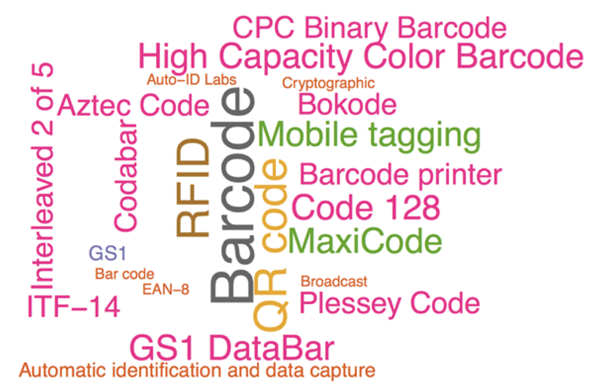

```

## Industry 4.0: a Comparison with Industrie 4.0

The Industry 4.0 paradygim can be understood and implemented differently in different industrial eco-systems, depending on the country in which it is adopted. In the present section we make use of Wikipedia to build a  network of pages regarding industry 4.0 in such a way taht it is possible to map how a country is actually implementing the industry 4.0 paradigm. To analyze the differences between the industry 4.0 concept in the country of origin (Germany) and the rest of the world, our approach is thus to investigate the Wikipedia pages of Industrie 4.0 and Industry 4.0 and the pages they are connected to. Using clustering algorithm it is then possible to explore the different focus that countries have on different technological sub-field of Industry 4.0.

All aspects during our analyses and the description of the project, e.g. page names, consist of two parts: one in English and one in German. For simplicity and better understandability, we well mostly refer to everything only by the English name.

### Methodology

In the present section we explain the methodology we adopted to build and analyze the two graphs of Wikipedia pages representing the concepts linked to industry 4.0 in Germany and in the rest of the world. As a proxy of the world-wide vision of industry 4.0 we analyzed the English version  of Wikipedia. 
The main steps of our methods are represented in the workflow of figure \@ref(fig:industriewf) The first step consisted of extracting all pages of interest from Wikipedia. Then the pages and their connections were used to build two graphs (the German and English version). The nodes of the graphs were then cleaned using a novel approach based on the categories of the Wikipedia pages. Finally a clustering algorithm was used to illustrate communities within the graph. These steps are described in the following sections.

```{r industriewf, echo=FALSE, fig.align='center', fig.asp=.75, fig.cap='The workflow shows the steps we followed to generate the two graphs of industry 4.0 related concepts.', message=FALSE, warning=FALSE, out.width='100%'}

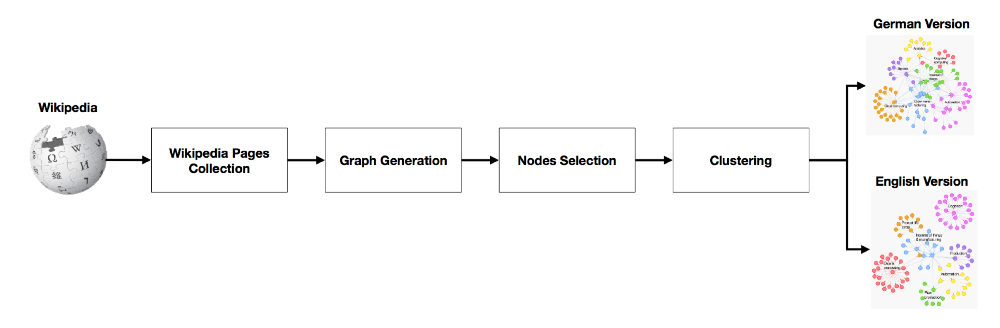

```

#### Wikipedia Pages Collection {-}

To list the pages connected to the concept of Industry 4.0, all Wikipedia pages that are linked to the page of Industry 4.0 (and Industrie 4.0) were downloaded. We will refer to these pages as level 1 connection. Then all the pages linked to the level 1 pages are collected and marked as level 2 pages. This process can be continued until a wanted level is reached: for the purposes of the present work we decided to show the effectiveness of the process stopping at level two. For each page, we collected the links to other pages and the categoriess of the page. 

#### Graph Generation {-}

Two pages that are linked by a link within Wikipedia shares a certain relations of which we ignore the meaning. Thus, it is possible that the approach we described until now, also collects pages that are not relevant for the analysis. In our case, this means that some of the extracted pages are not technologically related to the subject of Industry 4.0. Thus, the list of entries had to be cleaned from these non-relevant ones. 
To make the filtering process more efficient, we filtered considering the categories that had been extracted together with the pages. We considered as relevant all the categories of  the pages of level 1. Then the level 2 pages were automatically considered to be relevant if they were in one of the formerly marked categories. 
For the nodes selection we also used a black-list of non-relevant Wikipedia pages (e.g. International Standard Name Identifier, International Standard Book Number, Digital object identifier, ISBN), previously developed by the authors in (see chapter \@ref(technimetrochap)). This list has been traduced in German for the purposes of the present work. 

#### Clustering {-}

In order to identify macro topics in the formerly created graphs, we applied clustering methods. The most beneficial results were found to be generated by applying a spin glass algorithm, which employs the spin glass model and uses simulated annealing to find communities in networks [@reichardt2006statistical]. In this approach  the community structure of the network is interpreted as the spin configuration that minimizes the energy of the spin glass with the spin states being the community indices.

### Results

In this section we will focus on describing the differences that emerges between the two national technological approaches of industry 4.0 in Germany and in the rest of the world. 

#### The collected pages {-}

We collect 97 pages for the German graph and 95 pages for the English graph. A list of a sample of forty pages per language, alphabetically ordered is:

- __German Version__: Absatzwirtschaft, Automatisierung, Automatisierungsgrad, Automatisierungstechnik, Autonomic Computing, Autopoiesis, Betriebswirtschaftslehre, Corporate Evolution, Cyber-physisches System, Dataset, Daten, Datenabgleich, Datenarchitektur, Datenaustausch, Datenbasis, Datenelement, Datenfeld, Datenmanagement, Datenmodell, Datenmodellierung, Datensicherung, Datenstruktur, Datentyp, Denken, Dienst (Informatik), Dienstleistung, Digitales Objektgedächtnis, Elektronische Datenverarbeitung, Erfahrungskurve, Erinnerungsvermögen, Feld (Datentyp), Feldgerät, Fertigungslinie, Fließbandabstimmung, Fließbandfertigung, Gegenwart, Geschichte der Produktionstechnik, Glauben, Gruppenfertigung, Halbzeug.

- __English Version__: Adaptive system, Agent-assisted automation, Ambient intelligence, AmbieSense, Analytics, Artificial intelligence, Automated reasoning, Automation, Autonomic computing, Autonomous car, Big data, Big Data Maturity Model, Big memory, Carrier cloud, Cloud-based design and manufacturing, Cloud analytics, Cloud collaboration, Cloud computing, Cloud computing comparison, Cloud computing security, Cloud database, Cloud engineering, Cloud Foundry, Cloud management, Cloud manufacturing, Cloud research, Cognitive computer, Cognitive computing, Community cloud, Competitions and prizes in artificial intelligence, Computer-aided engineering, Computer-aided technologies, Computer-integrated manufacturing, Computer vision, Continuous analytics, Control loop, Control system, Cyber-physical system, Cyber manufacturing, Datafication. 


#### The Graphs {-}

The dimension of the graphs in terms of nodes, links and categories are shown in Figure \@ref(fig:graphmetricsindustrie). From this figure is evident how the two graphs has almost the same number of nodes; by the way, the mean number of categories for the German version is close to 0.5 while its 0.3 for the English version. Beside these measure, as it would be even more evident from further analysis, there is the broader approach to industry 4.0 in the rest world with respect to the more focused vision that Germany has. 


```{r graphmetricsindustrie, echo=FALSE, fig.align='center', fig.asp=.75, fig.cap='Number of nodes, links and categories for the German version of the graph (left) and the English version (right)', message=FALSE, warning=FALSE, out.width='80%'}

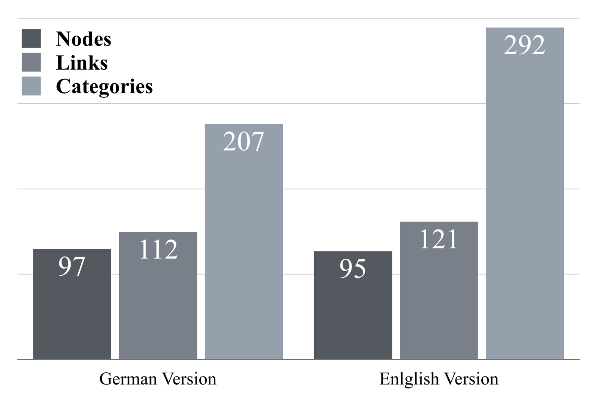

```

The resulting graphs are shown in figure \@ref(fig:graphindustrie1) (respectively the German version on the left and the English version on the right). Here the vertices of the graphs represent the Wikipedia entries, while the links are depicted by arcs that are directed from the originating page to the linked page. The structures of the two graphs and the difference in the number of links gives an evidence of the more focused network of concepts in Germany: the number of links is in fact lower for Germany, creating a more clustered graph. 


```{r graphindustrie1, echo=FALSE, fig.align='center', fig.asp=.75, fig.cap='The German version (left) and the English version (right) of the Industry 4.0 related graphs.', message=FALSE, warning=FALSE, out.width='100%'}

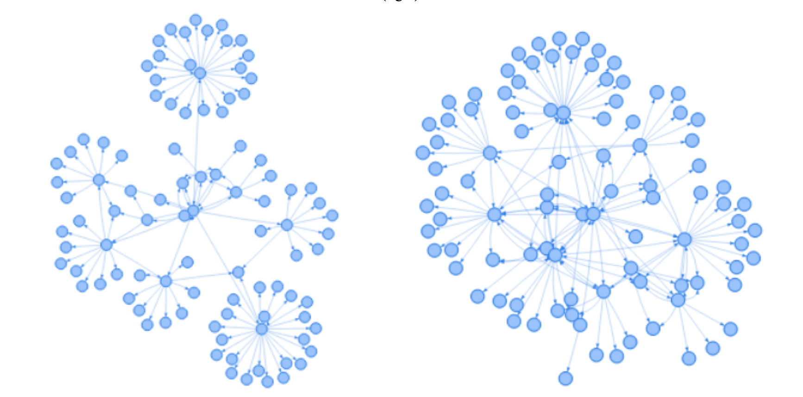

```

#### Graph metrics {-}

In this section we analyze the graphs using standard metrics. These measures allow investigations about relevant topology and specific features of a given graph. 
More precisely, we looked at the following measures: 
- Graph diameter: calculates the longest shortest path in a graph, thus, the minimal distance between two nodes that are the furthest away from each other. 
- Nodes Degree: Shows the number of nodes that every node is connected to. The mean value of the degree for the whole graph shows how interconnected the graph is: the higher the value, the more connections the nodes have with each other.
- Nodes Distance: Gives back the minimum number of edges that connect one node with each other. Here again, the mean value shows the interconnectivity of the graph: A lower value means that the way from one node to another is shorter, thus that the graph is more highly connected. The results of these metrics for the two graphs are:

- German Version: Diameter= 4, Mean Degree= 2.38, Mean Distance= 3.25

- English Version: Diameter= 4, Mean Degree= 3.29, Mean Distance= 3

From the diameter measure we can see that all of the pages are connected through a maximum of 4 edges. This is not surprising, since it was a premise of the method when setting the level to 2. Considering the mean degree, a level of 2.38 for the German version and 3.29 for the English version shows how the nodes of the English graph are more interconnected. This can also be qualitative observed when looking at the figures 3. Finally, the average distance from one node to another is higher in the German graph, supporting the finding of the measures discussed above. 

These findings goes in line with what is said by a study of Acatech [@kagermann2006industry]: in the USA, for example, the term Industry 4.0 is understood in a much wider meaning. Furthermore, Acatech study say that in Germany, the focus is mostly on technological dimensions, while in the USA, the development of the new business models in the area of big data analytics play a greater role, among others.


#### Clustering {-}

Figure \@ref(fig:industrieclusters) shows the outcomes of the clustering process: the vertices of the graphs represent the Wikipedia pages, the links are depicted by arcs that are directed from the originating page to the linked page and the clusters are represented by the different colors of the nodes. In order to make these clusters comparable, the label of the German version are translated in English. The resulting, corresponding groups as well as the number of nodes they contain can be found in table \@ref(tab:industrietab3).

Considering together figure \@ref(fig:industrieclusters) and table \@ref(tab:industrietab3), it is evident how the central node of the graph (Industry 4.0) is contained in the first cluster Internet of things & manufacturing for both the graphs. It is also by design connected to all other clusters, so that no cluster is isolated from Industry 4.0 node. 

As evident from table \@ref(tab:industrietab3), the clusters in the two graphs are similar. We have the same five clusters in both graphs and a different one for each language. This shows that Industry 4.0 framework if considered at a more abstract level, is similar in different countries. This is not surprising, since there must be something that made policy and industry call it the same name, but it is a strong result for our methods, able to map bottom-up this phenomenon. 

However, when looking at the clusters more closely, some interesting differences get clear. 
The cluster production, product life circle & flow production, which is completely missing in the English graph, is the one with the higher number of nodes in the German one. This shows how the topic of Industry 4.0 in Germany is much more concentrated on production than elsewhere. In the study of acatech [@kagermann2006industry], it is also explicitly stated that in Germany “ […] the focus is on optimizing production processes in terms of quality, price and flexibility and delivering better financial returns overall”. The focus on production for Germany is also confirmed by a monitor paper written by the by the European Commission [@industrie2016eu].
To give a clearer view of this phenomena, we have to consider that the word production is very similar in meaning to manufacturing. The cluster including the latter (internet of things & manufacturing) has more than the double number of nodes in the English graph with respect to the German one, so it might be that it is rather the wording that makes the difference. Anyway, by looking at the the disposition of the cluster (see figure \@ref(fig:industrieclusters)) internet of things & manufacturing in the two graphs, it can be observed that in the English version the cluster is strongly integrated with ITC-related topics (Data processing & Analytics, Cognition and Cloud Computing), adding the adjective cyber to the topic of manufacturing.

Additionally, also automation has more entries in the English version and is highly connected not only to internet of things & manufacturing, but also to could computing, which does not even exist in the German version of the graph: it is well known that Germany is not at the front when it comes to the integration of ICT in Industry 4.0. This found is again confirmed by the study of Acatech [@kagermann2006industry], where it is said that “Germany is currently lagging behind with regard to data-driven business models and the development of large platform ecosystems”.

The fact that cloud computing does not show up in the German graph is examined more closely. In fact, a Wikipedia page about this topic does exist in the German version of Wikipedia, but is not linked to the Industrie 4.0 page. As stated in section 4.3, contributors of the German version of Wikipedia tend to add only the most important connections between pages. This again shows that integrated ICT is not the most important topic in Germany now.

Another great difference in the number of nodes is in the cluster cognition, which seems to be more important in the German version of the graph. The German Wikipedia page describes this as a processing and rearrangement of information between a human and a system. Acatech study [@kagermann2006industry] does the same observation: “In Germany in particular, the focus is on integrating information, communication and manufacturing technologies”. This could explain even better the finding that the German graph lacks on the ICT side, giving a new interpretation: in Germany there is a different interpretation of the meaning of cognitive computing with respect to the rest of the world.

Finally, while the group of data, processing and analytics nearly has the same amount of nodes, the links of this cluster with the other clusters is quite different in the two graphs and also its content changes from on nation to the other. Words like big data does not even exist in the list of German pages related to industry 4.0 where it is limited to just data. This emphasizes the careful approach of Germany with this topic, which was also observed in [@wee2015industry]. Germany seems to be rather conservative when it comes to new emerging technological trends or even buzz-worlds like Big Data.


Table: (\#tab:industrietab3) Clusters names and number of nodes per cluster for each version of the Industry Graph 4.0.

|Cluster                                                |# Nodes German |# Nodes English |
|:------------------------------------------------------|:--------------|:---------------|
|1- Internet of things & manufacturing                  |12             |28              |
|2- Cognition                                           |23             |7               |
|3- Data, processing & analytics                        |23             |19              |
|4- Automation                                          |12             |20              |
|5- Cloud computing                                     |-              |21              |
|6- Production, product life circle and flow production |27             |-               |


```{r industrieclusters, echo=FALSE, fig.align='center', fig.asp=.75, fig.cap='The German version (left) and the English version (right) of the Industry 4.0 clustered graphs.', message=FALSE, warning=FALSE, out.width='100%'}

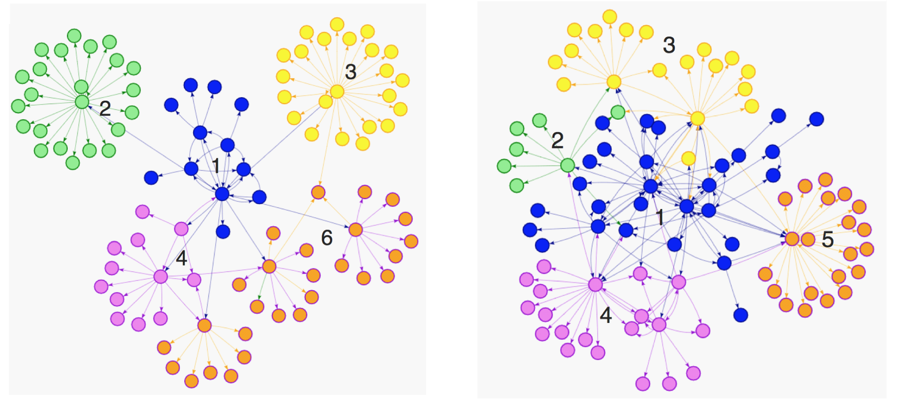

```


# Social Media

The technical knowledge generated by Social Media remains largely untapped. Some researchers proved that social media have been a valuable source to predict the future outcomes of some events such as box-office movie revenues or political elections. Social media are nowadays also used by companies to measure the sentiment of customers about their brand and products. 

This chpater proposes a new social media based model to measure how users perceive new products from a technical point of view. This model relies on the analysis of advantages and drawbacks of products, which are both important aspects evaluated by consumers during the buying decision process. This model is based on a lexicon developed in a related work (see chapter \@ref(advdrwresults)) to analyse patents and detect advantages and drawbacks connected to a certain technology.

The results show that when a product has a certain technological complexity and fuels a more technical debate, advantages and drawbacks analysis is more efficient than sentiment analysis in producing technical-functional judgements.

## Technical Sentiment Analysis

Nowadays, social media have become an inseparable part of modern life, providing a vast record of mankind’s everyday thoughts, feelings and actions. For this reason, there has been an increasing interest in research of exploiting social media as information source of knowledge although extracting a valuable signal is not a trivial task since social media data is noisy and must be filtered before proceeding with the analysis. In this domain, sentiment analysis, which aims to determine the sentiment content of a text unit, is considered one of the best data mining method. It relies on different approaches [@collomb2014study] and it has been used to answer research questions in a variety of fields comprised the measure of customers perception of new products [@mirtalaie2018extracting].
In this section, we try to understand if sentiment analysis is really the best available method to analyse consumer’s perception of products, expecialy when we want to measure the perception of the technical content of the product. Thus we compare State of the art sentiment analysis techniques with a lexicon of  advantages and drawbacks related to products.

### Methodology

Our work started with the selection of an event able to polarise Twitter users’ attention and products to analyse. In particular, we chose a premiere tradeshow for the video game industry, and two video game consoles disclosed during the event. We collected about 7 milions tweets about products published before, during and after the tradeshow. Since social media data is noisy (for example it may contains spam and advertising), before proceeding with the analyses, we filtered our dataset. In particular, after removing too short and non-English tweets, we manually classified a randomly extracted subset of posts to train a classifier which provide us the cleansed dataset. Then we conducted a sentiment analysis of the tweets using state of the art machine learning techniques. We classified each tweet as positive, negative or neutral. At this point we applied our lexicon identifying advantages tweets and drawbacks tweets. Finally we compared the outputs of the two analyses for the two product-related clusters of tweets. 
We found consistent differences between the extractions. The results shows that when a product has a certain technological complexity and fuels a more technical debate, advantages and drawbacks analysis is more able than sentiment in producing technical-functional judgements. For this reason we think that the proposed methodology peforms better then standard sentiment analysis techniques when a product has a certain technological complexity and fuels a more technical social media discourse.

#### Selection of a triggering event and products {-}

We chose the Electronic Entertainment Expo as event able to polarise users’ attention. Commonly referred to as E3, it is a premier trade event for the video game industry, presented by the Entertainment Software Association (ESA). We chose two new video game consoles, disclosed at E3 2017, as products of which predicting the success or failure. The first is Xbox One X, a new high-end version of Xbox One with upgraded hardware and the other product is New Nintendo 2DS XL, a streamlined version of the handheld console New Nintendo 3DS XL.

#### Data collection {-}

Twitter provides two possible ways to gather tweets: the Streaming Application Programming Interface (API) and the Search API. The first one allows user to obtain real-time access to tweets from an input query. The user first requests a connection to a stream of tweets from the server. Then, the server opens a streaming connections and tweets are streamed in as they occur, to the user.  However, there are a few limitations of the Streaming API. First, language is not specifiable, resulting in a stream that contains tweets of all languages, including a few non-Latin-based alphabets, that complicates further analysis. Instead, Twitter Search API is a Representational State Transfer API which allows users to request specific queries of recent tweets. It allows filtering based on language, region, geolocation, and time. Unfortunately, using the Search API is expensive and there is a rate limit associated with the query. Because of these issues, we decided to go with the Twitter Streaming API instead. For each product, we detected related hashtags and keywords an constructed a query to download relevant tweets. 
We chose to collect tweets not only after the tradeshow, but also before. For these reason, we initially identified some products keywords with their provisional names and we updated them at a later stage. Tweets have been downloaded from CNR (Consiglio Nazionale delle Ricerche, Istituto di Informatica e Telematica, Area di Pisa) since 11th June 2017 h. 10:00 to 31th July 2017 h. 15:00.

#### Data filtering {-}

The initial dataset resulted to be very noisy, containing tweets written in different languages, advertising and posts related to different products or subjects. We chose to keep into account only English tweets because sentiment and advantages/drawbacks lexicon is in this language. The data set is filtered removing tweets with less than five words and non-English posts with a language classifier. We obtained 7.165.216 of filtered tweets.  
At this point we created a golden set of relevant tweet to train a Supported Vector Machine classifier able to recognize relevant and unrelevant tweets. We defined characteristics that make a tweet: (i) relevant (posted by users or containing words or opinions related to our products of interests and their functionalities), (ii) irrelevant (tweets containing advertisings, links to e-commerce websites or messages related to other products or subjects). A researcher manually classified a subset made up of randomly extracted tweets. In particular, we exctract a subset composed of 6.500 finding 105 positive results and 6.395 negative. SVM model was then trained using this dataset, and computed a probability for each tweet to be relevant or irrelevant. A threshold of 0.7 has been chosen to label a tweet as relevant. The final dataset of filtered tweets, made up of 66.796 posts. We clustered tweets using product-related keywords. Clustering posts allowed us to further filter the final dataset which contained a small number of irrelevant tweets (Table \@ref(tab:tweetab1)).

Table: (\#tab:tweetab1) Clusters of tweets.

|                  | N° of tweets| % of tweets|
|:-----------------|------------:|-----------:|
|Xbox One X        |        64885|      0.9714|
|New N2DS          |         1706|      0.0255|
|Irrelevant tweets |          198|      0.0030| 

#### Sentiment analysis {-}

Table \@ref(tab:tweetab2) presents the results of the sentiment analysis. We classified each tweet according to its sentiment into positive, negative, or neutral. We used an established methodology developed by [@cimino2014linguistically]. We pre-processed the tweets by removing mentions (@ character), URLs, product hashtags, emoticons and single characters. As a result, for each tweet we obtained a probability of belonging to a mood class. After a manual analysis, we used a class prediction probability threshold of 0.6 to filter out low confidence prediction, i.e. tweets that cannot be classified as positive or negative with a high confidence are classified as neutral instead.

Table: (\#tab:tweetab2) Clusters of tweets.

|           | Positive| Negative| Neutral|
|:----------|--------:|--------:|-------:|
|Xbox One X |   0.3599|   0.0465|  0.5937|
|New N2DS   |   0.5299|   0.0158|  0.4543|
|Overall    |   0.3642|   0.0457|  0.5901|

#### Advantages and drawbacks analysis  {-}

To extract technical advantages and drawbacks from tweets we used the lexicon developed in chapter \@ref(advdrwresults) that contains 657 Advantages words and 297 Drawbacks clues. These words are searched on our dataset finding different percentages of tweets with words from the lexicon in the two product-related clusters of tweets. Table \@ref(tab:tweetab3) reports the results.

Table: (\#tab:tweetab3) Percentages of tweets containing or not words from our lexicon. 

|            | Adv| Drw| Adv & Drw| No Adv or Drw| Adv or Drw|
|:-----------|---------------:|---------------:|---------------------:|-------------------------:|----------------------:|
|Xbox One X  |          0.0884|          0.0374|                0.0037|                    0.8705|                 0.1295|
|New N2DS XL |          0.0662|          0.0094|                0.0000|                    0.9244|                 0.0756|

### Results

We adapted the advantages & drawbacks analysis to give as output a classification ef each tweet. We classified data coming from the latter analysis in this way: 

1. positive (tweets containing only advantages words)
2. negative (tweets containing only drawbacks)
3. neutral (tweets with no words of our lexicon or controversial tweets)

As we can see in figure \@ref(fig:tweetsentres), sentiment analysis is more able to polarise tweets. In fact, with this analysis we found lower levels of neutral tweets, respectively 59.37 % for Xbox One X and 45.43% for the New Nintendo 2DS XL. 

```{r tweetsentres, echo=FALSE, fig.align='center', fig.asp=.75, fig.cap='Comparison between Sentiment analysis and Advantages/Drawbacks analysis.', message=FALSE, warning=FALSE, out.width='100%'}

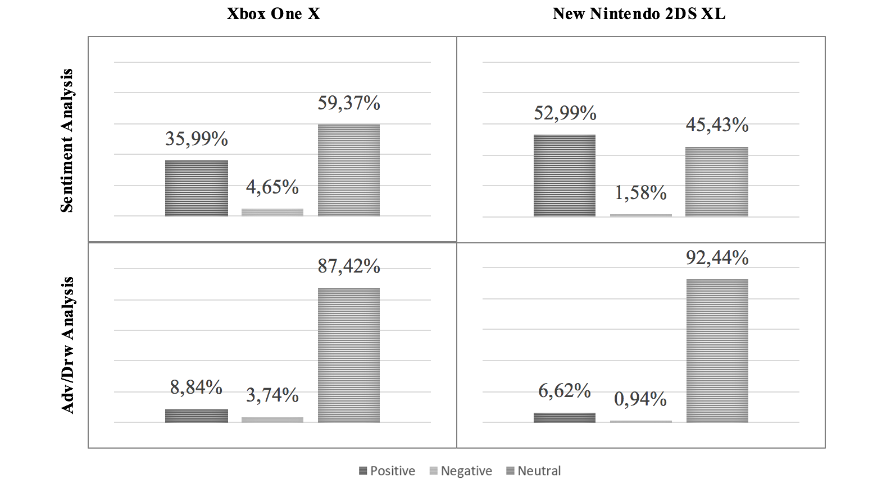

```

This was an expected result since this kind of analysis is designed to deal with colloquial language while our lexicon is technical, being derived from patents analysis. What surprised us is the different polarisation of the products that we see comparing the two analyses. In fact, while with sentiment analysis Nintendo achieves lower percentages of neutral tweets, with advantages and drawbacks analysis is the opposite, since Xbox tweets are more polarised. We also noted that we found more tweets with words of our lexicon in the Xbox subset than in the Nintendo one (\@ref(tab:tweetab3)). We did the hypothesis that the differences between the percentages of tweets with words found for each product, and the differences of polarisation between the two analyses depend on the different marketing focus, target customer, and technological complexity of the two new video game consoles. Xbox One X targets hard-core gamers who really wants a premium experience ^[http://www.businessinsider.com/why-xbox-one-x-costs-500-2017-6?IR=T (last access: 17/11/2017)]. With its marketing campaign, Microsoft pushed the technical supremacy of its new machine over the competitors’ products, fuelling a debate about its technical features amongst the potential users.

As a result, the campaign produced a more technical social discourse that allowed us achieving better results. Instead, the new Nintendo handheld console has been developed targeting children and families providing a model that falls somewhere in the middle of the line of 3DS consoles ^[ http://www.nintendolife.com/news/2017/05/reggie_explains_the_reasoning_behind_the_new_2ds_xl (last access: 17/11/2017)].
We initially checked our hypothesis using Google Trend to compare users’ search interest about technical review of the two products during the data collection period (Figure \@ref(fig:tweetsearchinterest)). Then, we analysed the number of technical articles related to the new products published by the 25 most popular video games and technology websites in the U.S, according to the ranking of SimilarWeb, a digital marketing intelligence company which publishes insights about websites. We used Google search engine to retrieve technical article within the web domains previously identified: we obtained 1.117 articles about Xbox and only 52 about Nintendo, proving that technical debate concerning Xbox is greater. This is and evidence of the fact that when a product has a certain technological complexity and fuels a more technical debate, advantages and drawbacks analysis is more able than sentiment in producing technical-functional judgements. The greater number of neutral tweets found with advantages and drawbacks analysis can also be explained with the Means-end chain model [@reynolds1995means]. Consumers express themselves basing on personal consequences linked with product use or basing on personal values satisfied by the product itself. For these reasons, tweets contain a more colloquial language which sentiment analysis is more able to interpret than the latter tool.

```{r tweetsearchinterest, echo=FALSE, fig.align='center', fig.asp=.75, fig.cap='Google Trends comparison of search-terms “Xbox One X review” and “New Nintendo 2DS XL review” during the data collection period, since 11th June 2017 to 31st July 2017. Values on the vertical axis depict search interest compared to the highest point in the graph during the observation time. A value of 100 is the peak popularity for the term. On average, users searched for Xbox reviews with an approximately five times higher frequency.', message=FALSE, warning=FALSE, out.width='100%'}

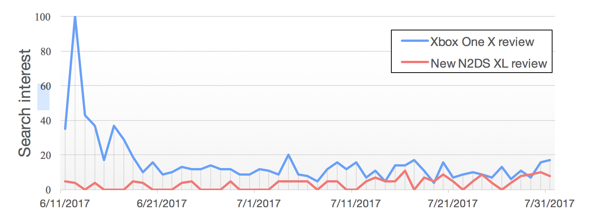

```


