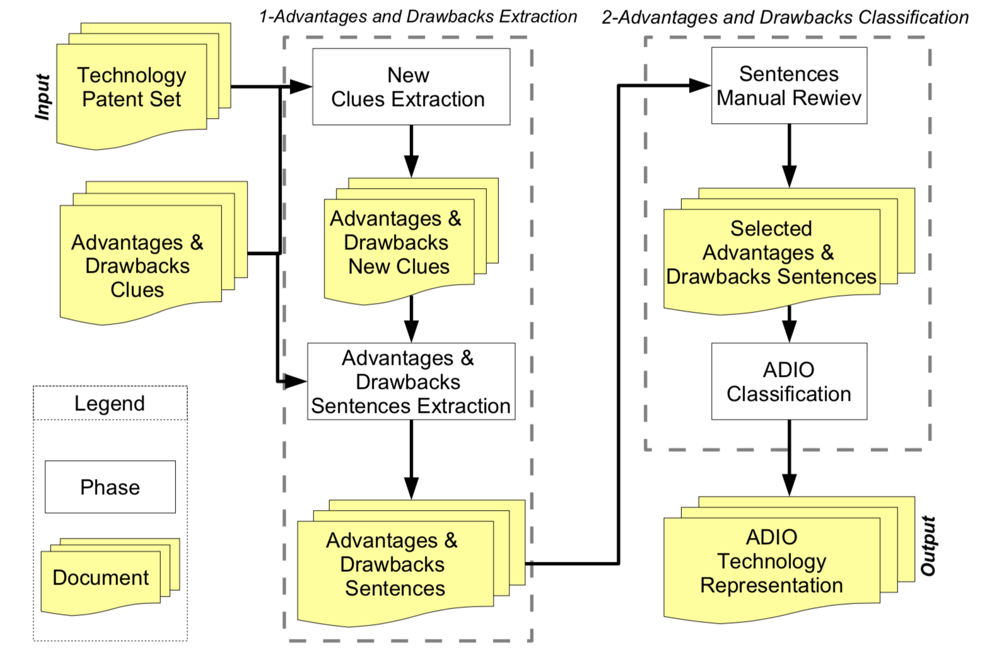

# (PART) Applications of the Results {-}

It has been highlighted by the guidelines of design research [@bichler2006design] that effective design-science research must provide clear and verifiable contributions in the areas of the design artifact, design foundations, and/or design methodologies. For this reason the present section is a collection of projects that describes the applications and results of the methods designed in _Part 3 "Methods and Results"_.

# Exploiting patent information in novel ways

Due to the complexity and volatility of user needs, companies increasingly ask product designers and engineers to create ideas that meet needs in novel and better ways, rather than just making existing technologies more attractive [@brown2010design]. As a matter of fact, these professionals are nowadays involved in the process of understanding in depth what users want and desire [@haley1968benefit; @day1979customer].
Unfortunately, it is well known that user needs are usually examined in separate business departments, such as marketing or business development, and are described in a language that is remote from the professional practice of product designers and engineers. The relation between the understanding of user needs by marketing departments and the development of new products by technical departments is a deeply troubled one. There is a large agreement within the design community that this state of affairs is not optimal and that dedicated efforts should be made to reconcile the engineering approach with a more articulated understanding of user needs, particularly of consumer needs [@pahl2013engineering; @eppinger1995product].

A promising approach is based on the description of products in terms of advantages and disadvantages, or drawbacks. Users typically choose an artifact considering the advantages that it brings and the disadvantages that it solves. Advantages and drawbacks exist if they have an impact on the user and if they affect the product in terms of effectiveness (the level at which the product reaches its goals) and efficiency (how many resources does the product have to consume to reach its goals).

At the state of the art, the two main tools to manage advantages and drawbacks developed by the design community are QFD and FMEA/FMECA. Companies frequently make use of Quality Function Deployment (QFD) in order to generate lists of requisites, users' needs, users' requirements and to guide the design process [@carnevalli2008review]. They use FMEA/FMECA to gather and study drawbacks, failure modes and their effects and causes [@liu2013risk]. On the other hand, the notion of advantages is also at the core of marketing techniques used in the segmentation of markets (benefit segmentation) and in the identification of alternative design solutions to achieve desired benefits (means-and-ends-chain analysis).

The interest in the description in terms of advantages and drawbacks is that it can be interpreted smoothly from the two sides of this troubled relationship: engineers can easily link them to performance specifications (usually described with a functional language) and hence technical specifications, while marketing experts can read them with the language of social sciences (for example, psychology, semiotics, sociology or anthropology). Given the promise of this description, why is it used so rarely?

There are several reasons. First, information on user needs is typically owned by users, and is stored in implicit and non codified formats. Second, and consequently, in order to access this information product developers must enter into direct and personal contact with users, listening and understanding the voice of the customer. Not only this is very expensive, but the experience shows that the earlier the stage of development of needs, the more ambiguous, fuzzy and uncertain the information obtained by users. Third, most of this information is not publicly disclosed but is kept confidential as company know-how. Researchers have hard time to access structured analyses of products based on advantages, even more so for descriptions based on drawbacks. Thus the goal of building up full scale descriptions based on advantages and drawbacks is still elusive.

In the present work we consider patents as a possible alternative information source for advantages and drawbacks. As stated by the World Intellectual Property Organization (WIPO), an invention is a solution to a specific technological problem [@world2004wipo]. The problem that an invention solves in a technological field is a certain negative effect that the state-of-the-art technologies cannot overcome; on the other side, a solution is the way to solve this problem. A solution can lead to some advantages with respect to the known state of the art. Thus, starting from the definition of invention, it is clear how it can be characterized by its advantages and the problems it solves. Based on these definitions, the WIPO explicitly suggests as a guideline for applicants to write patents in this language. The applicant (the person or company that applies for the patent) is led to include this information in patent documents in order to have more chances of success in the patenting phase.

An important feature that makes patent information valuable is that the information that is contained in these documents today will be contained in other documents, like manuals, handbooks and market reports, to which designers are more accustomed, in the future: information anticipates availability of products on the market by a factor varying from 6 to 18 months [@golzio2012]. In addition, these documents are freely accessible by many different databases nowadays [@kim2015patent].

To claim that patents include descriptions in terms of advantages and drawbacks is one thing, to show how this information can be used effectively, however, is a completely different business. To test the hypothesis of the presence of advantages and drawbacks information in patents and to exploit this information for design purposed, there is a need to overcome two main problems:

- analyzing patents requires skilled personnel and long time [@leon2007trends]
- due to the increase in the number of patent publications, there is a massive information overflow [@bergmann2008evaluating].

In this chapter we present a methodology for the extraction of information on advantages and drawbacks of technologies from patents, that is able to fully overcome these problems (as demonstrated in section \@ref(advdrwresults)) and with the final goal to make available patent-based structured information to the design community. 

## Towards formal definitions of Advantages and Drawbacks

Referring to section \@ref(advdrwresults), we propose that all useful definitions of advantages and drawbacks can be collapsed into three categories, each with a positive or negative sign, as follows:

1. more/less wanted output obtained . A wanted output is a desired effect of the system.
2. more/less unwanted output obtained. An unwanted output is undesired effect of the system.
3. more/less resources needed. More resources needed to achieve a desired effect imply less efficiency.

This classification can be labelled ADIO classification (Advantages-Disadvantages-Input.Output).
The operationalization of this classification for purposes of automatic information extraction and processing is the object of the rest of the paper. 

## Methodology

The goal of our system is to automatically extract short sentences that contain information about the advantages and the drawbacks of the technology from patent texts. Furthermore we propose a taxonomy that organizes the output of the system focusing on advantages and drawbacks that have impacts on the systems thus influencing its input or output.
A flow diagram representing the adopted method for the automatic ADIO extraction and classification of a technology is shown in Figure \@ref(fig:adioworkflow).
The method takes as entry a patent set representing the technology to analyze. The patent set and the list of advantages and drawbacks clues are entries of the process of advantages and drawbacks extraction and generate the phrases containing the advantages and the drawbacks. Than they become the entry of the process of Advantages and Drawbacks classification that exploits human knowledge to classify the technology according to the ADIO representation.

```{r adioworkflow, echo=FALSE, fig.align='center', fig.asp=.75, fig.cap='Work flow diagram followed to extract the ADIO technology repres- entation from a patent set.', message=FALSE, warning=FALSE, out.width='80%'}



```

### Advantages and drawbacks extraction

The process of advantages and drawbacks extraction is the first of the two-macro processes used in our system. The first process starts from a patent set containing patents inherent to a technology and extract relevant sentences in output. Each sentence describes an advantage or a drawback of the specific technology. All steps of this process are fully automatic. The patent set should be very large, in the order of several hundred (in our case study n > 1000 items).
To describe with a certain degree of precision an advantage or a drawback, patent applicants have to use sentences of a certain length. Since NER systems are designed to extract single words or short n- grams, we need to extract entities that are clues of the whole sentence that describes the advantage or the drawback. However our interest is not on the clue but rather on the words that follows the clue: the real advantage or the real drawback. We refer to these words as target. Considering the ADIO classification, proposed in the present work, these are words that help to classify whether the advantage or the drawback have an impact on the input (influencing efficiency) or the output (influencing effectiveness) of the system.
The few examples above shows how clues are words that indicates a characteristic of a flow or its modification (positive or negative); the clue and target together specify the entity and direction of the modification of the flows that evolve within the system. A summary of these linguistic concepts and some examples are shown in figure \@ref(fig:audioexamplesent).

```{r audioexamplesent, echo=FALSE, fig.align='center', fig.asp=.75, fig.cap='Examples of advantage or drawback sentences divided in its clue and target.', message=FALSE, warning=FALSE, out.width='80%'}

knitr::include_graphics("_bookdown_files/figures/audioexamplesent.png")

```

As stated above, we introduce a crucial concept, that of a “clue” for the identification of a complex text structure describing advantages or drawbacks. We describe here the process for collecting clues. The process is not trivial because the sources are heterogeneous, fragmented and sparse. For example, we can find lists of failures in repositories published in the car industry, lists of diseases or infections in medical treatises, lists of positive and negative words in sentiment analysis tool-chains. Some of them are very accurate but extremely short, domain specific and rarely occurring in patents (e.g. new diseases), while others are broad but ambiguous thus introducing noise in the analysis (e.g. sentiment annotated words).
We followed a twofold approach. The first approach consisted in the manual collection of clues of advantages and drawbacks directly from patent texts. This process was performed on 2000 patents in several patent classes. This has led to collect 3.254 advantage-clues and 5.142 drawback-clues.
The second approach consisted in looking for alternative methods to indicate advantages or drawbacks clues, finding defined word patterns. The most relevant are the negations of advantages to obtain drawbacks, and the negation of drawbacks to obtain advantages. It is worth noting the cases of suffixes like as -less or -friendly, - free and the like, and prefixes like as anti-, dis- , de-, un- and the like, that allow a rapid and systematic expansion of the database.
At the end of the process, advantages numbered 6.568 and the drawbacks numbered 14.809. This is a fairly large knowledge base for the system, and gave us a reasonable number of clues to be used in the next step of the process. Example of clues are shown in section \@ref(advdrwresults).
The first approach has the limitation that lists were extracted from a random but relatively small sample of patents (n= 2000). Another limitation is that the rules used in the second approach are not exhaustive, and they can create non-sense clues, due to the possible combinations of words (e.g. “anti- ability” or “un-problem”). On the positive side, it is reasonable to assume that using these approaches it is possible to collect a large set of clues that are relatively independent from the patent set. In addition, it is now clear how new clues could be easily extracted when changing patent sets. In order to obtain a larger and complete collection of clues it is unsuitable to use the manual extraction on each domain patent set. For this reason, new clues were iteratively used to train machine learning algorithms.

#### New Clues Extraction {-}

In this section we briefly describe the system used to automatically extract new word clues from patent texts. The system is based on the work discussed in section \@ref(advdrwresults). This process takes in input a corpus of patent documents regarding a certain technology. After the tokenization of the corpus, each token (word or n-gram) is represented by series of features. Then the advantage and drawback clues are re-projected on the text, generating a training set of words to be given as an input to a classifier system.
The classifier builds a model able to detect words that have similar behavior (in terms of the selected features) with respect to the behavior described in the training set. The model is used to classify the words contained in patents as potential new advantages or drawbacks word clues. These new words clues are technology specific clues or generic clues that did not belong to the starting list of advantages and drawbacks generic word clues.

#### Advantages and Drawbacks Phrases extraction {-}

Once all the new advantages and drawbacks clues are extracted, these are merged with the ones belonging to the original knowledge base, obtaining a final list which will be processed by the advantages and drawbacks sentences extractor.
The advantages and drawbacks sentences extraction is the activity through which the system catches the shortest informative sentence containing each word clues. To do that the patents are processed through a phase of part-of-speech tagging (POS tagging). Starting from the clues, only the POS sequences that match a certain pattern were extracted. The pattern, expressed using a regex regular expression is:

\begin{equation*} 
(Clue) + Noun.* Noun.* Noun.*
\end{equation*}

This structure has proven to be able to catch a reasonable number of words of the target, exhaustively expressing an advantage or a drawback without catching very long phrases.

###  Advantages and Drawbacks ADIO classification

The process of advantages and drawbacks classification is the second of the two macro processes involved in our system. This process takes in input the advantages and drawback sentences extracted in the advantages and drawback extraction process and gives in output the ADIO representation of the technology.

####  Sentences Selection {-}

As stated above, we suggest a clear classification of advantages and drawbacks in a 3*2 structure. After the extraction each sentence is assigned to one of the following classes:

1. more/less wanted output obtained. A wanted output is a desired effect of the system.
2. more/less unwanted output obtained. An unwanted output is undesired effect of the system. 
3. more/less resources needed.

If a sentence does not belong to one of these classes it is not taken in to consideration for the next analysis, even if expresses advantages or the drawbacks of the invention. This classification makes it possible to represent the technology using the ADIO representation.

#### ADIO Technology Representation {-}

Given the classification described above, we obtain three possible kind of advantages and three possible kinds of drawbacks. Considering a wanted or desired output, the achievement or the increase is an advantage, while the negation or the reduction is a drawback. On the other side, considering an input to the system or an unwanted output, negation and reduction constitute an advantage, while achievement and increase are clearly a drawback. It is important to specify that the both the input or the output (wanted or unwanted) could involve flows of matter, energy, or signal.

## Results

### Patent set 

To test the proposed process, we selected a patent set composed of a sample of 3,000 patents. The patent sets belongs to the A47J37 IPC patent class defined as _“Baking; Roasting; Grilling; Frying”_. We will refer to this patent set as cookers set.

### Extraction of Advantages and Drawbacks 

Total extracted advantages numbered 4129, drawbacks numbered 1835. After manual review of sentences the total number went to 2509 and 1532, respectively. During the manual review phase each sentence was assigned to one of the three classes of the taxonomy, considering the target of the sentence. The system itself decides if a sentence indicates an advantage or a drawback, considering the clue. The results in terms of cardinality of the classes of the taxonomy are shown in Table \@ref(tab:adiotableresults). As we can see from this table, the sentences review process has led to a balance between the extracted advantages and drawbacks. It is interesting to see how the wanted outputs are more likely expressed as advantages (1786 sentences are advantageous wanted output while 660 are drawbacks); the situation is reversed for the unwanted output (431 sentences or that advantages and 682 for the drawbacks).

Table: (\#tab:adiotableresults) Examples of clues of advantages and drawbacks extracted manually from patents.


|Class           | Number of Advantages Sentences| Number of Drawback Sentences|
|:---------------|------------------------------:|----------------------------:|
|Input           |                            292|                          190|
|Wanted Output   |                           1786|                          660|
|Unwanted Output |                            431|                          682|
|TOT             |                           2509|                         1532|


### A-D-I-O Representation

The two ADIO schemes for the advantages and drawbacks of cookers are shown respectively in Figure \@ref(fig:adiorapresentationout). The sentences shown in this figure are a sample of all of the 2662 extracted sentences. Furthermore these sentences are taken as-is from patents, misprints and errors included.

```{r adiorapresentationout, echo=FALSE, fig.align='center', fig.asp=.75, fig.cap='Examples of advantage or drawback sentences divided in its clue and target.', message=FALSE, warning=FALSE, out.width='80%'}


```


Both the results are promising for future applications in the design fields. In particular Figure \@ref(fig:adiorapresentationout) (a) allows designers to focus on the positive side of the effects provided by the product and to better meet the explicit and implicit user needs. Similarly, Figure \@ref(fig:adiorapresentationout) (b) helps designers to redesign of the product in a proactive way, to keep attention to the critical issues identified by the drawbacks and to conceive possible corrective actions to solve such drawbacks.

## Discussion

This paper has proposed a method to extract and summarize sentences that describe advantages and drawbacks of technologies from patents. Advantages and drawbacks are considered as phenomena that influence the efficiency or the effectiveness of products by modifying their inputs or their outputs. Advantages and drawbacks information are useful for designers who want to design new products or to redesign old ones so to meet user needs in novel and better ways. The proposed approach allows patent readers to analyze a massive quantity of patents and to reduce the time needed for research and analysis.

In the future, we want to focus on the application of the proposed ADIO framework to a wider number of patents set and hopefully we would like to automate the classification of advantages and drawbacks. Furthermore we want to focus on the extraction of new entities of interest for designers, and to understand which other groups of words contained in patents texts can add value to the design process.

# Enriched dictionaries for Innovation

The demand for intelligence and foresight of technologies is increasing due to the need of companies and governments to make sense of the rapidly changing technology landscape and to make better decisions. In particular, emerging technologies exhibit not only rapid growth, but also strong conditions of technology and market uncertainty, so that traditional techniques of technology intelligence are challenged [@rotolo2015emerging].

Technology intelligence makes large use of a statistical procedure called clustering. This multivariate technique is commonly used to place entities into relatively homogeneous groups, maximizing the difference with other groups, when entities are not subject to an existing classification. In technology intelligence this is the most interesting situation: if technologies were already fully classified, then they would already be established or mature.

It is important to remark that clustering, in one way or another, is almost a necessity in technology intelligence. The amount of data available on technologies, even on the last generation of technologies, is so large that a preliminary effort of clustering and profiling is generally considered a preliminary step for the analysis.

In technology intelligence the formation of clusters is generally based on words extracted from relevant documents (scientific publications, patents, technical standards). There are two main approaches to the extraction of words from documents: extracting from the metadata associated to the document, or extracting from the full text of the document. Examples of metadata are authors, affiliations, inventors, assignees, keywords, titles. This approach has generated a large literature that uses metadata in order to extract usable knowledge. Within this literature, a notable stream of studies has extracted usable knowledge from documents by clustering the metadata in order to obtain meaningful structures. This method is associated to the use of keywords, as we will see below.

More recently, a different approach has been introduced, based on the processing of the full text of documents. Following the remarkable advancements in computational linguistics, it has become possible to process the entire text of publications, patents, or technical standards to a large scale. Here the clustering exercise does not take place on metadata, but on words, or their combinations, included in the text of documents. The topic modeling is the most used approach. Topic modeling is a tool to extract structures of text from corpora without the help of external sources of knowledge [@blei2003latent].  Once the words have been extracted from metadata or the full text, a clustering strategy must be designed based on an appropriate definition of similarity. 

We then suggest the exploration of a novel approach, one that combines domain knowledge with powerful data science techniques, called _enriched dictionaries_. These are large and highly structured collections of words, associated to formal definitions and internal linkages, that are produced on the basis of domain knowledge of various kinds. In some cases they are publicly available, in othr cases they are the resuld of dedicated and idiosincratic research efforts. These dictionaries can be used in order to “filter” the semantic content of the full text of documents according to pre-defined structures, generated within the domain knowledge and validated at the state of the art. They can be used, therefore, within the so called supervised text mining approach.
This paper has two objectives: introducing the methodology of enriched dictionaries, and showing that it allows the joint use of several, and complementary, perspectives: one based on the abstract engineering principles of technologies (functional view), another on the advantages delivered by the technology (advantage view). These dimensions are kept separate in the literature and clustering exercises do not combine them. We show the power of clustering technologies using these views in a combined way.

## An overview of dictionaries for technology intelligence

### Publicly available dictionaries

One of the advantages of the dictionary approach is the possibility to utilize publicly available dictionaries, that is, available online with unrestricted, free access.
We made systematic use of Wordnet, a large dictionary in English language made available and curated by Princeton University. Wordnet is a standard reference in computational linguistics.

Upon the basic Wordnet dictionary, several specialized or dedicated dictionaries have then been developed, which are also available with unrestricted, free access.
We made use of the following dictionaries.

- Artifacts: a collection of terms referring to objects, inventions and tools. The dictionary is one of the Name categories available in the Wordnet-based categorization dictionary from Provalis, free to download ^[https://provalisresearch.com/products/content-analysis-software/wordstat-dictionary/wordnet-based-categorization-dictionary]. Artifacts were chosen to explore texts in order to find structural indications for the components of an invention. 

- Acts: a collection of terms referring to generic actions. This is another Name category from the Wordnet dictionary. Acts were selected in order to find verbal expressions referable to functions carried out by the objects described therein.

### Research-based dictionaries

The dictionary methodology offers the flexibility to build up dedicated or specialized dictionaries, that represent the state of the art of a given knowledge domain. We make use of two dedicated dictionaries recently developed by the authors in an academic research context.
Needless to say, in these cases the authors must give the readers or users of the dictionary full proof of the completeness of the dictionary, or the compliance with formal criteria for the definition of a dictionary. These proofs have been offered in a number of papers cited below.

- Functional verbs: list of verbal expressions describing functions, or actions performed by artifacts on given objects [@fantoni2013automatic; @apreda2016functional].

- Advantages and Disadvantages: list of terms referring to measurable benefits or drawbacks related to an object, chosen for their capacity to represent applications of an invention (see section \@ref(advdrwresults)).

Table \@ref(tab:dictex1) offers an overview of the dictionaries used for this analysis, with a few examples of terms.

Table: (\#tab:dictex1)  Sources and main characteristics of dictionaries.

|Dictionary               | Numberof entries|Examples of chunks                                                                           |
|:------------------------|----------------:|:--------------------------------------------------------------------------------------------|
|Artifacts                |            12374|Acetanilid, Actuator, Aerogenerator, Agglomerator                                            |
|Acts                     |             5527|Abduction, Abidance, Accenting, Acquiring                                                    |
|Functional Verbs         |            11256|Abrade, Absorb, Abut, Accelerate                                                             |
|Advantages/Disadvantages |            29902|Ability, Accelerate, Acceptance, Accessibility, Accident, Accidents, Aggravated, Aggravation |

```{r dictex1code, echo=FALSE, fig.align='center', fig.asp=.75, fig.cap='', message=FALSE, warning=FALSE, out.width='80%'}

knitr::kable(
  readxl::read_xlsx("_bookdown_files/tables/dictex1.xlsx")
  )

```

## The value added of enriched dictionaries 

In order to illustrate the original contribution of the enriched dictionary approach, it is useful to refer to similar approaches, recently introduced in the literature. The starting point of this literature is similar to the one advocated in this paper, i.e. the need to supervise the full text mining with the help of list of words that reflect domain knowledge.

A natural candidate here is the list of words that describe technical functions, or the abstract characterization of the working principles of technologies [@cascini2004natural; @dewulf2006directed; @cascini2007computer; @cascini2008measuring]. The pioneering approach in this field is TRIZ, the patent-based methodology that has identified a number of abstract inventive principles [@petrov2002laws], whose application to patent texts has permitted the detection of evolutionary trends in specific technologies [@verhaegen2009relating; @wang2010identifying; @yoon2011automated; @park2013identification]. A variant of this approach combines the functional approach with lists of product attributes or properties [@yoon2012detecting; @yoon2011invention; @kim2010cause]. More recently, a similar approach has been introduced, suggesting that subject-action-object (SAO) linguistic patterns can be derived automatically from the full text of patents [@yoon2011identifying; @choi2012sao; @park2011identifying]. A SAO textual sequence is considered an indication of the engineering principle that describes an action that is changing an object. Choi et al [@choi2012sao] reviews the state of the art of function-based technology databases (in particular, TRIZ and Creax) but suggest that SAO structures are more versatile and flexible in order to apply Natural Language Processing techniques.

Within this line of investigation the notion of technology tree (Tech Tree) has been introduced [@choi2012sao]. It combines within a single representation taxonomies of products, technologies, and abstract functions. Similarity matrices are built along these dimensions and aggregated. 

While these two approaches have generated a large and interesting literature, their main limitation is the lack of transparency. The queries obtained from the TRIZ inventive principles have not been published and there is no demonstration of their reliability (i.e. replicability under controlled conditions) with respect to all semantic variations of words. Similarly, the SAO queries, although intuitively clear, leave the readers and users with the problem of establishing the semantic content in the engineering sense, given that the notion of “action” may cover, in fact, many different meanings.

## Methodology

The cited studies have suggested that a mixed approach to the clustering problem could be the best solution to achieve good results. In particular there is a need for placing more domain knowledge into the analysis, while keeping the enormous advantages of text mining and automatic knowledge representation techniques.

This is the starting point of the dictionary approach we propose. It suggests that the full text of technical documents is searched by using a structured list of words, generated from a substantive body of domain knowledge, formally defined, and organized in a hierarchical way.

A dictionary, in substance, is a collection of terms pertaining to a precise context and then selected following a logical pattern. The content of a dictionary may sensibly vary from case to case, comprising terms related to a precise technology, a technical field, a social group, or more generic parts-of-speech such as particular kinds of actions or nouns, and so on.

The main difference between a dictionary and a mere collection of keywords is in their respective scope, which is, for a dictionary, wider and far more complete, including all the synonyms, hypernyms and hyponyms of a term. By definition, a dictionary must include all the definitions and terms referring to the chosen context. The completeness has an important consequence for text mining applications. When a dictionary is used as a tool to filter the content in a collection of texts, the query is formed not only by principal words, but also by secondary words, such as synonyms. These secondary words would be lost if the analysis were based on words and keywords. Therefore dictionaries contribute to overcoming the biases introduced in the analysis by the subjective choice of keywords by experts.

To start with, the dictionary method was combined with topic modelling techniques in order to overcome one of the main limitations of topic modeling, that is, the extraction of irrelevant topics.

The starting assumption is the possibility of representing a document using the main topics cited in it. A topic is, basically, a collection of terms that delineate and describe an argument. Topics may be identified by using unsupervised or supervised methods. The unsupervised application of the method will have the result of giving generic topics, often irrelevant in specialized analysis. This outcome can be mitigated, but not eliminated, by the application of ranking techniques, such as Term Frequency-Inverse Document Frequency (TF-IDF), that allow the identification of coherent topics. Alternatively, analysts may refer to supervised methods, which are however resource-consuming in their design and implementation.
The dictionary approach offers an excellent solution to the trade-off between relevance and precision of the search, which plays in favor of supervised methods, and the parsimony of the analysis, which on the contrary militates for the adoption of unsupervised methods.

In addition, if topics are clearly delineated, it becomes possible to identify similarities between documents that refer to technologies with a transversal, or cross-domain, potential for application. 
Dictionaries can be used for different purposes and help to identify latent structures from a variety of perspectives. We advocate the use of several dictionaries in parallel, on the same collection of texts, as a way to examine technologies with a variety of perspectives. Figure \@ref(fig:dictwf) illustrates the main steps of the methodology.

```{r dictwf, echo=FALSE, fig.align='center', fig.asp=.75, fig.cap='Steps of the dictionary approach to the text mining of patents.', message=FALSE, warning=FALSE, out.width='80%'}


```


The basic idea of the process is that a document can be represented by the set of terms, numbers, graphic symbols and punctuation that compose meaningful sentences. The "technical" objects belonging to this set are named Features. 
Starting from selected patent sets, a Document-Feature Matrix is created using different dictionaries as filters to select only the desired features; the obtained matrices are then used as the starting point to perform a topics number evaluation algorithm, based on the connections between documents with same or similar features. Topics are formally clusters of features, coupled because of their pertinence to the same concept; measuring the percentage of cohesion of a document to each topic recognized is, then, a method to collect informations about the contents of the document itself.

#### Creation of the Document-Feature Matrix {-}

A patent can be represented by a vector exhibiting the number of occurrences, if a given feature is included, and 0 otherwise. Since these features are ordered within dictionaries, all patents in a patent set can be represented with similar vectors. A collection of texts can be therefore represented as a matrix called Document-Feature. A Document Feature Matrix (DFM) is a algebraic matrix with N rows, corresponding to individual documents in the corpus, and M columns representing the features. With this formalization it is possible to measure the occurrences of features in every document contained in the corpus. It is a powerful tool to get a fast quantitative information about a document set, counting the features originated in the dictionaries, with the opportunity of selecting (or removing) some of them.

Each patent in the patent set is filtered using one of the four dictionaries at a time.
The resulting list of words was processed in order to eliminate the generic words, or those words that, being diffused across most documents, do not have specific semantic content. This is done by using the stopwords labelled SMART in the text mining literature, in combination with a list of stopwords extracted from the text of patents and including some generic words in the legal language of patents (or “Patentese”), such as claim, invention, right, tool etc.

Due to the large number of entries in dictionaries and the exploratory nature of this work, we restricted the number of features considered for each of the DFMs to 500. The selection was made automatically, by selecting the top 500 terms in terms of share of documents in which they appear.
In some cases the selected patent text delivered no matching with the selected features. In this case the patents were eliminated. Thus the fina DFM only includes documents with positive entries from the lists of features extracted from the analysis.
It must be noted that DFMs are sparse matrices: sparsity is a mathematical parameter, varying from 0 to 1, that indicates how much systems are loosely coupled. In particular, it is a measure of the Z zero-valued elements in a matrix divided by the N x M total number of elements. Thus, a sparse matrix is a matrix in which large part of elements in cells are zeroes. Sparsity it is a good measure of how documents in a corpus differ from each other with respect to their Features.

Documents are iteratively examined in pairs: if two documents share a feature they are considered similar. Various metrics of similarity can be defined and computed. After a measure of similarity is defined, various clustering techniques can be applied as well. In this application we use the cosine similarity, which is largely adopted in the field.
Cosine similarity is a measure of similarity between two non-zero vectors, that computes the cosine of the angle between them in an inner product space. Each document in the Document-feature Matrix is characterized by a vector where the value of each dimension corresponds to the number of times the feature appears in the document. Two documents, then, are similar if their cosine similarity is near to 1.

Given two n-dimensional vectors of attributes, x and y, their cosine similarity is calculated by the dot product of them, normalized by the product of the vector lengths.
Results of the similarity measures are stored in a N x N matrix, in which documents are both upon rows and columns. It is a squared matrix with ones on its diagonal, indicating identities between patents and themselves, and the upper (or lower, for it is the same) half filled with similarity values for all the document
couples. The most intuitive method to analyze which patents are more similar is to visualize them in a graph. To do so, it was used the igraph package , which contains a list of commands for creating and analyzing graphs. We can use our similarity matrices as a base to build the corresponding graphs, using them as they were adjacency matrices.

#### Adjacency Matrix {-}

An Adjacency Matrix is a square matrix that represents a finite graph. In this case, the similarity matrix has in position (i,j) the inverse of the distance between vertices vi and vj . This gives to the graph not only information about whether two vertices are connected, but also a measure of their connection. It was chosen to set a threshold t = 0.8 for similarities in order to avoid representation of loose relations between vertices. To better visualize results, graphs were migrated from R to Gephi, a visualization software that simplifies this kind of operations. Gephi makes possible to assign colours to nodes as an intuitive way to label them; in our graphs four different colours were used to partition patents in their class, then Force Atlas layout algorithm was performed to see how well the graphs were clustered.

#### Optimal Number of Topics {-}

Once created, a DFM can be interpreted as a graph showing similarity links between documents. In this context, in fact, similarity can be defined in terms of the percentage of total features that are shared between documents. Features can also be grouped in topics. In turn, similarity between documents can be defined in terms of the percentage of topics shared between documents.
Finally, documents that refer to the same topic, hence are similar among them, can be grouped in cluster. Within a cluster it is possible to define a metrics of cohesiveness: the larger the number of topics shared by documents, the larger the cohesiveness of the cluster they belong to.

The optimal number of topics is not defined once and for all, but it depends in subtle ways from the characteristics of the documents in the set and the list of features. Thus the optimal number is the result of an experimental approach. The R package ldatuning calculates several metrics and then delivers an estimate on the optimal number of topics for Latent Dirichlet Allocation (LDA) models. In our application, we chose the CAOJUAN metric to evaluate the number of topics. The decision to use just one metric was made due to computational reasons; we selected the model proposed by Cao Juan, since he demonstrated that LDA models perform in an optimal way when the average cosine distance of topics reaches the minimum. Starting from the assumption that less correlated topics are more independent, the author defined average dispersion  as a metric to measure the topic structure, using cosine distance. A smaller average dispersion denotes a more stable topic structure, that is, a topic model which is defined in a better way.

## Results

We now turn to the analysis of the topics resulting from the filtering procedure based on dictionaries, the construction of the DFM, the measurement of cosine similarity.
We will use four measures to highlight the content of the patent sets:

-	Average cosine distance of topics
-	Average number of topics
-	Average sparsity of DFM

The dictionaries were divided in two macro-classes, due to their nature: Non-Technical Dictionaries (Acts and Artifacts) versus Technical Dictionaries (Functional Verbs and Advantages & Disadvantages). The Blacklist set, filtered with canonical and “Patentese” stopwords, will be useful for a more complete understanding of the findings.

In order to test the dictionary approach to clustering, we trained the algorithm on a standard patent set, formed by patents belonging to four IPC classes whose technologies are largely known. Table \@ref(tab:dicpatents) illustrates the International Patent Classification (IPC) classes included in the analysis (a random sample of 2.000 patents each).

Table: (\#tab:dicpatents) Patent sets under examination .

```{r dicpatentscode, echo=FALSE, fig.align='center', fig.asp=.75, fig.cap='', message=FALSE, warning=FALSE, out.width='80%'}

knitr::kable(
  readxl::read_xlsx("_bookdown_files/tables/dicpatents.xlsx")
  )

```

The technologies examined are largely mature. As it is shown in Figure \@ref(fig:dicttrendsipc), in some of them the patenting activity started as early as XIX century. The maturity of these technologies is a good starting condition for the training set: similarities and dissimilarities of the patents should be clearly visible.

By placing them together in the same patent set we deliberately include very different technologies. We ask the algorithm based on dictionaries to be able to discriminate technologies in a patent set which is, by construction, highly heterogeneous.


```{r dicttrendsipc, echo=FALSE, fig.align='center', fig.asp=.75, fig.cap='Technological history of the technologies in the selected patent sets.', message=FALSE, warning=FALSE, out.width='80%'}

knitr::include_graphics("_bookdown_files/figures/dicttrendsipc.png")

```

Table \@ref(tab:dictmetrix) offers a summary of measures derived from the application of dictionaries to the four patent sets combined together. 

Table: (\#tab:dictmetrix) Summary of findings from the application of dictionaries to the combined patent sets.

```{r dictmetrixcode, echo=FALSE, fig.align='center', fig.asp=.75, fig.cap='', message=FALSE, warning=FALSE, out.width='80%'}

knitr::kable(
  readxl::read_xlsx("_bookdown_files/tables/dictmetrix.xlsx")
  )

```

Two findings are visible in Table \@ref(tab:dictmetrix). First, there is large difference in the cohesiveness of the clustering based on Technical and Non-technical dictionaries. The average cosine distance calculated with the Artifacts and Acts dictionaries is ten times smaller than the average cosine distance for Advantages & disadvantages and the Functional dictionary. Second, Non-technical dictionaries give origin to a much smaller number of topics.

Let us examine the differences between dictionaries more in detail. We start by examining the performance of each dictionary in extracting and clustering topics.

#### Non-technical Dictionaries {-}

Table \@ref(tab:dictactsresults) shows the results of the application of the Acts dictionary to the four separate patent sets, while Table \@ref(tab:dictartsresults) shows the same for the Artifacts dictionary.


Table: (\#tab:dictactsresults) Findings from the application of the __Acts__ dictionary to selected patent sets.

```{r dictactsresultscode, echo=FALSE, fig.align='center', fig.asp=.75, fig.cap='', message=FALSE, warning=FALSE, out.width='80%'}

knitr::kable(
  readxl::read_xlsx("_bookdown_files/tables/dictactsresults.xlsx")
  )

```


Table: (\#tab:dictartsresults) Findings from the application of the __Artifacts__ dictionary to selected patent sets.


```{r dictartsresultscode, echo=FALSE, fig.align='center', fig.asp=.75, fig.cap='', message=FALSE, warning=FALSE, out.width='80%'}

knitr::kable(
  readxl::read_xlsx("_bookdown_files/tables/dictartsresults.xlsx")
  )

```

These two dictionaries were retrieved from the Wordnet categorization dictionary, which is a tool for linguistic analysis; thus, the terms comprised in them are of common use, and their suitability for the description of patents is not guaranteed.
Taken together the Non-technical dictionaries deliver two main results. First, there is a difference in the optimal number of topics between simple technologies (Burners and Toothbrushes) and more complex and articulated technologies (Prosthesis and Funeral devices). In the case of the Acts dictionary, the optimal number of topics is 2-6 for the former technologies and 18-16 for the latter. Second, Non-technical dictionaries deliver clusters with an extremely low cosine distance, that is, with strong internal cohesiveness.
In other words, Non-technical dictionaries produce an excellent clustering of documents. This suggests that they can be used to obtain a small number of non-technical topics, that allow a general identification of the content of documents, but not the identification of technical similarities and differences.

To provide an example of the potential of the dictionary methodology we show in Tables \@ref(tab:acttopicresults) and \@ref(tab:arttopicresults) the top ten words found in a selection of the topics extracted with the Non-technical dictionaries in the patent set Prosthesis. We need to test whether Non-technical dictionaries deliver topics that are satisfactory with respect to their potential to describe technologies.

Table: (\#tab:acttopicresults) Top ten words in selected topics extracted in the patent set __Prosthesis__ with the aid of the __Acts__ dictionary.

```{r acttopicresultscode, echo=FALSE, fig.align='center', fig.asp=.75, fig.cap='', message=FALSE, warning=FALSE, out.width='80%'}

knitr::kable(
  readxl::read_xlsx("_bookdown_files/tables/acttopicresults.xlsx")
  )

```

Table: (\#tab:arttopicresults) Top ten words in selected topics extracted in the patent set __Prosthesis__ with the aid of the __Artifacts__ dictionary.

```{r arttopicresultscode, echo=FALSE, fig.align='center', fig.asp=.75, fig.cap='', message=FALSE, warning=FALSE, out.width='80%'}

knitr::kable(
  readxl::read_xlsx("_bookdown_files/tables/arttopicresults.xlsx")
  )

```

In the case of the Artifacts dictionary, Topic 5 gives us information on components related to the body part interested by the prosthesis, while Topic 14 tells us about electrical tools and sensors that are involved in the invention. Also in this case, the two groups are useful to gather information about the basic composition of the set, but not enough on focus to have a satisfactory definition of the technologies.


#### Technical Dictionaries {-}

Table \@ref(tab:dictadvsresults) shows the results of the application of the Advantages & Disadvantages dictionary to the four separate patent sets, while Table \@ref(tab:dictfunctsresults) shows the same for the Functional dictionary.

Table: (\#tab:dictadvsresults) Findings from the application of the __Advantages and Disadvantages__ dictionary to selected patent sets.

```{r dictadvsresultsscode, echo=FALSE, fig.align='center', fig.asp=.75, fig.cap='', message=FALSE, warning=FALSE, out.width='80%'}

knitr::kable(
  readxl::read_xlsx("_bookdown_files/tables/dictadvsresults.xlsx")
  )

```

Table: (\#tab:dictfunctsresults) Findings from the application of the __Functional__ dictionary to selected patent sets.

```{r dictfunctsresultscode, echo=FALSE, fig.align='center', fig.asp=.75, fig.cap='', message=FALSE, warning=FALSE, out.width='80%'}

knitr::kable(
  readxl::read_xlsx("_bookdown_files/tables/dictfunctsresults.xlsx")
  )

```

The technical dictionaries applied contain a large number of features, generating a large DFM. An overall look at Tables \@ref(tab:dictadvsresults) and \@ref(tab:dictfunctsresults) shows several interesting findings. First of all, the technical dictionaries allow the identification of a much larger number of topics with respect to non-technical dictionaries: the average number is 32 for the Advantages & Disadvantages, and 37 for the Functional dictionary. This means that technical dictionaries show a higher power of discrimination of semantic content. This is an important finding for Technology intelligence, since a larger number of internally coherent topics is an extremely useful starting point for the interpretation of their content.

Second, in the case of the Functional dictionary the Document-Feature Matrix (DFMs) is less sparse: the average sparsity index is 73,8%, as opposed to around 98% for the non-technical dictionaries and 94,3% for the Advantages & Disadvantages dictionary.
Third, the total number of documents used, i.e. the documents in which there is at least one matching between the words and the features of the dictionary, is larger in the case of technical dictionaries (in particular, it is 498 out of 500 for the Functional dictionary).

Fourth, the cosine distance of topics is approximately ten times larger in the case of technical dictionaries, meaning that clusters enjoy a ower cohesiveness.
These findings point to an important contribution of technical dictionaries, and in particular of the Functional dictionary, to Technology intelligence, that is, technology mapping, clustering, interpretation, and foresight.

The Functional dictionary offers a large number of features that find a matching with the text of the patents, so that the resulting DFM is less sparse. The fact that the total number of topics is larger also means that each of the topics is populated by a smaller number of features. Each topic, therefore, lends itself to a clear understanding of the technical content. The differences between topics have also a clear technical interpretation.

It can be said that technical dictionaries, as opposed to non-technical dictionaries, allow a fine-grained intelligence of the technical content of patent sets. This is in itself an important achievement, given that the topic modelling algorithm has not been previously trained, but is only filtered by the dictionary. In practice we achieve the precise results of supervised topic modeling with an effort which is more similar to that of the unsupervised approach.

In order to give a better understanding of the potential of the technical dictionary approach, let us examine more in detail in table \@ref(tab:advtopicresults) and \@ref(tab:functtopicresults) the top 10 words in some of the topics identified in one of the four patent sets examined, namely Prosthesis.

Table: (\#tab:advtopicresults) Top ten words in selected topics extracted in the patent set __Prosthesis__ with the aid of the __Advantages & Disadvantages dictionary__.

```{r advtopicresultscode, echo=FALSE, fig.align='center', fig.asp=.75, fig.cap='', message=FALSE, warning=FALSE, out.width='80%'}

knitr::kable(
  readxl::read_xlsx("_bookdown_files/tables/advtopicresults.xlsx")
  )

```

Table: (\#tab:functtopicresults) Top ten words in selected topics extracted in the patent set __Prosthesis__ with the aid of the __Functional dictionary__.

```{r functtopicresultscode, echo=FALSE, fig.align='center', fig.asp=.75, fig.cap='', message=FALSE, warning=FALSE, out.width='80%'}

knitr::kable(
  readxl::read_xlsx("_bookdown_files/tables/functtopicresults.xlsx")
  )

```

In Table \@ref(tab:advtopicresults) Topic 6 calls the attention to features of the prosthesis such as adjustability, facilitation and stability, that is, on ergonomic features. Topic 28 emphasizes comfort (as an advantage made possible by the invention) or discomfort (as a disadvantage addressed by the invention). The content of these topics, thanks to the power of the technical dictionary, is crystal clear.

In Table \@ref(tab:functtopicresults) we see, in topic 15, the positioning of prosthesis on the neck of patients, and in topic 20, the orientation of arms with the support of prosthesis. Both these topics deal with the issue of placing the prosthesis around or over various parts of the human body.
It is important to underline that, once generated, topics can also be combined together in further steps of the analysis. 

#### Blacklist {-}
  
Finally, the information power of technical dictionaries can be appreciated by comparing the results with those that would be obtained by filtering the texts with semantically poor words, such as generic words (stopwords) and “patentese” generic words. As stated above, the combination between generic and patentese stopwords is labelled Blacklist.

Table: (\#tab:dictblacklist) Top ten words in selected topics extracted in the four patent sets with the aid of the __Blacklist__.

```{r dictblacklistcode, echo=FALSE, fig.align='center', fig.asp=.75, fig.cap='', message=FALSE, warning=FALSE, out.width='80%'}

knitr::kable(
  readxl::read_xlsx("_bookdown_files/tables/dictblacklist.xlsx")
  )

```

The Table \@ref(tab:dictblacklist) shows the clustering results using as filter a blacklist, composed by traditional and patentese stopwords. The following observations are in order. First, we observe a remarkable flatness in the number of topics: it equals 40, which is the maximum value that can be achieved by the algorithm. Second, Burners and Toothbrushes have a smaller distance value, confirming that these two patent sets are composed by more homogeneous types of features.

Summing up, it seems that the dictionaries deliver different results. On the one hand, Non-technical dictionaries include more generic word expressions. Non-technical dictionaries deliver better performance if the goal is to provide a global representation of the technological field, since they generate a smaller number of topics and better indicators of effectiveness of clustering.

On the other hand, if the goal is to detect novelty and technological trends, or to identify the areas of exploration of emerging technologies, then Technical dictionaries perform better, as they generate a larger number of topics. Analysing these topics it is possible to get insights on technological differences among patents in the same patent set and to produce detailed technology maps. This is particularly important for innovations in the pre-paradigmatic stage.

## Discussions

Patent clustering is a standard application in technology intelligence and has been common practice in the professional IP industry. In recent years, patent clustering based on text mining has gained large acceptance. In this paper we have introduced a novel methodology to cluster patents.
With respect to the existing literature we give a contribution by testing the use of dictionaries as a structured list of words to filter patent data and build up clusters. 
The clustering based on dictionaries is significantly different from the one provided by IPC classification. We have tested the use of multiple dictionaries on the same patent set. The resulting clusters allow a fine-grained interpretation, which is illuminating for purposes of technology intelligence.
Kreuchauff and Korzinov [@kreuchauff2017patent] have developed a set of performance criteria to compare and evaluate the identification approaches proposed in the literature. These criteria include: degree of intervention of experts, portability, transparency, replicability, adaptability, updating capacity, and finally extent and relevance of data obtained. We suggest that the enriched dictionary approach satisfies all these criteria: it does not involve the role of experts, is portable and transparent (after publication of the dictionary in the open literature), it is therefore replicable to any technology, is adaptable and has capacity to update (particularly if based on Wikipedia), and offers broad and relevant data.

# Impact of Research from the Perspective of Users

A substantive interest has been developed in the last 15 years on the so-called “impact revolution”, namely the increasing demand for showcasing the results of publicly funded research in order to justify public expenditure. Public funders are increasingly required to demonstrate the relevance of funded research not only for scientific communities but also for the economy and society at large. In other words, there is an increasing demand to prove that the users and beneficiaries of research results are not only the traditional academic audience - researchers and university students - but include a large number of social actors. Let use use here the concept of “societal impact”, as opposed to academic impact, to include all dimensions of impact on the society and economy that are realized through impact pathways that go beyond the institutional research and teaching activities.

The issue of societal impact of public research has gained prominence in the specialized literature since the start of the century and has accelerated in recent years [@van2000evaluation; @erno2011measuring; @bornmann2013societal; @bornmann2014evaluate; @bornmann2017does]. Indeed, a quick look at the most important journals in the field of innovation, research policy and research evaluation shows that the most largely cited, downloaded or read articles in the last five years are almost invariably dedicated to the issue of societal impact.

This follows from the adoption of societal impact of research as one dimension of evalution of research, both ex ante and ex post, in many advanced countries.

As discussed by several authors, societal impact has become one of the criteria of ex ante project selection in several institutions and countries [@kanninen2006methods; @dance2013impact]. It is also a crucial chapter in the ex post research assessment in some countries, such as United Kingdom. Within the UK Research Excellence Framework (REF) the assessment of societal impact has been responsible for 20% of the total score, while an increase to 25% has been announced in September 2017 for the future exercise. The publication of REF case studies of societal impact has fueled a field of analysis [@derrick2014unwrapping; @samuel2015societal; @khazragui2014measuring]. Some authors advocate impact analysis as a way to examine the effects of research agenda on the societal priorities [@cozzens2002evaluating].

This surge of policy interest, however, comes in a period in which the scientific analysis of the concept of societal impact and of the potential and limits of existing methodologies has not yet come to a general agreement. As succinctly stated by Lutz Bornmann, impact evaluation is “still in the infant stage” [@bornmann2013societal]. And Bozeman and Sarewitz [@bozeman2011public] explained that “there has been remarkably little progress in the ability to measure directly, systematically, and validly the impacts of research on social change”, so that “we have no satisfactory analytical tools for characterizing the social impact (of research)” [@bozeman2011public].

This paper is a contribution to the substantive and methodological work on the assessment of societal impact of research. From the substantive point of view, it introduces the notion of target group, or group of potential users of research, as a necessary component of the design and implementation of research projects. From the methodological point of view, the paper strongly supports the idea, already advanced in the literature, that Text mining techniques are promising in this field, but suggests a major modification by introducing the Enriched dictionary methodology.

To be more precise we argue that a necessary component for impact assessment is the definition of users of research at a granular level. In addition, we suggest that the more researchers are able to define precisely their target groups the more they are likely to reach them effectively and to increase the impact. We develop a full scale, replicable and scalable methodology to identify the user groups mentioned in research-based texts, such as research proposals (ex ante), impact case studies (ex post), or publications. We test the methodology on the collection of case studies developed under the Research Excellence Framework (REF) in the United Kingdom. We examine three main dimensions of user target groups (frequency, intensity and specificity) and disaggregate the data by broad discipline. 

## Methodological challenges

### Variability in the identification of outcomes and users

A first methodological issue is that in order to assess the societal impact of research, there is a need not only to identify observable elements that can be considered as an outcome of the research process, but also to define the actors that are affected, or benefit, from those outcomes. It turns that these elements are subject to huge variability across disciplines.
Consequently, there are areas in which methodologies are more sophisticated and largely tested, and others in which there is remarkable lack of experience and methodological work [@stern2013long; @mitton2007knowledge, @cturcan2015national]

Among the former the health care sector is probably the one in which the impact assessment of research has made the largest progresses: a number of well structured research impact assessment methodologies have been developed and implemented. There in fact are as many as 16 different impact assessment models, according to Milat, Bauman and Redman [@milat2015narrative]. An important reason for this accumulation of experience and knowledge is that the outcomes that demonstrate the expected impact are clearly identified and standardized, and the categories of users are clearly observed, given a high degree of professionalism. 

At the opposite side of the spectrum, there is still much uncertainty about the way in which the societal impact of research in social sciences and humanities (SSH) could be defined and observed, even less quantified and measured. The challenges associated with identifying the impact of outputs from these fields stem from a number of issues, most of which have been noted in earlier evaluation-based literatures. According to certain theoretical perspectives the very notion of impact is problematic for SSH [@blasi2018ssh].
From a historical perspective, it has become increasingly clear that research across SSH has had a large influence on modern societies on a long time scale [@bod2013new]. It should be recognised therefore that a certain share of research need not be asked to demonstrate any impact, but be valued for its own sake [@small2013value]. It is part of the millennial history of humankind that some people, some ages of life, some resources are dedicated to the search for intangible and priceless goals such as beauty or truth. Research from the arts and humanities is needed in order to preserve in society the ability to interpret, appreciate, enjoy and valorize symbolic values inherited from the past. Should the many scholars from this field be interrupted or deprived, modern societies would rapidly become unable to coordinate, administer and govern themselves.


Consider the problem from the perspective of potential users of SSH research: the results or products are not necessarily used on the basis of direct access to scientific sources (as it happens more frequently with technological and biomedical research), but after some transformation and intermediation by specialised actors (e.g. journalists of popular magazines; social media). Furthermore they do not necessarily take the form of compelling evidence, or ultimate scientific authority, but enter into a social arena for public and political conversations and debate, where arguments may be advanced and refuted. In addition, audiences may be dispersed, non-institutionalized, or even transient (e.g. issue-based) and not professional. Finally, social behaviors are by definition slow to change, thus the impact of research is likely to be seen only after a long delay. This means that both outcomes and categories of users are much more difficult to identify and define.

### Sources of information 

Current approaches can be classified, according to Morton [@morton2015progressing], as forward tracking, backward tracking, and evaluation of mechanisms. In forward tracking, researchers are asked to reconstruct the ways in which their research might be useful for given categories of users. Alternatively, users are asked to declare which kind of research results they are likely to utilize [@tang2000pilot]. The strong limitation of this approach is that it relies heavily on the researcher’s and research user’s own recollections of research use [@nutley2007using; @donovan2011state]. In some sense, this is also the limitation of the use of case studies of research impact: it is difficult to verify whether they are a random collection or they are biased in one way or another. 
Backward tracking suffers less from these subjective biases. If the sample of final outcomes is well designed, it can offer important lessons for researchers and policy makers. However, it comes with long delays with respect to actual research results.

It should be noted that this methodology is the one largely adopted in impact assessment of health-related research: once it is agreed that clinical guidelines are a suitable candidate for assessment, it is possible to trace back the impact using the citations to the medical literature.
Evaluation of mechanisms is a partial methodology, which describes in great detail the pathways in which research results are channeled from their origin to the endpoint.

### Text-based impact assessment

More recently, an interesting alternative approach has been suggested. Based on the availbility of Machine learning and Text mining techniques, it has been argued that the evidence for the impact of research might be traced by extracting selected expressions from certain kinds of documents. We may distinguish between two kinds of documents: (a) produced by users of research; (b) produced by researchers themselves. 
There are several suggestions to use documents produced by users of research. In one of the most developed efforts to conceptualize the social impact of research, called Public Value Mapping (PVM) Bozeman and Sarewitz [@bozeman2011public] suggested the use of three main sources of statements, from which it could be possible to trace the impact of research: government statements, academic literature, and public opinion polls containing public statements. More recently, Bornmann, Haunschild and Marx [@bornmann2016policy] have suggested to use the frequency of occurrence of policy-related words in policy documents as evidence of impact of research. In this paper we will make these suggestions operational. 

Yet another approach in the same line is to examine the documents produced within social media. A prominent approach is based on Altmetrics measures. The main tenet of Altmetrics is that citations, the basic unit of analysis of bibliometrics, capture only part of the impact of published research, so that “citation tracking has never been able to follow the less visible- but often more important- threads of invisible colleges, woven through personal connections and informal communications” [@priem2012altmetrics]. By accessing data on the personal use of published materials “Altmetrics could deliver information about impacts on diverse audiences, like clinicians, practitioners, and the general public, as well as help to track the use of diverse research products like datasets, software, and blog posts” (ib.). Sibele et al. [@fausto2012research] examine in this light the phenomenon of research blogging. There are however severe limitations that might make Altmetrics problematic. The extent to which Altmetrics can capture traces of societal impact has recently been seriously contested [@bornmann2014evaluate]. Social media are used more for internal discussions within scientific communities, rather than a bridge between the research community and society at large. According to Haustein there is lack of evidence that social media events can serve as appropriate indicators of societal impact [@haustein2016tweets].

Among the documents produced by researchers, we might further distinguish between: (a) research proposals (ex ante documents) and (b) case studies produced after the realization of research projects (ex post, or documents produced within the research assessment process).
It is this type of documents we suggest to examine as a novel methodology to assess the potential societal impact of research. In this paper we follow type (b) documents and use the collection of case studies produced by UK researchers under the REF exercise. In future studies we plan to use archives of proposals made available in public sources in order to examine the ex ante representation of researchers.
The REF impact case studies, as already noted, have been the object of a large literature in recent years. Among these studies, King’s College and Digital Science [@king2015nature] have indeed produced, using Text mining techniques, an interesting analysis of beneficiaries of UK research, publishing a fascinating infographics. This analysis, however, lists only a fairly small set of research users, most of which are defined with generic terms. It is our contention that much further work should be done in this direction. We propose a new lexicon-based methodology, called Enriched dictionary (see below), which allows a much more fine-grained analysis.

## Methodology

Basically we suggest to examine carefully the full text of documents produced by researchers and extract, in a highly structured and theory-dependent way, information on potential users of research. Users are defined as categories of human agents that share some characteristics that are relevant with respect to the object of interest. In the present context users are social groups, or target groups, that are potentially affected by research results and that use these results for their own purposes.
Before entering into a technical description of the methodology let us address the rationale of assuming users as an important dimension of research impact.

There are several compelling theoretical reasons for this choice.
First, the literature has strongly underlined the interactive nature of societal research impact. As discussed above, the most recent literature and practice strongly suggest to abandon a unilinear model of impact, in which it is expected that researchers produce results, diffuse them in various channels, and see the results taken up by interested users. Let us call this approach a “percolation model”: researchers produce results that eventually percolate down into society, but without knowing the ways in which they flow, the obstacles they meet, the timing of the process, or the final destination of the flows. On the contrary, it is strongly suggested to adopt an interactive model of interaction, in which researchers actively engage into systematic relation with potential users.
In an interactive model there must be a reflexive activity on one side about the nature (characteristics, interests, behavior, style) of the other side. Researchers must build up a representation of their potential users, and vice versa. How could researchers engage with users if they do not know them? And how they could know potential users if they do not engage into some sort of analysis, even as simple as description and characterization? For interaction to take place, there must be some preliminary recognition of the existence, nature, attitudes of those that may utilize the research results.
According to our methodological suggestion, it is this representation that is the preliminary object of interest for impact assessment. If researchers have a representation of their potential users, they will leave traces of this representation in their written texts. When they write research proposals they will promise to address the issues of these users, and when they write case studies of research impact they will report on the takeup or use of their research activities by these users. 
Second, it has been shown that research activities have a huge variety of impact pahways, largely dependent on the scientific discipline. In turn, this implies that disciplines have at least partially different target groups. Research in political science is different from research in oncology not only because their scientific foundations, methods, objects and cognitive styles are different, but also because they talk to different user groups. The texts produced by researchers themselves are a necessary starting point to reconstruct the various impact pathways.
Third, focusing on user groups has the advantage of shifting away the attention from discrete events or products to long term processes of interaction between research and society. The focus on discrete events or products is a typical feature of the narrow definition of research impact cultivated since long time in the so called “valorization of research”. This impact is defined and measured with reference to highly stylized entiities, such as patents, licensing contracts, research contracts, and spinoff companies. These are clearly defined, legally enforced, highly visible and measurable entities. Defining and measuring impact is easier by focusing on these entities because they convey the meaning of knowledge transfer from research to the market, and because the final outcome can be defined in monetary terms.
We suggest to focus on user groups as a relatively permanent social entity, which is defined by a specific combination of social status, needs, culture, practices and routines. User groups survive the individual personality of people. They are a permanent, although often entirely informal, characterization of society.
Finally, our methodology allows the large scale automatic analysis of large corpora. This means that the inevitable subjectivity in the reconstruction of impact by researchers in writing their proposals and/or impact case studies can be mitigated by examining large scale patterns.
It is important to remark that the notion of users is consistent with other suggestions in the literature that adopt different definitions, such as stakeholders, constituencies, interest groups. Our definition is broader and admits more internal variability, as discussed below.

### Operationalizing user groups using Natural Language Processing techniques

A simple implication of our methodology is that researchers “leave a trace” of their representation of users, or the groups of social agents that are most likely to use or uptake the results of their research activity. By using state-of-the-art Text mining technologies we are able to identify these traces in written texts and to give them unambiguous meaning.
By assuming target groups as units of analysis we suggest to introduce a number of concepts, from which suitable indicators can be derived. 

_Definition 1_
Stakeholders are entities influenced by the research activity. This definition covers all possible entities that engage an active or passive relation with the research activity.

_Definition 2_
Target groups are entities or groups of entities on which researchers claim to have an effect.

Given definition 2, it is clear that every target group is also a stakeholder, while the reverse does not hold true. Non-target stakeholders include the proponents themselves, managing autorities, funding agencies and so on. We need a formal technique for identifying target groups in the text of research documents. This technique as been developed as described in section \@ref(usersresults).

Dictionaries are a peculiar type of written text, characterized by authoritativeness, saturation and update. In other words, a dictionary must be composed of entries established by some authority, most often an academic one and/or an authority established since long time by reputation (e.g. editorial initiatives of prestigious publishers). Saturation means that all words that are related to the domain of the dictionary must be included. It is a major flaw of a dictionary the lack of important entries. A dictionary is characterized by a property of semantic saturation: all words that have a meaning associated to a given field are included in the dictionary. Using this tool it will be possible to count the occurrences of target groups, and develop indicators of frequency and intensity. Finally, update means that dictionaries have an internal organization (for example, an editorial board) that examines all new expressions, discusses their acceptability in the dictionary, and make official and authoritative decisions about inclusion or exclusions.

These formal requisites, that used to be appropriate only for established dictionaries, are currently satisfied by a larger variety of sources. In particular, the huge power of Text mining techniques has made it possible to automatize at least some of the steps needed to create a formal dictionary. Section \@ref(usersresults) illustrates the steps undertaken in order to build up an Enriched dictionary of users. It currently includes 76.857 entries, that have been shown to saturate the semantic field of users. It includes, among others, all jobs, work positions, professions, hobbys, patient roles, sports, creative and enterteinment roles, political, institutional and organizational roles, social roles, that have been classified in hundreds of official sources. In particular, this includes all stakeholders and target groups, as defined above.

Our Natural Language Processing (NLP) system follows the following steps.
- Sentence splitting and Tokenization: this process splits the text into sentences and then segments each sentence in orthographic units called tokens. Sentence splitting plays a key role since thanks to a given word, it is possible to find all sentences in which the word is used.
-	POS tagging and Lemmatization: The Part-Of-Speech tagging (or POS tagging) is the process of assigning unambiguous grammatical categories to words in a specific context. It plays a key role in NLP and in many language technology systems. Once the computation of the POS-tagged text is completed, the text is lemmatized according to the result of this analysis.
-	Target groups Annotation: The Target groups Extraction tool is based on lexicon methods. Among the various lexicon methods we adopt, as stated above, the Enriched dictionary approach. With respect to users, we use a lexicon composed of 76.857 entries. By launching this Extracion tool we are able to capture all the different ways in which each target group can be expressed in a research document.

Table \@ref(tab:impact1) shows the output of the NLP procedure for a sentence contained in the corpus (“Each year, in England alone, approximately 152,000 people suffer a stroke.”). As it can be seen, the automatic annotation system isolates the only word (“people”) that may be part of a target group.

Table: (\#tab:impact1) Tokenization, lemmatization and annotation of a sentence in the corpus.

```{r impact1code, echo=FALSE, fig.align='center', fig.asp=.75, fig.cap='', message=FALSE, warning=FALSE, out.width='80%'}

knitr::kable(
  readxl::read_xlsx("_bookdown_files/tables/impact_1.xlsx")
  )

```

## From text extraction to indicators

After having extracted all possible expression of target groups in research documents, we are in a position to develop indicators with suitable statistical properties. They are defined as follows.

### Frequency {-}

For a given document J, let us define T_j (number of target groups contained in J) and W_j (number of words contained in J). We then define:


\begin{equation*} 
F_j= \frac{T_j}{W_j}*100
\end{equation*} 

The frequency F of a document measures the percentage of words that are target groups. If a document shows high frequency it means that it cites many times target groups, even if it/they are always the same and they are generic. For example, an impact description that repeats many times the target group people will show high frequency.

### Diversity {-}

For a given document J, let us define Tu_j (number of different target groups contained in J) and Wu_j (number of different words contained in J). We then define:

\begin{equation*} 
D_j= \frac{Tu_j}{Wu_j}*100
\end{equation*} 

The diversity D of a document measures the percentage ratio of different words that are target groups. If a document has a high diversity it means that it cites many different target groups, even if they are generic.

### Specificity {-}

For a given target group i, let us define N (number of document in the corpus) and ni (number of documents that contains the target group i). We then define Si, the specificity of the target group i as:

\begin{equation*} 
S_i= \frac{log(N/n_i)}{log(N)}
\end{equation*} 

The Specificity of a target group Si measures how rare, and thus specific, is a target group in the overall corpus. The specificity diminishes for target groups that occur very frequently in the corpus and increases for target groups that occur rarely (more specific target group). Let us take the example before, in which the annotation system identifies people as a target group. There will be a large amount of documents in which the word people will occur, so that the ratio between the total number of documents in the corpus and the number of those that include the word people will be close to one. On the contrary, highly specific words (say, free climbers) will occur less frequently, so that the above ratio will increase.
Since we are interested in giving a measure for each document, having defined Si for each target group, if the document j contains k different target groups, we have that the specificity of the document j is:

\begin{equation*} 
Sj=\sum_{i=1}^{k}Si,j/k
\end{equation*} 

The specificity of a document Sj measures how rare, and thus specific, are the target groups contained in that document and it is the mean of the specificity of all the target groups that it contains. If a document contains only rare target group (not cited by other impact descriptions) that document exhibits high specificity. For the previous example, suppose we have a document repeating many times that the research has an impact on people. Since the target group people is a common one (thus having a low specificity Si itself) the measure of the specificity of the document, resulting from the sum of low specificity values, will be low.

An interesting example of application of these principles comes from the scientific study of popular science, or divulgation. In these fields authors use a language which must be understood by lay people, not by professional scientists. For this reason they tend to use generic words, rather than highly specific and professional words. This is, incidentally, one of the reasons why professional scientists ofte disregard popular science as a literary genre: they perceive the generic nature of language used as too coarse. Scholars of popular science have used quantitative linguistic techniques to distinguish between generic and specific terms in the same semantic field [@jacobi1999communication]

### The meaning of Frequency, Diversity and Specificity indicators for the analysis of research impact

The above definitions are building blocks of a model of engagement of researchers with their potential users.
At the outset, it is important to examine whether researchers include users in their representation of research activity at all. Thanks to the use of an Enriched dictionary, which by definition saturates the semantic field, we are in a position to establish whether user-related expressions are found in researchers’ texts or not. Since in this paper we use the impact case studies produced under the REF, the minimum level is by definition satisfied, as it was the condition for submitting the case study. At the same time, this indicator will be extremely useful for the ex ante evaluation of research proposals. The appropriateness of this indicator and its policy implications will be the object of future research. Authors of the REF documents are by definition aware of the existence of target groups of users.

Once the awareness level is satisfied, frequency comes into play. Frequency is a standard measure in computational linguistics and Text mining techniques, since it gives evidence of the relative importance of words or expressions. The frequency by which target groups are mentioned in a document is a measure of their perceived importance. We are keen to examine the frequency by which users, or target groups, are mentioned in documents produced by researchers.
Yet researchers may cite repeatedly a target group, but consider them as a unique entity. This approach is reasonable when the target group does not have internal differentiation (i.e. it is not segmented) and when the results of the research are equally useful for all its members. 

But in many relevant cases this undifferentiated approach does not work. Representing and addressing users as a single target group may weaken the potential for impact.

There are two directions in which researchers can deepen their representation of target groups, and hence their impact. One is to address different target groups. This is similar to the notion of segmentation in consumer psychology: if target groups have sufficiently dissimilar characteristics with respect to the activity (in this case, the use of reserch results), then it is better to treat them differently. The other is to go in depth in addressing each of the target group, by refining their approach, using fine grained representations of the needs of the users. We capture these two directions by measuring diversity and specificity. It is our contention that the language used by reseachers is a clear signal of their approach to research impact. A high level of diversity implies that researchers understand the need to mention, identify, enumerate target groups that have different names. They stop using generic words (say, people) and start to introduce some of the many criteria for segmentation. In addition, or in alternative, they discover that within their target groups it is possible to go deep in the fine grained representation, by adding specificity.

A spatial metaphor may help to capture the point: by increasing diversity of target groups researchers move horizontally, defining new regions of the space, while by increasing specificity they move vertically, drilling the ground in each of the regions. Frequency, diversity and specificity are not necessarily correlated. An interesting empirical issue is the relation between these two dimensions.


Let us articulate an example. Suppose an expected impact of a given research is on policy making. A low specificity situation arises when researchers speak about “policy makers”, or “government”. A more mature and engaged approach should articulate the policy making process by identifying several specific user groups in addition to the various layers of political and legislative decision making. For example, interest groups. These social actors are extremely important in shaping the policy agenda. A well developed body of research in political theory has examined the way in which new policy issues are generated, framed in the public conversation, and pushed forward in the policy arena until they become established in the policy agenda (Sabatier, 1987). Pittman (2006) argues that the most important factors leading to government interest there is the role of domestic advocacy, as well as the interest in their international standing. Second, intermediary organizations or boundary organizations, such as technical agencies and regulatory bodies (Agrawale, Broad and Guston, 2001). Third, opinion-makers such as think tanks should be included. Many other examples could be added. These actors would be mentioned with more specific expressions.

Finally, researchers may engage into identifying user groups “by name and surname”, that is, as concrete and localized actors with whom they plan to enter into interaction. Counting or measuring them would be the final stage of maturity of research engagement with users.

## Data

### Description of the corpus

The corpus is composed of 6637 REF impact case studies. They generally follow a template illustrated in the REF criteria. The template has a Title and five main text sections, plus the name of the Submitting Institution and the Unit of Assessment. In addition to the Title of the case study, the text sections of the template and the indicative lengths, as recommended in the REF criteria are:

1.	Summary of the impact, 100 words
2.	Underpinning research, 500 words
3.	References to the research, 6 references
4.	Details of the impact, 750 words
5.	Sources to corroborate the impact, 10 references

We take into consideration the sections Summary of the impact and Details of the impact. It is common practice in computational linguistics to examine the length of documents to be included in a corpus in order to ensure comparability. Figure \@ref(fig:impacthistogramslength) shows that the limits established by the REF criteria are not always respected. Nevertheless, since the distribution of the length is almost normal and there are not outliers it is appropriate to include all documents in the corpus.

```{r impacthistogramslength, echo=FALSE, fig.align='center', fig.asp=.75, fig.cap='Distribution of number of words in relevant sections of the REF impact case studies.', message=FALSE, warning=FALSE, out.width='100%'}


```

Within the REF repository projects are classified using three criteria:

-	Impact type: There are eight Summary Impact Types. These follow the PESTLE convention (Political, Economic, Societal, Technological, Legal, and Environmental) widely used in government policy development, with the addition of Health and Cultural impact types.
-	Units of assessment (UOA): Institutions were invited to make REF submissions in 36 subject areas, called units of assessment (UOAs), each of which had a separate expert panel. 
-	Research subject areas: The REF Impact case studies are assigned to one or more Research Subject Areas (to a maximum of three) by text analysis of the ‘Underpinning research’ (Section 2 of the Impact case study template). This is a guide to text search that uses a disciplinary structure that is more fine-grained than the one in the 36 Units of assessment.

Figure \@ref(fig:impactmetadataanalysis) shows the number of documents per Unit of assessment.

```{r impactmetadataanalysis, echo=FALSE, fig.align='center', fig.asp=.75, fig.cap='Number of documents per Unit of assessment (UoA) in REF impact case studies.', message=FALSE, warning=FALSE, out.width='100%'}


```

### Preliminary analysis of the corpus

In this section we present a descriptive analysis of the content of the documents to give an evidence of two important facts: 
1. The description of the impact contains target groups;
2. This information is enough to make a significant statistical analysis.

The corpus contains 8.230.598 words in total and 141.705 different words. By annotating the entire corpus with the entries of the Enriched dictionary we find that the total number of words referring to target groups is 169.037, while the number of different target groups is 1830, or 1.3% of different words.The number of documents that contain at least one target group is 6628, or 99,9% of the total. Only for nine documents we were unable to locate any word referring to a target group. 

Figure \@ref(fig:impactusersdistributions) offers a vivid demonstration of the issue of specificity of words referring to target groups. As many as 37% of all projects include people, and as many as 25% mention company as isolated words. Among the top 20 occurrences we find extremely generic words such as public, community, individual, organization, user, or society. Slightly more specific are the words referring to the school or youth context (child, school, student, teacher) or the health context (patient, patients). In order to find more specific words we have to go further down the ranking. Please note that in all these cases these words do not appear in combination with other that might increase the specificity, but in isolation. Should the same word appear in combination with other more semantically connotated words, they would form a separate target group. As an example, the word people is considered part of a separate expression in the following examples: people with cystic fibrosis, people with primordial dwarfism, people with rheumatoid arthritis, ordinary people in extraordinary situation, people in senior management, people from different background, key policy people in uk government, specific community of people, young people in deprived community in Glasgow. Each of these expressions is considered as a separate target group and their Specificity is computed according to the formula above.

```{r impactusersdistributions, echo=FALSE, fig.align='center', fig.asp=.75, fig.cap='Top 20 occorrences of words referring to target groups in the corpus of REF impact case studies.', message=FALSE, warning=FALSE, out.width='100%'}

knitr::include_graphics("_bookdown_files/figures/impact_users_distributions.png")

```

To see the difference in the use of words in sentences consider the following examples from REF case studies: “The validation of the exit poll forecast allowed people to see the power of social scientific methods, and may have helped them to establish a level of trust in evidence-based information” (generic use of the word people) and “Key components of this are nurturing people with cross-cultural understanding, diversity in thinking and global leadership skills” (more specific use). The NLP procedure developed for this analysis is able to accurately distinguish these situations.

## Results

### Descriptive analysis

Table \@ref(tab:impact2) offers a snapshot of the value of indicators calculated across the entire corpus. The minimum value of indicators (zero) is represented by the 9 documents without target groups. On average the REF impact case studies contain words that represent target groups as 2% of total words, and words that represent distinct target groups as 2.5% of different words. In absolute terms, the median REF impact case study contains 10 different words thet refer to target groups, repeated 22 times in total. 

Table: (\#tab:impact2) Descriptive statistics of indicators of target groups in the corpus of REF impact case studies.

```{r impact2code, echo=FALSE, fig.align='center', fig.asp=.75, fig.cap='', message=FALSE, warning=FALSE, out.width='80%'}

knitr::kable(
  readxl::read_xlsx("_bookdown_files/tables/impact_2.xlsx")
  )

```

There is not large variability in the number of different target groups, as the first and third quartile at 7 and 14 are close to the median value. Interestingly, all distributions are close to the normal. A small number of documents use words that refer to target groups with much larger frequency and diversity. The document with maximum use of target groups identifies as many as 34 different words or combination of words. In terms of repetition, the document with the largest number of words uses 115 times a word representing target groups. When coming to specificity, the mean value of 0.659 implies a good level of specificity, given the range of the indicator.
Figure \@ref(fig:impactusersfreqcomparison) shows the distribution of documents by indicators.

```{r impactusersfreqcomparison, echo=FALSE, fig.align='center', fig.asp=.75, fig.cap='Top 20 occorrences of words referring to target groups in the corpus of REF impact case studies.', message=FALSE, warning=FALSE, out.width='100%'}

knitr::include_graphics("_bookdown_files/figures/impact_users_freq_comparison.png")

```

###	Findings by subject area

We disaggregate the indicators with respect to the subject areas, or the Units of assessment (UoA), according to the REF nomenclature. This analysis offers a new perspective on the way in which he various disciplines describe their impact pathways. We use the conventional boxplot representation.

Figure \@ref(fig:impactfrequency) shows a surprising finding. On top of the ranking by frequency of occurrence of words that refer to target groups of users we find Humanities: not only Education (which by nature refers to children, students and teachers as user groups), but also Music and drama, Classics, Language and literatire, and History. Or, in other words, disciplines that are not oriented towards users, but rather cultivate the goal of knowledge per se. At the bottom of the ranking we find, again surprisingly, Engineering disciplines, with a number of specializations, and Economics, that is, disciplines that, on the contrary, have a pragmatic orientation towards various target groups of users.

```{r impactfrequency, echo=FALSE, fig.align='center', fig.asp=.75, fig.cap='Boxplot of the Frequency indicator in the corpus of REF impact case studies by subject area (Unit of assessment)', message=FALSE, warning=FALSE, out.width='100%'}

knitr::include_graphics("_bookdown_files/figures/impact_frequency.png")

```

Figure \@ref(fig:impactdiversity) confirms a similar ranking by subject area when we use the Diversity indicator, with slight variations. In the case of diversity we find also Theology and religious studies, as well as Art and design. Almost all subject areas in Humanities consistently show up at the top when we investigate the frequency by which they mention users of research and the number of different target groups they are able to identify. This is a remarkable finding. It is true that this comes from documents that are themselves retrospective reconstruction of impact, but this feature applies to all subject areas in the same way.

This finding sheds light on one of the controversial issues in the literature on impact evaluation, that is, the role of Humanities and Arts. It seems that one of the tenets of the argument that Humanities and Arts are not sensitive to the audiences, or users, of their research results, is simply false. When asked to reflexively reconstruct their impact, they are systematically able to mention their target groups.


```{r impactdiversity, echo=FALSE, fig.align='center', fig.asp=.75, fig.cap='Boxplot of the Diversity indicator in the corpus of REF impact case studies by subject area (Unit of assessment)', message=FALSE, warning=FALSE, out.width='100%'}


```

This comes at a cost, however. Humanities rank top in the Frequency and Diversity of target groups, but rank at the bottom when coming to their Specificity. Figure \@ref(fig:impactspecificity) shows an almost reverse ranking of subject areas when the indicator chosen is Specificity.
At the top of the Specificity ranking we find Social Sciences, such as Economics, Politics, Anthropology and Law. This is another interesting finding. These disciplines have been able to target highly specific groups of users, following a process of academic specialization. They have low Frequency and low Diversity- that is, do not spend much emphasis on their target users, but have high Specificity- that is, they know whom to target.

Large part of Humanities are found at the bottom: Psychology, Education, Philosophy, Language and literature, Art and design. Engineering disciplines are more scattered.

Finally, by combining the three indicators it is possible to examine more closely the pattern of impact of subject areas.

```{r impactspecificity, echo=FALSE, fig.align='center', fig.asp=.75, fig.cap='Boxplot of the Specificiy indicator in the corpus of REF impact case studies by subject area (Unit of assessment)', message=FALSE, warning=FALSE, out.width='100%'}

knitr::include_graphics("_bookdown_files/figures/impact_specificity.png")

```

Frequency and Diversity are highly correlated (\@ref(fig:impactfrequencydiversity)). Humanities rank top in both indicators and are located in the top right region of the graph. Almost all disciplines in Engineering and Economics and Econometrics lie at the opposite corner.
When coming to Specificity, correlation with the other indicators is on the contrary extremely low and is negative (- 0.016 with Intensity, - 0.146 with Diversity).

```{r impactfrequencydiversity, echo=FALSE, fig.align='center', fig.asp=.75, fig.cap='Scatterplot of the relation between Frequency and Diversity indicators in the corpus of REF impact case studies by subject area (Unit of assessment)', message=FALSE, warning=FALSE, out.width='100%'}

knitr::include_graphics("_bookdown_files/figures/impact_frequency_diversity.png")

```

## Discussion

The data show an intriguing disciplinary pattern: Humanities and Arts show remarkably higher frequency of terms related to users, but a significantly lower specificity. The opposite is found for many areas of STEM, namely Engineering and several Natural science disciplines.

The results for Humanities are very intriguing. Research in Humanities is often considered as pure, abstract, not engaged with society. This representation is used by those governments that argue that research funding in these areas should be cut because their impact on society cannot be demonstrated. For Social Sciences the situation is slightly different, but there is a presumption that only a few social sciences have an impact, in particular those with instrumental value, such as Economics.
Our data tell a different story. When asked to demonstrate the impact of their research, scholars in Humanities and Arts use a very rich vocabulary of users and mention users very frequently, twice as much as scholars in STEM. At the same time, they are less capable to transform their orientation in operational terms, by definining, identifying, targeting specific groups or audiences.
At the opposite extreme, it seems that scholars in STEM mention very precise and well defined groups of users. This might be a result of the nature of their studies: researchers in Medicine follow specific targets in terms of disease and patients, or technologists have narrow industrial applications. 
This remarkable difference may create an imbalance in the assessment of research impact.

Research in STEM finds more easily and unambiguously the groups of potential users, so that its impact is easier to observe and operationalize. As it has been noted by the studies on REF, evaluators may find it easier to use concepts drawn from STEM to evaluate all types of research, simply because they point to more observable and discrete products of research. From the field of social studies of evaluation it is well known that measurements lead to a feedback loop so that the immediate availability of indicators may lead to believe that important things are only those that can be measured.

The notion of impact of research deserves further and intense research effort in the near future. We see several directions of research. First, apply the methodology to ex ante research documents, such as research proposals: do they include users? do they identify target groups with adequate Diversity and/or Specificity? Second, test whether there is a relation between the Specificity of identification of target groups and the assessment of the research, either ex ante (approval of a proposal) and ex post (score obtained in research assessment exercises). Third, extend the methodology to other kinds of documents.

# Defining Industry 4.0 Professional Archetypes

Worldwide industrial systems are evolving by leveraging Internet connected technologies to generate new added values for organizations and society. Researchers, policy makers and entrepreneurs refer to such phenomenon with the name of Industry 4.0.

An increasing number experts from different fields are focusing on this topic, bringing their contribution in terms of new technologies and methods. As a consequence of this process, the companies that are embracing the new paradigm need to manage new technologies  and the new relations among them with a multidisciplinary approach. The result is an emerging need of new professional figures able to bridge the different fields.

Moreover, while the scientific interest in technological aspects of Industry 4.0 is constantly growing, the understanding of the future works and professional roles is slowed down by the heterogeneity, complexity and static nature of job description systems. These issues are usually addressed by qualitative methods thus making the results uncertain and partial.

The first step of the present chapter is to develop a data driven mapping of 4.0 competencies which benefit (rather than being disadvantaged) by the heterogeneity of the entities to map.
Then we propose a classification of the groups of competencies with the aim of identifying and defining the archetypes of Industry 4.0 workers. Given the bottom-up process we adopted to reach our goal, also the relationships between them can be described.

## Digital Competences Development

The radical technological change is going to affect the whole industrial environment and will radically transform, in several different ways,  the world we live in (see section \@ref(technimetrochap)). 
Consequently, the revolution is not just referred to the availability of new sophisticated machines, but also to the deep reconsideration of worker roles it brings with.
On the one hand Industry 4.0 implementation may have negative impact on specific professional figures, which could be substituted by robots. In support of this theory, Osborne & Frey implemented a methodology to estimate the probability of job computerization using a Gaussian classifier [@frey2017future]. The results are quite pessimist: they distinguished between High, Medium and Low risk of computerization: according to their estimates around the 47% of jobs is in the high risk category.
On the other hand, another possible impact is represented by a significant increase of worker competences and the emersion of new professional profiles: our research mostly focused on the second prospect.

## Methodology 

In this chapter we show the process to built the graph of Wikipedia pages related to Industry 4.0. This graph will be then used by expert to define 4.0 workers archetypes. 
Figure 1 shows the process we adopted. The whole process takes in input a set of linked entities (e.g. Wikipedia pages) and gives as output a clustered graph. 

```{r archewf, echo=FALSE, fig.align='center', fig.asp=.75, fig.cap='Flow diagram of the process of 4.0 Archetypes definition.', message=FALSE, warning=FALSE, out.width='100%'}


```

#### Wikipedia Pages Collection {-}

The process takes as input a set of entities linked between them. A link between two entities represent the existence of a relation between them. Here the concept of relation is intended as the sharing of a topic. In other words, two entities has to be connected if they belong to the same topic. Any entities-links structure that meets this requirements can be used as input for the proposed process. For the purpose of the present work, we decided to use the free encyclopedia Wikipedia . 
Wikipedia is structured in such a way that each page contains links to other Wikipedia pages. The links from page to page are manually assigned by the contributors, so the structure of the links evolves dynamically. Furthermore each page is labeled by the contributors through categories with the intent of grouping together pages on similar subjects. To collect industry 4.0 related wikipedia pages we exploit this information and structure.  In the date of 23/11/17 we collected three levels of pages typologies for a total of 4739 pages:

- L1, The Wikipedia page of industry 4.0 ^[https://en.wikipedia.org/wiki/Industry_4.0] _(1 page)_
- L2, All the pages linked to L1 _(39 pages)_
- L3, All the pages linked to L2 _(4699 pages)_

For each page we collected the page name, the links and the categories. 

#### Pages Graph Generation {-}

Once we collected all the pages and the links between them, we represent this structure as a directed graph (S). It is composed of:

-	A set of nodes (N): the Wikipedia pages. 
-	A set of edges (E): the links between the pages (considering also the direction of the edge)

S has 4739 nodes and 194.299 edges. 

#### Nodes filtering on 4.0 Categories {-}


Considering the content of Wikipedia, it is reasonable to assume that not all of the 4.739 pages are related to Industry 4.0. 

To sanitize the set of nodes N we adopted a series of filtering rules based on the categories of the pages. The steps we followed were:

-	Count the occurrence of each category we extracted. At this step we had 14.711 categories.
-	Filter the categories having an occurrence minor or equal to 3. This threshold level has been chosen looking at the distribution of the occurrences (the number of pages per category). A change in the central node could make changes on the selection of this threshold level. At this step we had 1.605 categories. 
-	Manually screen the categories and select those related to industry 4.0, taken in to consideration the definition of Industry 4.0. At this step we had 337 categories. 
-	Selecting the nodes that contains at least one of the 337 categories.

As an example, the top 10 categories in terms of occurrence and the relative occurrences are: production and manufacturing (51), parallel computing (42), manufacturing (37), business terms (33), management (31), process management (29), engineering disciplines (28), internet of things(28), technology in society (26) and cloud computing (25). This list shows how the process is able to make categories correlated to Industry 4.0 emerge.
We thus obtain a new graph S’ that is a subgraph of S (all the nodes N’ and the edges E’ are a subset of N and E respectively).  S’ has 645 nodes and 703 edges.
Of these nodes 75 are disconnected from the graph (both in-degree and out-degree equals to zero) and are thus not useful for the analysis we will conduct in section 3.4 . These nodes are filtered, obtaining a definitive S’ having 570 nodes. 

#### Clustering {-}

We can assume that S’ gives us a reasonable representation of Industry 4.0 related wikipedia pages in terms of precision and recall. 

It is thus possible now to analyze if the pages are arranged in clusters, or in other words, if there exists groups of similar pages. 

To understand the concept of similarity we need to consider the nodes N1 and N2, and the sets of all nodes connected to N1 and N2, respectively L1 and L2. The similarity of N1 and N2 is proportional to the module of the intersection between L1 and L2. To investigate this similarity and to find clusters of similar pages, we grouped similar nodes via short random walks. The algorithm is described in [Durrett, R.: “Random Walks. Random Graph Dynamics”, 153-186. 
].  The approach finds ways to compute an intimacy relation between the nodes incident to each of the graph’s edges. The process is non-supervised so it makes an optimal decision on the number of clusters. The output was 9 different communities. 

The obtained graph is shown in Figure \@ref(fig:archeout). The figure shows the nodes, the edges and the label of the nodes. The dimension of the nodes is proportional to the out-degree of each one (the number of tail edges adjacent to the vertex) and the color represent the community to which it belongs to. The label of the nodes (as center of the clusters) are shown for those having an out degree greater than 4. The table shows the correspondence between the community, the colors and the percentage of nodes per community. 

```{r archeout, echo=FALSE, fig.align='center', fig.asp=.75, fig.cap='Representation of the graph S’. The nodes are the Wikipedia pages related to Industry 4.0. The arch between two nodes exists if there is a link between the pages. The labels of the nodes are shown only for nodes having an out-degree (number of tail edges adjacent to the vertex) greater than 4. The color of each node represent the community to which the node belongs. The table in the low-left shows the percentages of nodes for each community.', message=FALSE, warning=FALSE, out.width='100%'}

knitr::include_graphics("_bookdown_files/figures/archeout.png")

```

#### Workers 4.0 Archetypes Definition {-}

The authors generated a list representing the “Industry 4.0 workers archetypes” based on Wikipedia. The bias due to the profile of people writing this kind of Wikipedia pages does not reduce the importance of this exercise, but it is fundamental to understand why the reader will find such a great emphasis on technologies, methodologies and tools as pages describing the archetypes in section 4. Skills, competences and professional figures (in the strict sense) are then behind and beyond the archetypes, which represent just the attitudinal profile of the workers that will be soon seek by companies adopting Industry 4.0 paradigm.  

Table of Figure \@ref(fig:archeouttab) shows the relation between the Archetypes and the communities (created by the text-mining procedure presented above). It also shows the total number of nodes per archetypes and per community. 	

```{r archeouttab, echo=FALSE, fig.align='center', fig.asp=.75, fig.cap='Table of the accordance between the archetypes and communities. The total of pages for each archetypes is shown in the last column, the total of pages for each community is shown in the last row. ', message=FALSE, warning=FALSE, out.width='100%'}

knitr::include_graphics("_bookdown_files/figures/archeouttab.png")

```

From this table it emerges that:

-	Group 1 (75 pages) has two nodes/centers: the page “Big Data” and the page “Analytics”. This is why from Group 1 derives two different Archetypes: “the Architect” (44 pages, centered in Big Data) and “the Prophet” (21, centered in Analytics). This is an evidence of the fact that these two archetypes are strongly related between them, since they belong differently from all the other groups.

-	More than 80% of the pages referred to Group 2 (centered in the page “SCADA” and “Industrial Control system) were used for creating the Archetype of “the Perfectionist”. It is important to underline that the page SCADA - acronym of Supervisory control and data acquisition- being a specific control system architecture, was discarded from the assignation to a specific archetypes. Our focus for designing “the Perfectionist” was the generic page “Industrial Control System”. 

-	Group 3, Group 4 and Group 9 are composed of pages we linked to the same Archetype: “The Geek”. In respect of Group 1, we made a different choice: we referred the most part of these three groups’ pages to just one Archetype, “nuanced” on the basis of the nearest technologies in the graph: “Cloud Computing”, “Automation” and “Internet of Things”.  As the Geek was created starting from three different groups, it has three different declinations as shown in Figure \@ref(fig:archecoolout). The geek, as will be explained in section 4, has to be seen as the expert of a specific family of similar technologies strongly related to industry 4.0. 

-	Group 6 is composed of 26 pages, that were referred to almost all the Archetypes. These pages are general purpose, and referring to Figure \@ref(fig:archeout), this is also evident from their central position in the graph (there are related to every community). The predominance of pages referred to one Archetype (the Geek) didn’t allow us to consider this Group, centered in the page “Computer Integrated Manufacturing”, as another nuance of “the Geek”. Moreover, Group 6 is strictly related to Group 9, as the proximity of the clusters in the graph can easily show. 

-	In group 7, centered in “Root Cause Analysis” page, we found 100% of pages referable to the Archetype we called “The Investigator”.

-	As in the previous group, also in Group 8 (centered in “Value Chain” page) the 100% of pages were referable to one Archetype: “the Strategist”

Figure \@ref(fig:archecoolout) shows the same graph of Figure \@ref(fig:archeout), associating to each group an Archetype. In this new version of the graph it is possible to identify the centers of each cluster, the position of the clusters (and the related archetype) in respect of the others, the interrelation among the clusters/archetypes. 

```{r archecoolout, echo=FALSE, fig.align='center', fig.asp=.75, fig.cap='The different professional archetypes associated with each technological cluster.', message=FALSE, warning=FALSE, out.width='100%'}

knitr::include_graphics("_bookdown_files/figures/archecoolout.png")

```

## The Archetypes

The term "archetype" has its origins in the Greek word “archein”, which means "original or old" and “typos” "pattern, model or type". It is thus etymologically referred to the "original pattern" from which all other similar persons are derived, modeled or emulated. In this work we consider this etymological meaning, discarding any philosophical or psychoanalytic references which would mislead our research.
As regards the personality many theories have been proposed over the years [11,12], but a common vision at the academic level has not been reached yet. Both Jung’s theory of personality types [13] and the Myers-Briggs indicator (MBTI) in the field of work psychology [14] come to several psychological types defined through descriptions and traits. Some of them (e.g. the 16 psychological types of MBTI) are a standard for Human Resource managers and are largely used for resource classification and selection.
It is important to underline that in the present work i) technologies and skills have been extracted in a scientific and repeatable manner, ii) they have been clustered following a well-known and accepted algorithm. Conversely, archetypes’ names have been chosen with the intent to better communicate the research outcomes.


The archetype description sections are built following a common structure:

1.	_The name of the archetype._ The choice of the name was made by the authors in order to have an evocative impact on the reader and reaching a communication goal. In some cases, the names are deliberatively imaginative, renouncing to respect a rigid scientific approach with the aim of charming and interesting the reader

2.	_The list of the Wikipedia pages selected._ The pages represent the elements considered by the authors for defining the archetypes. The selection of the pages was done referring to the clusters identified with the data-mining as shown in section 3. All the Archetypes are referred at least to one group, with the exception of group 1, from which two different Archetypes were created, and groups 3,4 and 9, which all together participated in the creation of another Archetype (even if with three different declinations). In many cases the pages reported in the box are related to technologies, methodologies, tools: evidently the authors of Wikipedia pages related to Industry 4.0 are more interested in “hard” rather than “soft” topics, such as competencies or cultural aspects of the new paradigm.

3.	_Industry 4.0 Emerging needs._ The authors presented shortly the needs that the companies face when introducing Industry 4.0 applications. The needs are mainly based upon the interpretation given by the acatech study [15], which represent one of the most effective key for understanding the new paradigm [16].

4. _The archetype._ We have already explained what we meant with the word “archetype” and the rationale behind the choice of the specific names. The explanation of the archetype given in this section is based on the interpretation of the Wikipedia pages selected and on the semantic fields they refer to. We tried to describe the inner nature of the individuals referable to each specific archetype, defining the peculiar traits of their mindset and their most marked features. The aim was also to describe them so to make them recognizable in our daily experience.

5.	_Keywords._ The keywords are taken from the column “categories” of the clustered list of selected Wikipedia pages as shown in section 3.2. Strikethrough in the body of the text indicates where the authors decided of deleting misleading words: we kept them for making clear and transparent the procedure behind this cleaning activity. The reasons for deleting some words were: a) they were too generic and did not characterize the archetype, b) they were too specific and they made the archetype losing its capacity of encompassing more aspects, c) even if they survived to the “cleaning” after the data-mining, they were referred to another semantic field (disambiguation).
 
#### The Architect {-}

_The Wikipedia pages selected_: Big data; Data blending; Data quality; Cognitive computing; Data fusion; Data science; Unstructured data; Data lake; Data set; Data; Data lineage; Data transmission; Radio-frequency identification; Data philanthropy; Datafication

_Industry 4.0 Emerging needs_

When taking a decision in Industry 4.0 paradigm it is more important than ever that the individuals can access, collect and process data and information. Data can be gathered from  machinery, equipment and tools thanks to sensors, actuators and information processing systems, linked to a communication layer. Big data is a buzzword usually linked to Industry 4.0 and used to describe mass data that cannot be analyzed adopting common procedures, but requires advanced applications and technologies. Thus, in the new paradigm, it is important not just collecting the data, but also collecting and processing them in an innovative way and shaping them in a form that make them usable for the company decision-makers and other employees.

_The archetype: The Architect_

The Architect is the individual that is at ease in managing, transforming and processing data. He/she has a clear idea of the importance of data and understand which data are useful, in which context and for who. The Architect likes formalized information and the possibility of shaping them, has an innate capacity of breaking the problems and find the best solutions: this capacity is fundamental when having to deal with different sources of information and numerous data and inputs. He/she is precise and reliable, has a great aptitude for visualization and for problem solving.

_Key words_: big data; data management; distributed computing problems; technology forecasting; transaction processing, artificial intelligence; cognitive science
business intelligence; data; information technology management, computer data, automatic identification and data capture; privacy; radio-frequency identification; ubiquitous computing; wireless, big data, types of analytics, online analytical processing

#### The Prophet {-}

_The Wikipedia pages selected_: Analytics; User behavior analytics; Business analytics; Data mining; Data analysis; Continuous analytics; Machine learning; Data visualization; Cultural analytics; Predictive analytics; Natural language processing; Customer analytics; Business intelligence; Analytic applications; News analytics; Statistics; Behavioral analytics; Predictive engineering analytics

_Industry 4.0 Emerging needs_

The implementation process of the Industry 4.0 paradigm involves different stages. At one advanced stage of this process the company should be able, starting from the data collected, to simulate future scenarios and select the most likely one [15]. To do so the company needs to have analyzed and assessed a number of data and projected the “digital shadow” of its assets in the future. Forecasting and the recommendations based on it became the key elements on which building the development of the company. The analysis of the different scenarios is the basis for building the business success. For reaching these targets it is fundamental to have constructed proper “digital shadows” of the assets and have understood the interactions among them.

_The archetype: The Prophet_

The Prophet is an individual with strong analytical thinking skills, able to examine in details specific situations in a critical way. He/she has a future-oriented mindset: is at ease in thinking about next steps, possible scenarios and with a medium-to-long-term vision.
Starting from the analysis of data and adopting also statistical methods, the Prophet investigate the problems (creative thinking) and identify possible solutions (complex problem solving) in order to reach the best case scenario he designed.
 
_Key words_: analytics; business intelligence; business terms; financial data analysis; formal sciences; data mining; formal sciences; cybernetics; learning; machine learning; actuarial science; big data; business intelligence; financial crime prevention; prediction; statistical analysis; types of analytics; financial technology; information management; data; formal sciences; information; mathematical and quantitative methods (economics); research methods; statistics; artificial intelligence; computer security; human behavior; machine learning; computational fields of study; data analysis; particle physics; scientific method; data; information technology governance; statistical charts and diagrams; visualization (graphic); artificial intelligence; computational fields of study; computational linguistics; natural language processing; speech recognition; business intelligence; business software stubs; applied data mining; business analytics; market research; marketing performance measurement

#### The Perfectionist {-}

_The Wikipedia pages selected_: Industrial control system; Instrumentation; Control valve; Overall equipment effectiveness; Enterprise resource planning; Distributed control system; Control system; Lean manufacturing; Total productive maintenance; Programmable logic controller; Risk; Control System Security; Control loop

_Industry 4.0 Emerging needs_

Since the First Industrial Revolution, quality improvement has been one of the critical aspects for developing any business. In the current age of high competition and mass production, this has become, along with price strategies, the main element for expanding the market. Thus, quality control has become a central issue to consider before establishing any industrial undertaking and the best way for ensuring the best allocation of resources and highest level of production. In Industry 4.0 paradigm quality has become even more important, mainly because the increased flexibility of machinery, processes and procedures allow to intervene continuously for analyzing the parameters, identify machine faults or quality issues with a high degree of confidence and in advance. Flexibility and agility (which denotes the ability to implement changes in real-time, including changes to the company’s business model) are two key factors that allow a constant improvement.
 
_The archetype: the Perfectionist_

The Perfectionist is the individual who is never satisfied of the actual conditions: it could be his/her current personal situation, the preparation for an exam, the functioning of a process or a machinery. He/she always thinks that things can be done better, in a shorter time, with less resources, involving different teams, collaborating more (or less). The Perfectionist likes tests: he/she tries, monitors, checks the results, thinks about it (possibly analyzing data and empirical results) and then suggests - or decides - how to make things work right.
 
_Key words_: control engineering; industrial automation; industry; manufacturing; telemetry; lean manufacturing; automation; control theory; systems engineering; systems theory; industrial computing; programmable logic controllers; measuring instruments; sensors; business terms; computer-aided engineering; erp software; enterprise resource planning terminology; information technology management; management; production and manufacturing; supply chain management terms; commercial item transport and distribution; inventory; management; process management; production and manufacturing; actuarial science; environmental social science concepts; financial risk; risk; applications of distributed computing; control engineering; industrial automation; control devices; valves; applications of distributed computing; control engineering; industrial automation; business terms; commercial item transport and distribution; computer security; computer security procedures

#### The Geek {-}
 
_The Wikipedia pages selected_: Cloud computing; Smart grid; Productivity; Cyber manufacturing; Artificial intelligence; Embedded system; Cyber-physical system; Cybernetics; system; Manufacturing; Computer network; Cloud manufacturing; Computer security; Internet of things; Information technology; Distributed computing; Service-oriented architecture; Automation; Adaptable robotics; Automation Technician; Developmental robotics; Industrial Engineering 

_Industry 4.0 Emerging needs_

Beside the aspects related to a new organizational structure and a different work culture, Industry 4.0 is strongly determined by the new technologies, both hardware and software. It is impossible to implement Industry 4.0 applications without considering technical aspects. The enabling technologies (Clouds, Augmented reality, Simulation, IoT, etc.) must be known in the company in order to make the new paradigm real. Technologies are so specific and so many, that it is important to have an extensive knowledge of them (even if not deep) and be able to integrate them for finding the most effective custom-made solution to solve specific problems.
 
_The archetype: the Geek_

The Geek is the archetype of an individual extremely passionate in new technologies and its applications. He/she is interested in everything is new and innovative, in seeing beyond and within things: how technological applications work, why and at what extend their capacities can be brought. Integration is always an important aspect: the Geek appreciate the ideas of combining, breaking and keeping just some aspects for recombining and then creating something new. He/she has a kinesthetic learning (or tactile learning) and has a kinesthetic approach to the work: he/she needs make tests (rather than thinking or planning), piloting solutions (rather than have someone else doing the job) and working on the field. The geek is always up-to-date on the newest technology and is always willing to be the first in creating something new. As the number of pages referable to the Geek were numerous, the authors decided to create three different nuances represented by three different logos, one for each field of expertise of the Geeks. 

_Key words_: ambient intelligence; emerging technologies; internet of things; computers; information-theoretically secure algorithms; information technology; media technology decentralization; distributed computing; architectural pattern (computer science); enterprise application integration; service-oriented (business computing); software design patterns; web services; cloud computing; cloud infrastructure; big data; industrial revolution; industrial automation; industrial computing; technology forecasting; computer systems; industrial computing; industry; internet companies; manufacturing; computer systems; physical systems industry; manufacturing ambient intelligence; emerging technologies; smart grid; artificial intelligence; computational fields of study; computational neuroscience; cybernetics; formal sciences; technology in society; unsolved problems in computer science; cybernetics computer networking; computer networks; telecommunications engineering; computer network security; crime prevention; cryptography; cybercrime; cyberwarfare; e-commerce; information governance; national security; secure communication; security technology; weapons countermeasures; economic growth; industry; production and manufacturing; production economics; electrical engineering; embedded systems; cloud computing; automation; engineering disciplines; adaptable robotics; robot kits; robotics stubs; industrial automation; technicians; machine learning; robot control; engineering disciplines; industrial engineering; operations research; production and manufacturing

#### The Investigator {-}

_The Wikipedia pages selected_: Root cause analysis; A3 problem solving; Failure mode and effects analysis; Quality control; Business process mapping; Forensic engineering; Business process; DMAIC; Incident management; Value stream mapping; Design of experiments; Pareto chart; 5S (methodology)

_Industry 4.0 Emerging needs_

Industry 4.0 paradigm enables to a constant check on procedures, processes and systems, as they are all integrated and all the information are conveyed to a same “repository” (the communication layer). All these aspects can be then monitored in a totally new way: it is possible, for example, to have data in real time and the decisions can be taken according to information which can be transferred almost at the same time they are created by one or more devices or tools. Thanks to the high amount of information than can be analyzed, also mistakes can be treated in a different way: in Industry 4.0 it becomes easier to focus and investigate on the causes of a failure – and solve it -, rather than on finding out who is to blame.
 
_The archetype: the Investigator_

The Investigator is the individual who is naturally curious: as a proper scout he/she wants to understand what is working and what is not. He/she is never satisfied with the explanation he/she receives and is always searching for a mistake, a bug or just another way for reaching at the same conclusion. The Investigator is eager for analyzing what is already known and what is new, he/she likes going into details and understanding how things works and how they could work in a different way. When identified the problem the Investigator is not necessarily interested in finding the fix, he/she rather prefer to have some other problems to break and leaving someone else the possibility of coming up with a solution (that he/she would love to analyze again).
 
_Key word_: business terms; problem solving; process management; production and manufacturing; quality; quality management; six sigma; design for x; management; quality control; statistical process control; business process; enterprise modelling; process management; lean manufacturing; commercial item transport and distribution; inventory; japanese business terms; lean manufacturing; manufacturing; methodology; process management; quality control tools;
business process; data management; design of experiments; experiments; industrial engineering; quantitative research; statistical theory; systems engineering; reliability analysis; reliability engineering; systems analysis; engineering disciplines; engineering failures; forensic disciplines; materials science; business software; disaster preparedness; enterprise modelling; firefighting in the united states; itil; incident management; categorical data; statistical charts and diagrams

#### The Strategist {-}

_The Wikipedia pages selected_: Value chain; Core competency; SWOT analysis; Business model; Delta Model; Strategic management; Balanced scorecard; Game theory; Strategic planning; Control (management); Porter's five forces analysis; Strategic thinking

_Industry 4.0 Emerging needs_

If Industry 4.0 allows the companies to foresee different scenario based on data and information, it doesn’t not guarantee to the entrepreneurs to select the right one or take the correct decision. Data should be read correctly, but also the strategy for reaching the preferred scenario should be decided in the proper way. In particular, one of the most dangerous risk is not being able to redefine properly the company business model, which should be constantly monitored, assessed and, according to the most updated information, modified.

_The archetype: the Strategist_

The Strategist is the individual who has a mind wide open: he/she thinks to the outcomes of each activity and reflect on the different ways for reaching the target. Strategic thinking, strategic management and planning are its most marked qualities: he likes thinking to all the possible outputs in a comparative way. He/she is also a pragmatist, as starting from the analysis of the current situation he/she doesn’t like to create different scenarios (as the Prophet does) but rather reaching the result established in the more effective way. Even if the Strategist is not an entrepreneur, he has some of its qualities and this is why this archetype can be referred to the “entrepreneurial mindset”. The Strategist is visionary, risk-taker, creative, with a strong willingness to challenge the status quo and he has diplomatic and leadership skills.
 
_Key words_: distribution (business); michael porter; process management; supply chain management; value proposition; business models; management; strategic management; types of marketing; business planning; business software; business terms; management; control (social and political); control theory; artificial intelligence; formal sciences; game theory; john von neumann; mathematical economics; business terms; strategic management; business intelligence; strategy; systems thinking

## Discussions

The present section can be seen as a first step of a long journey. As stated in introduction our Archetypes are intended in the etymological sense, as original models, and we assume that they are emerging in the digital economy. Thanks to the data-mining exercise we were able to place the clusters of Wikipedia pages in a graph, analyzing them according to the contents, the position in the graph and the relation among them. 
This recurrence of same pages in almost all the clusters let us concluding that some topics are common to all the Archetypes, independently to the cluster they were originated. For example, being able to read and exploit data is a transversal issue and all the Archetypes (and all the workers referable to them) should be used to work with them. Another constant in all the cluster is the reference to technologies: they are central in the new paradigm, it is unavoidable for a digital worker knowing them. Even if the “Fourth Industrial Revolution” doesn’t end with a bunch of IT tools, they are at the center of the new paradigm and workers must be used to play with them [17]. 

To conclude and anticipate the further developments, in figure \@ref(fig:archeporter) we give an interpretation of the position of the archetypes in  the graph. We can cluster the Archetypes according to the general company area they could be referred. The areas are: 

1.	Business. The Strategist and the Investigator are the main actors. In this area the decision regarding the future and the strategy of the company are taken: it is important to have people who have always the big picture clear in their mind (the Strategists) and are good in analyzing the situation for what it is (the Investigator). 
2.	Data. The Architect and the Prophet suits well here. This area is referred to the acquisition, collection and management of data. This area is perfectly suitable for someone who is comfortable in analyzing and structuring data (the Architect) and for who has a future-oriented mindset, always based on the actual inputs  coming from the company functions (the Prophet). 
3.	Process. The Geek (automation) is the only major player in this area. The process area is where the core activities of a company are performed.

The connection between the three areas are ensured by three Archetypes:

-	The Perfectionist, is the bridge between the process area and the business area: in both of them is useful to have someone who is comfortable in solving problems and making things work always better. 
-	The Geek (cloud) is the bridge among the Data area, where he/she contribute with the knowledge of technologies, and the Business area, where Archetypes will benefits from these technologies for new business development.
-	Finally, the Geek (IoT) is the connection among the Process area and the Data area, representing the bridge between the core activities and the usage of information coming from them.

A possible next step of our study will be identifying at which function of the Porter value chain model each Archetype suits better. Then, having placed the Archetypes in their most suitable function, it will be then possible to allocate for each Archetype the most appropriate 4.0 professional profiles, so to follow their attitudes and exploit better their skills. 
At this stage, as the new paradigm is still emerging, we cannot go further in our research, but the road-map is now clear and the first step is taken. 

```{r archeporter, echo=FALSE, fig.align='center', fig.asp=.75, fig.cap='The Archetypes grouped by business areas. The image also shows the strategic roles of Perfectionist, Cloud Geek and IOT Geek, who represent the bridges between different functions.', message=FALSE, warning=FALSE, out.width='100%'}


```


